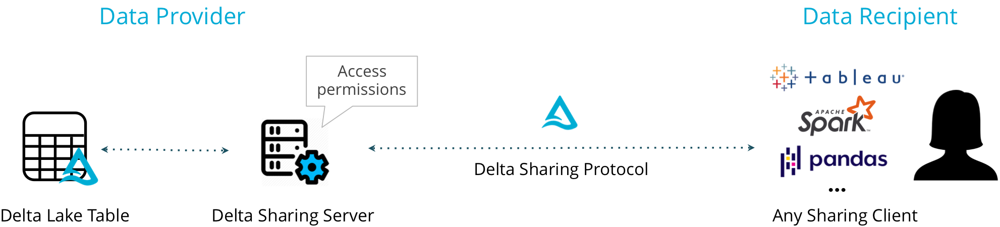

# An open standard for secure data sharing

> 数据湖(Delta Lake)中数据的安全共享
>
> Delta Sharing is the industry’s first open protocol for **secure data sharing**, making it simple to share data with other organizations regardless of which computing platforms they use.

