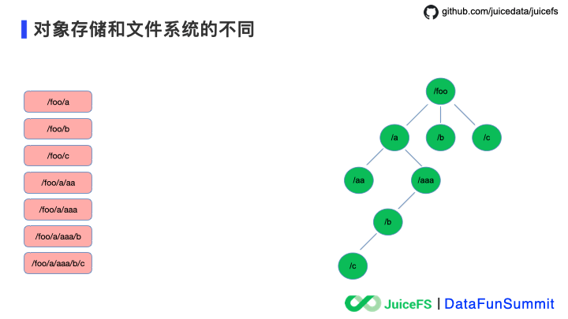

# 对象存储和文件存储区别

一个文件系统的目录结构中应该是右边树形结构的样子，而对象存储中是左边扁平的结构，**每个对象的 key 用 “/” 模拟了路径结构**，但**对象与对象之间没有关联**。

一个文件系统的目录结构中应该是右边树形结构的样子，而对象存储中是左边扁平的结构，每个对象的 key 用 “/” 模拟了路径结构，但对象与对象之间没有关联。在这两种数据结构下咱们看看 “rename” 操作的不同实现方式。

**对象存储**

在`mv /foo /bar` 这个改名操作中，需要在元数据索引中找到搜索出所有 key 包含 `/foo` 对象，然后拷贝为一份新的对象，将 key 里的`/foo`改为`/bar`，会有**大量的对象发生 I/O 复制，拷贝完成后删除旧的对象，在拷贝和删除完成之后再更新对象存储的元数据索引**。整个操作**没有事务保证**，完成时间依赖于改名操作涉及的对象数量，缺少事务保证也是造成数据不是强一致性的原因。

**文件系统**

右边文件系统中的改名操作，只需要找到路径名对应的 inodes 更新即可，保证了操作原子性。