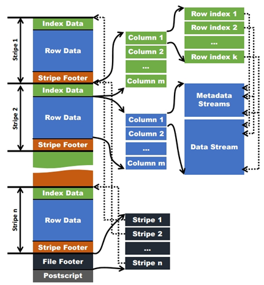
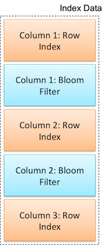
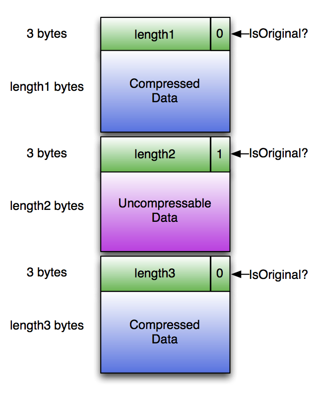

[toc]

# ORC(Optimized Row Columnar)

当前是v1版本。

**现在v2版本正在开发**

## 文件格式

文件分成Header，Body，Tail 三部分。

- Header：固定的ORC字符串（三字节）；
- Body：行和索引；
- Tail：文件级别的信息

### Stripes

一组行形成一个stripe，每次读取文件是以行组为单位的，一般为HDFS的块大小，保存了每一列的索引和数据。

- Index 数据：stripe内的行的索引，列式存储；

- Row Data：数据，列式存储；

- Stripe Footer：

  - 每列的编码信息；
  - stream的位置；

**row group：索引的最小单位**，默认为10000个值组成，一个stripe中包含多个row group。

**stream**：一个stream表示文件中一段有效的数据，分为索引和数据两类。

- PRESENT，DATA，LENGTH，ROW_INDEX，BLOOM_FILETER等类型；

### File Tail（文件尾端）格式

- encrypted stripe statistics: list of ColumnarStripeStatistics
- stripe statistics: Metadata
- footer: Footer
- postscript: PostScript
- psLen: byte

#### PostScript

用来**解析文件后面的部分**（File Footer，Metadata，文件版本），其不压缩，并且位于文件的最后一个字节（PostScript序列化的长度，必须小于255）前。

- 文件的读取是从文件末尾读取，一次性读取16K（期望一次读取Footer和PostScript，而不是多次读取）；

#### Footer

表示**文件内容的布局**，类型schema信息，行的数量和列的统计信息。

#### File Metadata

包含stripe级别的列统计信息，可以对每个Stripe进行谓词下推；

### Index

行组索引由每个原始列的ROW_INDEX流组成，默认10000行作为一个row group。

## 索引

Orc 文件有三种索引：

- **file**级别：statistics about the values in each column across the entire file（File Footer区）
- **stripe** 级别：statistics about the values in each column for each stripe（File Footer区）
- **row** 级别：statistics about the values in each column for each set of 10,000 rows within a stripe

### Row Group Index

列的统计信息

- min-max：最大、最小
- sum：个别类型（数值、String等）
- 是否有空值

### Bloom Filter Index

每列（`orc.bloom.filter.columns`指定的）有BLOOM_FILTER 流，BLOOM_FILTER流为一列中的每个行组（默认为10,000行）记录一个Bloom筛选器条目。

布隆过滤器流与行组索引交织。这种放置方式使在单次读取操作中同时读取Bloom筛选器流和行索引流变得很方便。

## 加密

支持对数据进行加密，具体流程TODO。

## 压缩

如果ORC文件编写器选择通用压缩编解码器（zlib或snappy），则使用该编解码器压缩ORC文件中除Postscript以外的所有部分。

读取器能够跳过压缩的字节而不解压缩整个流。

每个标头的长度为3个字节，其中（compressedLength * 2 + isOriginal）存储为小字节序值。

 

## 编码

每种类型采用不同的编码方式，其存储使用的stream类型也不相同。

以SmallInt，Int，BigInt类型为例，需要PRESENT和DATA两种stream。如果数据没有空值，则PRESENT可以不存。

| ENCODING  | STREAM KIND | OPTIONAL | CONTENTS              |
| :-------- | :---------- | :------- | :-------------------- |
| DIRECT    | PRESENT     | Yes      | Boolean RLE           |
|           | DATA        | No       | Signed Integer RLE v1 |
| DIRECT_V2 | PRESENT     | Yes      | Boolean RLE           |
|           | DATA        | No       | Signed Integer RLE v2 |

