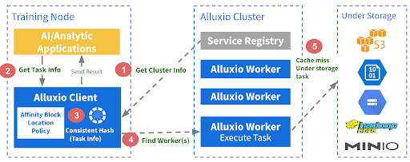

# Alluxio

- Only one UFS is supported by Dora. Nested mounts are not supported yet.

## 架构

**Decentralized Object Repository Architecture**：一致性 Hash

- 扩展性：支持 10 亿规模的文件；
- 高可用性：无单点故障，99.99可用性；
- 性能：优先考虑 Presto/Trino 支持的SQL分析工作负载 和 AI 工作 GPU负载；

### Worker

- 按**路径分片**，**存储元数据和数据**；

### Client

- 运行在应用中
- 使用相同的一致性hash算法，计算文件对应的 Worker

### Service Registry

> Alluxio Master Node：worker注册，集群配置更新，处理 write IO 操作。

- 服务发现，维护 Workers 的信息

### Scheduler

- 处理所有的异步 jobs，如预加载数据到 Workers

## Catalog Service

## Transform Service

