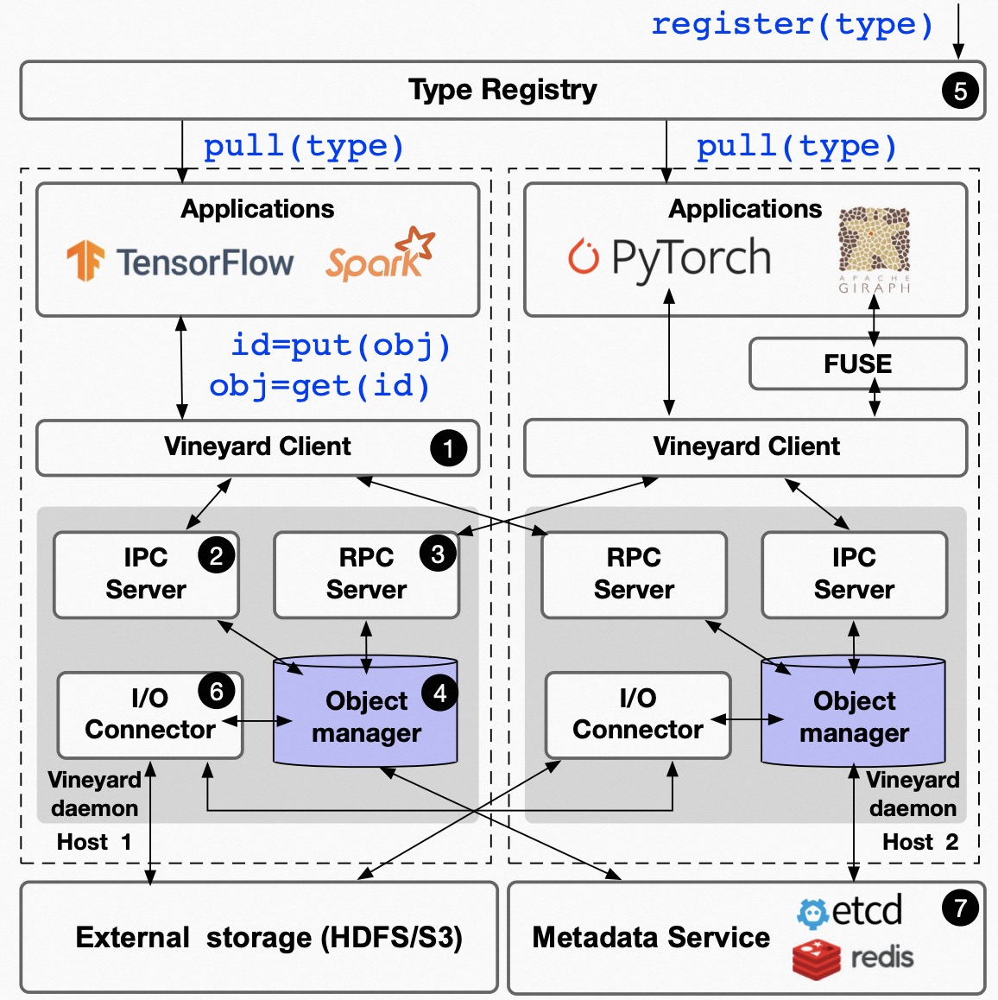

# Vineyard

> https://github.com/v6d-io/v6d
>
> an in-memory immutable (distributed) data manager.


## 架构




## 使用

### vineyard server

```shell
# 默认使用 /var/run/vineyard.sock 监听 IPC 连接
# IPC: 进程间通信，在一个节点的多个进程
python3 -m vineyard
```


### vineyard client

```python
import vineyard
client = vineyard.connect('/var/run/vineyard.sock')
```

