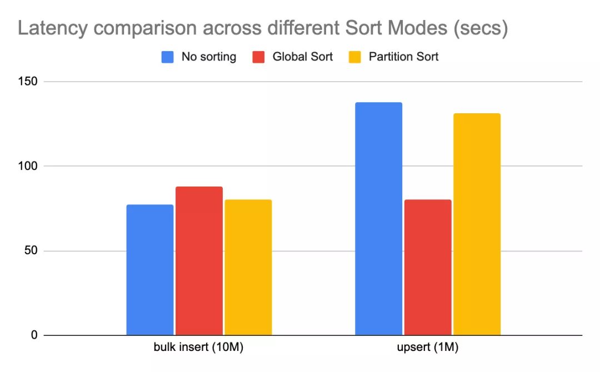

# 批量插入

## 原理

`bulk_insert`按照以下原则提供了3种模式来满足不同的需求：

- 如果数据布局良好，排序将为我们提供良好的压缩和`upsert`性能。特别是记录键具有某种排序（时间戳等）特征，则排序将有助于在upsert期间裁剪大量文件，如果数据是按频繁查询的列排序的，那么查询将利用parquet谓词下推来裁剪数据，以确保更低的查询延迟。
- 写parquet文件是内存密集型操作。当将大量数据写入一个也被划分为1000个分区的表中时，如果不进行任何排序，写入程序可能必须保持1000个parquet写入器处于打开状态，同时会产生不可持续的内存压力，并最终导致崩溃。
- 在**批量导入数据时，最好控制好少的文件个数**，以避免以后后续写入和查询时的元数据开销。

3种开箱即用的模式为：`PARTITION_SORT`、`GLOBAL_SORT`、`NONE`

## 模式

### GLOBAL_SORT（全局排序）

默认模式。

Hudi在**输入分区中对记录进行全局排序**，从而在**索引查找过程中最大化使用键范围修剪的文件数量**，以便提升`upsert`性能。

### PARTITION_SORT（分区排序）

对给定spark分区内的记录进行排序：

- 但是给定的spark分区可能包含来自不同表分区的记录，因此即使我们在每个spark分区内进行排序，也可能会在产生大量文件，因为**给定表分区的记录可能会分布在许多spark分区中**；
- 写入时可能不会同时打开太多文件，因为我们在移动到下一个文件之前关闭了该文件；

### NONE

不会对用户记录进行任何转换（如排序），将数据原样委托给写入器。

- **较大的内存开销**：将大量数据写入分区为1000个分区的表中时，写入程序可能必须保持1000个parquet写入程序处于打开状态；
- 给定文件的**最小-最大范围可能非常宽**（未排序的记录），因此后续的`upsert`会在索引查找期间从大量文件中读取bloom filter（布隆过滤器）；
- 记录没有排序，并且每个写入器可以跨N个表分区获取记录，因此这种模式可能会导致在`bulk_insert`结束时产生大量文件。由于有大量的小文件，这也可能会影响`upsert`或查询性能。

## 配置

- `hoodie.bulkinsert.sort.mode`：排序模式，`NONE`, `GLOBAL_SORT`（默认） , `PARTITION_SORT`

- `hoodie.bulkinsert.user.defined.partitioner.sort.columns`：排序的列，逗号分隔多列；

## 性能测试

不同模式下简单benchmark性能差异如下

> 说明：该基准测试使用不同的排序模式将1000万条记录批量插入hudi，然后`upsert`100W个条记录（原始数据集大小的10%）。

- `NONE`模式对批量导入性能最佳，因为它不涉及任何排序；
- 与`NONE`模式相比，`GLOBAL_SORT`相比`NONE`模式开销约为15%；
- `PARTITION_SORT`相比`NONE`模式开销约为4%，因为也涉及到对记录的排序操作；
- 后面的`upsert`性能：`GLOBAL_SORT`相比`NONE` upsert性能高40%。`PARTITION_SORT`相比`NONE`模式有约5%的改进，这是由于大量小文件开销导致。