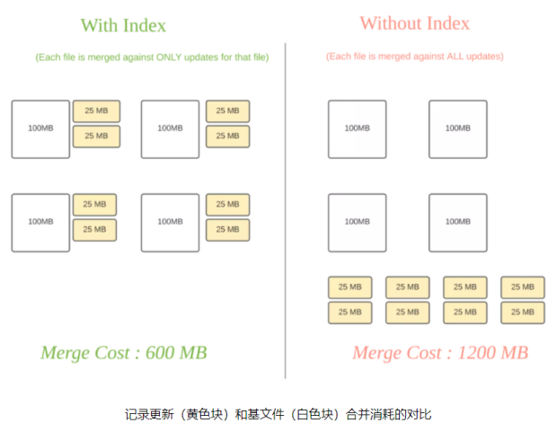

# Hudi 索引技术

Hudi 通过`HoodieKey`有 Min/Max 统计和BloomFilter，用于快速定位 Record 所在的文件。

**索引机制提供高效的`upsert`操作**（区分消息是INSERT还是UPDATE）：

- 将 Hoodie key （**记录键+分区路径**）到 file id (FileGroup) 之间的映射关系；
- 映射数据第一次写入文件后保持不变，一个 FileGroup 包含了一批 record 的所有版本记录

Hudi索引可以根据其查询分区记录的能力进行分类：

1） **全局索引**：**不需要分区信息**即可查询记录键映射的文件ID。比如，写程序可以传入null或者任何字符串作为分区路径（partitionPath），但索引仍然会查找到该记录的位置。全局索引在记录键在**整张表中保证唯一的情况下非常有用**，但是**查询的消耗随着表的大小呈函数式增加**。

2） **非全局索引**：非全局索引**依赖分区路径**（partitionPath），对于**给定的记录键，它只会在给定分区路径下查找该记录**。这比较适合总是**同时生成分区路径和记录键的场景**，同时还能享受到更好的扩展性，因为**查询索引的消耗只与写入到该分区下数据集大小**有关系。

## 索引类型

- **HBaseIndex**：本质上是全局索引；
- **BloomIndex**：Bloom索引，通过base file（parquet）的footer的meta区记录record key组成的BloomFilter；
  - 动态布隆过滤器（设置`hoodie.bloom.index.filter.type=DYNAMIC_V0`），根据文件里存放的记录数量来调整大小从而达到设定的伪正率。
- **SimpleIndex**：a lean join of the incoming update/delete records against keys extracted from the table on storage；
- **InMemoryHashIndex**：内存中ConcurrentMap，Spark 内存索引当前是用来测试的索引；

- **Flink State-based Index**：HUDI 在 0.8.0 版本中实现的 Flink witer，采用了 Flink 的 state 作为底层的 index 存储，每个 records 在写入之前都会先计算目标 bucket ID，不同于 BloomFilter Index，避免了每次重复的文件 index 查找；

### 场景和适用

**场景一：对事实表的延迟更新**

- 特点：大**部分更新会发生在最新的几个分区上而小部分会在旧的分区**

- 适用索引：**布隆索引**

- 原理：因为查询索引可以靠设置得当的布隆过滤器来剪枝很多数据文件。另外，如果生成的键可以以某种顺序排列，参与比较的文件数会进一步通过范围剪枝而减少。**Hudi用所有文件的键域来构造区间树**，这样能来高效地依据输入的更删记录的键域来排除不匹配的文件。

  

**场景二：对事件表的去重**

- 特点：**大部分都是仅追加的数据，插入和更新只存在于最新的几个分区中**。由于重复事件可能发生在整个数据管道的任一节点，在存放到数据湖前去重是一个常见的需求。

- 适用索引：**布隆索引**

- 原理：我们可以利用作为首类处理对象的时间来构造由事件时间戳和事件id（event_ts+event_id)组成的键，这样插入的记录就有了单调增长的键。这会在最新的几个分区里大幅提高剪枝文件的效益。

  

**场景三：对维度表的随机更删**

- 特点：**更新量通常很小但所接触的分区和数据文件会很多，范围涉及从旧到新的整个数据集**。有时因为没有很好的分区条件，这些表也会不分区。
- 适用索引：**简单索引**

- 原理：更新操作通常会触及表里大多数文件从而导致布隆过滤器依据输入的更新对所有文件标明真正(true positive)。最终会导致，**即使采用了范围比较，也还是检查了所有文件。**使用`简单索引`对此场景更合适，因为它不采用提前的剪枝操作，而是直接和所有文件的所需字段连接。如果额外的运维成本可以接受的话，也可以采用HBase索引，其对这些表能提供更加优越的查询效率。

## 多级索引

> Hudi 多模索引：https://www.onehouse.ai/blog/introducing-multi-modal-index-for-the-lakehouse-in-apache-hudi

### 背景

使用索引提升数据查询的速度，就需要存储`metadata`。对于TB、EB级别表中的`metadata`，其量级会很大。

- 通常的做法是把metadata存储于单独的数据块block或者是数据文件中。

- 在实测的过程中，遇到了读写瓶颈。

- 同时，在维护metadata的过程中，它需要实时的和数据表进行同步。

这样的管理十分复杂，因为要保证`transaction`，如果我们要在Hudi中引用新的索引开发周期会很长。

### 设计

#### 可拓展的元数据（scalable metadata）

Serverless，不需要任何的计算或者内存需要，独立存在，且独立于计算及查询引擎，且能高性能地支持不同索引类型；

- 在内部构建一个**元数据表meta table**，使用 Hudi的mor表来存储（快速更新和删除）；

  - Hudi表也是Serverless的，它不会依赖任何计算及内存资源；
  - 支持任意的索引大小；

- **针对不同的索引是建立独立的分区**，不同的index可以完成独立的管理以及自动化的管理；

- 索引的初始化

  - 同步：在写入表的过程中，在最后commit之前会做一个index的步骤；
  - 异步：如下图所示，保证`concurrent write` 不受影响；

  

#### 事务性保证

多级索引中的元数据和数据表保持实时同步，**保证每次的更新都是事务性的**；

- multi table多表的transaction，有自我管理的表服务，包括compaction, cleaning；
  - 保证定时操作，以保证这个metadata table 的读性能会很好。

#### 查询速度保证

保证对于多级索引的查询是低延迟的，主要的查询类型包括`point, range, and prefix lookups`等。

- 使用 `HFile` 作为MDT的数据格式，相比于 Parquet/Avro 更适用于点查询；
  - HFile格式中的index使得 pointed lookup非常高效，在千万（10M）+条目中查询 N (1-10) 条目，HFile 相比于 Parquet、Avro 有 10-100倍的提升

### 效果

多级索引所带来的主要的读写性能提升

- **File Listing**：云存储中，大型表的上千分区以及百万级的数据文件做listing，会造成读写瓶颈；
  - 利用metadata table中的files来做分区，分区里提供了这个数据表里所有的file。相比于云软件系统有2-20倍的提升；
- **Data Skipping**：针对 query 构建列统计索引，针对 upsert 构建 bloom filter；
  - 具体内容和效果见下一节；

## 数据跳过索引

> 参考：[Apache Hudi数据跳过技术加速查询高达50倍](https://mp.weixin.qq.com/s/IEDdmrYM3-eBS-rvqb0mWg)
>
> [1] Z-order和希尔伯特空间填充曲线: *[https://hudi.apache.org/blog/2021/12/29/hudi-zorder-and-hilbert-space-filling-curves](https://hudi.apache.org/blog/2021/12/29/hudi-zorder-and-hilbert-space-filling-curves)*
> [2] Extensible Data Skipping :  *[https://arxiv.org/abs/2009.08150](https://arxiv.org/abs/2009.08150)*

### 背景

数据跳过本质上是各种类型索引$^{[2]}$的通用术语，使查询引擎能够**有效地跳过数据**，这与它当前执行的查询无关，以减少扫描和处理的数据量，节省扫描的数据量以及（ 潜在地）显着提高执行时间。

- 了解哪些文件可能包含查询正在寻找的数据，查询引擎必须**读取表中每个 Parquet 文件的 Parquet 页脚，会影响性能**；

### 发展历史

#### Hudi 0.10

- 引入对高级数据布局优化技术的支持，例如 **Z-order和希尔伯特空间填充曲线**$^{[1]}$（作为新的聚类算法）；
- 引入简单的**列统计索引**（存储为简单的 Parquet 表），支持 Hudi 中数据跳过实现，展示 Z-order 和 Hilbert 的强大功能空间填充曲线作为高级布局优化技术；

#### Hudi 0.11

Hudi 0.11 中，在元数据表中引入多模索引$^{[3]}$，例如布隆过滤器索引和列统计索引，作为**元数据表中的专用分区**（分别为“column_stats”和“bloom_filters”）：

- 列统计索引 (CSI) 享有元数据表的一致性保证；
- 元数据表使用 HBase的HFile作为基础文件和日志文件格式，促进**基于键的快速查找**（排序键值存储）；

#### 下一步

[HUDI-1822](https://issues.apache.org/jira/browse/HUDI-1822)（TODO：进一步分析）

- 支持 Merge-On-Read 表中的数据跳过
- 为列统计索引查询添加缓存
- 进一步分析和优化列统计索引性能

### 设计

> [RFC-27](https://github.com/apache/hudi/tree/master/rfc/rfc-27)

通过**列统计数据**来排除掉不需要读的文件：

- 常见的列统计数据包括取**最大值、最小值、数量、大小**等；
- （针对query）`multi model index`的metadata 中构建`column_stats`分区；
  - 分区里的**每条记录包含这个Hudi表里所对应文件的列统计数据**；
  - 每个Record key是由**列名称、分区名称和文件名称**组成，可以快速定位所需统计信息；
  - 查询复杂度是基于查询列所需要的列的数量，通常这个数量是5到10个；
- （针对upsert）metadata table中引入一个bloom_filter 分区，取代parquet file 中 footer 中的 bloom filter
  - 每条记录包含单个数据文件（partition + file name）的 bloom filter，支持 prefix lookup；
  - 实测，在有 100k 文件的 Hudi 表中，相比于读取 footer，从 MDT 读取 bloom filter的速度有3倍的提升

### 配置

摄取期间**同步**构建列统计索引：

- `hoodie.metadata.index.column.state.enbale=true`

异步索引器功能**回填**现有表的索引

查看数据跳过操作：默认情况下元数据表仅在写入端启用，需要以下配置

- `hoodie.metadata.enable=true`：确保在读取路径上启用了元数据表
- `hoodie.enable.data.skipping=true`：数据跳过功能已启用

## Future（Data skip index）

- [RFC-27](https://cwiki.apache.org/confluence/display/HUDI/RFC-27+Data+skipping+index+to+improve+query+performance) ：在元数据表上添加额外的索引形式，作为新分区，添加索引列范围，它可以扩展到许多小文件，并支持更快的更改。
- [RFC-8](https://cwiki.apache.org/confluence/display/HUDI/RFC-08++Record+level+indexing+mechanisms+for+Hudi+datasets)：Record level indexing mechanisms for Hudi datasets
- [point-lookup-ish queries](https://github.com/apache/hudi/pull/2487) 
