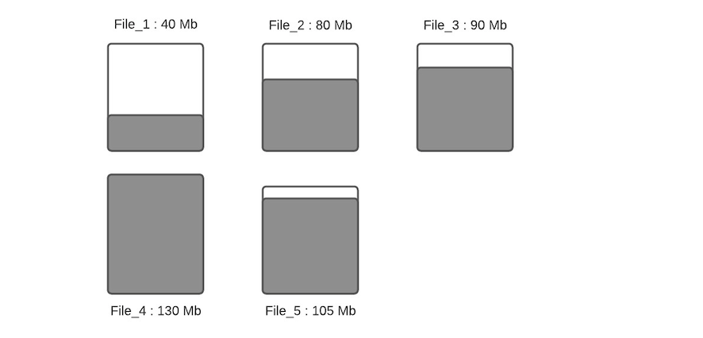
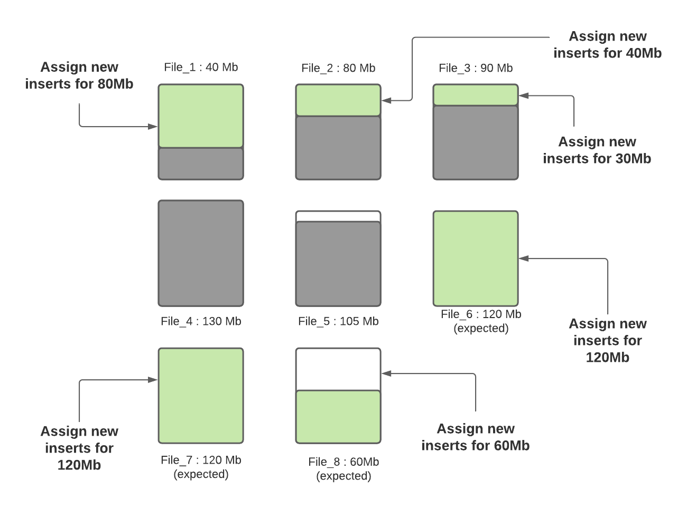

# 维持最优大小的文件机制

## 配置

- `hoodie.parquet.max.file.size`：120MB，数据文件最大大小，Hudi将试着维护文件大小到该指定值；
- `hoodie.parquet.block.size`：120MB，parquet RowGroup的大小，保持跟文件大小一致。
- `hoodie.parquet.small.file.limit`：默认100MB，小于该大小的文件均被视为小文件，**0表示关闭该特性**；

### CopyOnWrite表

*MOR也共用这个参数？*

- **`hoodie.copyonwrite.insert.split.size`**：500000，单文件中插入记录条数，此值应与单个文件中的记录数匹配（可以根据最大文件大小和每个记录大小来确定）。将这个值设置为一个较低的值，将产生小文件(特别是当`hoodie.parquet.small.file.limit`为0时)；默认值是写100MB的文件，记录默认1kb，则每个文件有100K的记录条数，放大大500K。
  - `hoodie.copyonwrite.insert.auto.split`：自动调整`hoodie.copyonwrite.insert.split.size`的大小，根据最后commit的元数据。
  - `hoodie.copyonwrite.record.size.estimate`：默认1024（1kb），平均每条record的大小，没有明确指定则根据提交元数据动态计算记录大小；

## 原理

> [How Apache Hudi maintains optimum sized files](https://hudi.apache.org/blog/2021/03/01/hudi-file-sizing)

下文讨论了在初始写入时，在Hudi中的文件大小优化，这样我们就不需要只是为了文件大小再次有效地重写所有数据。如果你想同时拥有(a)自管理文件大小和(b)避免查询小文件，自动文件大小功能可以节省时间。

当**执行INSERT/UPSERT操作时，Hudi有能力维护配置的目标文件大小**。(注意:bulk_insert操作不提供这个功能，它被设计为普通spark.write.parquet的一个更简单的替代品)。

以`COPY_ON_WRITE`表来演示Hudi如何自动处理文件大小特性。

- UpsertPartitioner 源码（Spark-Hudi）；

假设一个指定分区下数据文件布局如下

假设配置的`hoodie.parquet.max.file.size`为120MB，`hoodie.parquet.small.file.limit`为100MB。File_1大小为40MB，File_2大小为80MB，File_3是90MB，File_4是130MB，File_5是105MB，当有新写入时其流程如下：

**步骤一：**将更新分配到指定文件，这一步将查找索引来找到相应的文件，假设更新会增加文件的大小，会导致文件变大。当更新减小文件大小时（例如使许多字段无效），则随后的写入将文件将越来越小。

**步骤二：**根据`hoodie.parquet.small.file.limit`决定每个分区下的小文件，我们的示例中该配置为100MB，所以小文件为File_1、File_2和File_3；

**步骤三：**确定小文件后，新插入的记录将分配给小文件以便使其达到120MB，File_1将会插入80MB大小的记录数，File_2将会插入40MB大小的记录数，File_3将插入30MB大小的记录数。

**步骤四：**当所有小文件都分配完了对应插入记录数后，如果还有剩余未分配的插入记录，这些记录将分配给新创建的FileGroup/数据文件。数据文件中的记录数由`hoodie.copyonwrite.insert.split.size`（或者由之前的写入自动推算每条记录大小，然后根据配置的最大文件大小计算出来可以插入的记录数）决定，假设最后得到的该值为120K（每条记录大小1K），如果还剩余300K的记录数，将会创建3个新文件（File_6，File_7，File_8），File_6和File_7都会分配120K的记录数，File_8会分配60K的记录数，共计60MB，后面再写入时，File_8会被认为小文件，可以插入更多数据。

Hudi利用诸如自定义分区之类的机制来优化记录分配到不同文件的能力，从而执行上述算法。在这轮写入完成之后，除File_8以外的所有文件均已调整为最佳大小，每次写入都会遵循此过程，以确保Hudi表中没有小文件。

