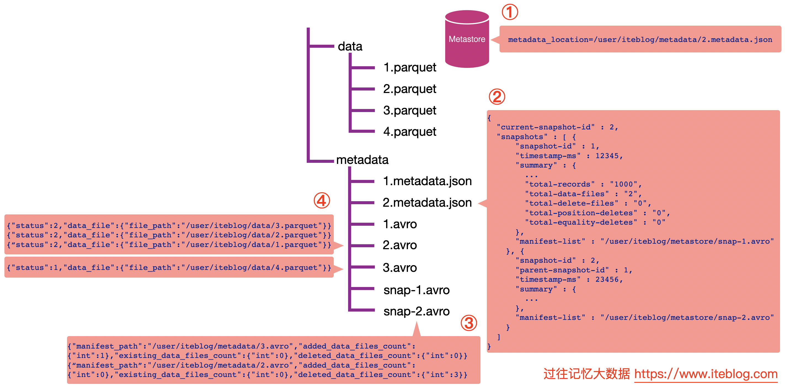

[toc]

# 时间旅行

## 示例



假设我们的表是存储在 Hive 的 MetaStore 里面的，表名为 iteblog，并且数据的组织结构如上如所示。

### 查询最新快照的数据

- 通过数据库名和表名，从 Hive 的 MetaStore 里面拿到表的信息。
  - 从表的属性里面其实可以拿到 `metadata_location` 属性，通过这个属性可以拿到 iteblog 表的 Iceberg 的 metadata 相关路径，这个也就是上图步骤①的 */user/iteblog/metadata/2.metadata.json*。
- 解析 /user/iteblog/metadata/2.metadata.json 文件，里面可以拿到当前表的快照 id（current-snapshot-id），以及这张表的所有快照信息，也就是 JSON 信息里面的 snapshots 数组对应的值。
  - 从上图可以看出，当前表有两个快照，id 分别为 1 和 2。快照 1 对应的清单列表文件为 /user/iteblog/metastore/snap-1.avro；快照 2 对应的清单列表文件为 /user/iteblog/metastore/snap-2.avro。
- 如果我们想读取表的最新快照数据，从 current-snapshot-id 可知，当前最新快照的 ID 等于 2，所以我们只需要解析 /user/iteblog/metastore/snap-2.avro 清单列表文件即可。
  - 从上图可以看出，snap-2.avro 这个清单列表文件里面有两个清单文件，分别为 /user/iteblog/metadata/3.avro 和 /user/iteblog/metadata/2.avro。注意，除了清单文件的路径信息，还有 added_data_files_count、existing_data_files_count 以及 deleted_data_files_count 三个属性。
  - Iceberg 其实是根据 deleted_data_files_count 大于 0 来判断对应的清单文件里面是不是被删除的数据。由于上图 /user/iteblog/metadata/2.avro 清单文件的 deleted_data_files_count 大于 0 ，所以读数据的时候就无需读这个清单文件里面对应的数据文件。在这个场景下，读取最新快照数据只需要看下 /user/iteblog/metadata/3.avro 清单文件里面对应的数据文件即可。
- 这时候 Iceberg 会解析 /user/iteblog/metadata/3.avro 清单文件，里面其实就只有一行数据，也就是 /user/iteblog/data/4.parquet，所以读 iteblog 最新的数据其实只需要读 /user/iteblog/data/4.parquet 数据文件就可以了。

### 查询某个快照的数据

在查询的时候只需要指定 `snapshot-id` 属性即可，比如我们想查询上面 snapshot-id 为 1 的数据，可以在 Spark 中这么写（查询步骤跟上面一致）：

```scala
spark.read
    .option("snapshot-id", 1L)
    .format("iceberg")
    .load("path/to/table")
```

### 根据时间戳查看某个快照的数据

通过 as-of-timestamp 参数指定时间戳来读取某个快照的数据。如下所示：

```scala
spark.read
    .option("as-of-timestamp", "12346")
    .format("iceberg")
    .load("path/to/table")
```

第二步里面的 JSON 数据里面有个 snapshot-log 数组，如下：

```json
"snapshot-log" : [ {
  "timestamp-ms" : 12345,
  "snapshot-id" : 1
}, {
  "timestamp-ms" : 23456,
  "snapshot-id" : 2
}]
```

每个列表里面都有个 timestamp-ms 属性和 snapshot-id 属性，并且是按照 timestamp-ms 升序的。在 Iceberg 内部实现中，它会将 as-of-timestamp 指定的时间和 snapshot-log 数组里面每个元素的 timestamp-ms 进行比较，找出最后一个满足 timestamp-ms <= as-of-timestamp 对应的 snapshot-id。

由于 as-of-timestamp=12346 比 12345 时间戳大，但是比 23456 小，所以会取 snapshot-id = 1，也就是拿到 snapshot-id = 1 的快照数据。剩下的数据查询步骤和在查询中指定 snapshot-id 是一致