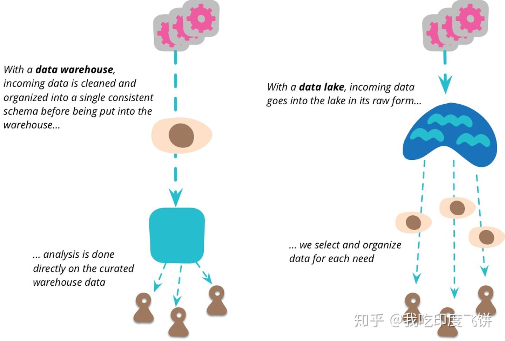
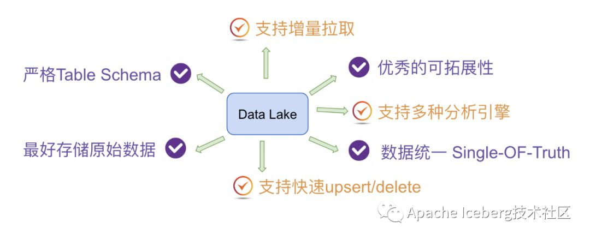
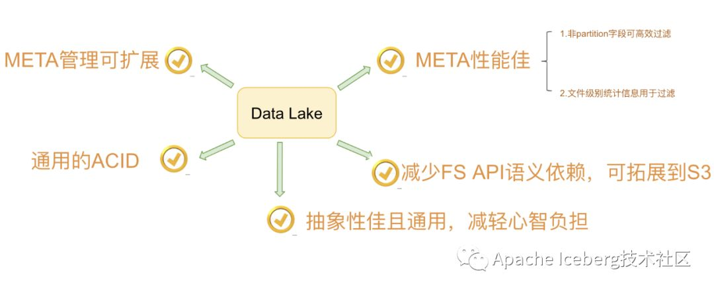
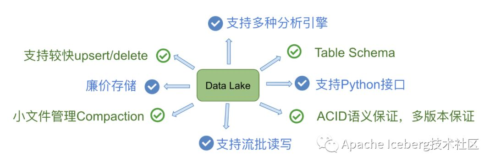
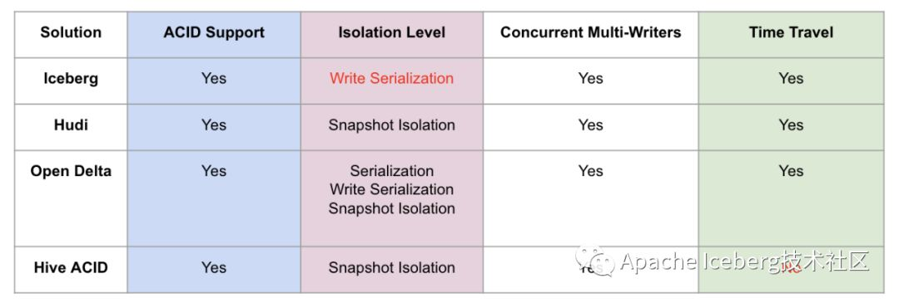
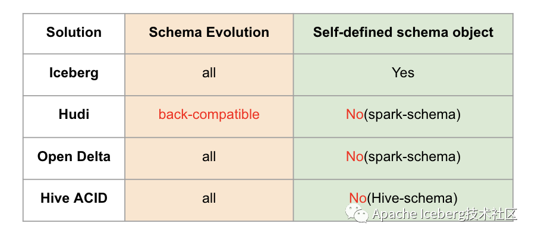
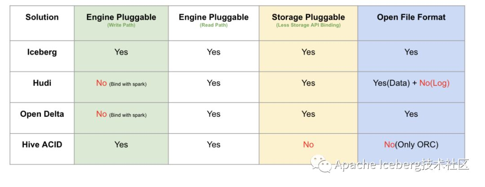
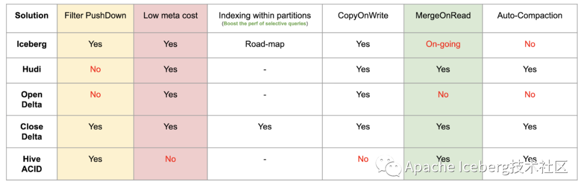
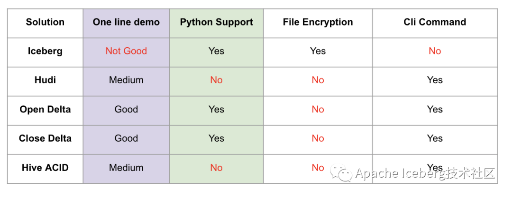
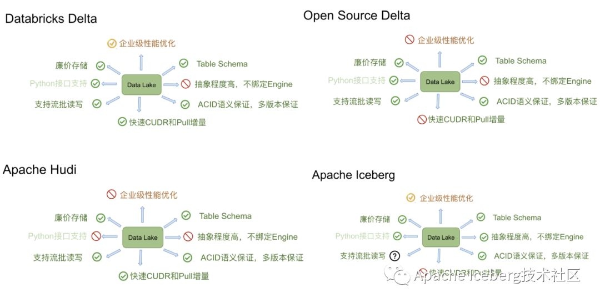

[toc]

# 数据湖

数据湖是一种在系统或存储库中以自然格式存储数据的方法，它有助于以各种模式和结构形式配置数据，通常是对象块或文件。

数据湖的主要思想是对企业中的所有数据进行统一存储，从原始数据（源系统数据的精确副本）转换为用于报告、可视化、分析和机器学习等各种任务的目标数据。

数据湖中的数据包括**结构化数据（关系数据库数据），半结构化数据（CSV、XML、JSON等），非结构化数据（电子邮件，文档，PDF）和二进制数据（图像、音频、视频）**，从而形成一个容纳所有形式数据的集中式数据存储。

解决的场景问题是什么？

- 存储原始数据，结构化和非结构化的数据？

 **问题（TODO）：非结构化数据在Hudi中的存储（Parquet 二进制？）**

## 数据湖VS数据仓库

| 特性         | 数据仓库                                           | 数据胡湖                                                     |
| ------------ | -------------------------------------------------- | ------------------------------------------------------------ |
| **数据**     | 来自事务系统、运营数据库和业务线应用程序的关系数据 | 来自IoT设备、网站、移动应用程序、社交每题和企业应用程序的非关系和关系数据 |
| **Schema**   | 设计在数据仓库实施之前（写入型Schema）             | 写入在分析时（读取型Schema）                                 |
| **性价比**   | 更快查询结果会带来较高存储成本                     | 更快查询结果值序较低存储成本                                 |
| **数据质量** | 作为重要事实依据的高度监管数据                     | 任何可以或无法进行监管的数据（例如原始数据）                 |
| **用户**     | 业务分析师                                         | 数据科学家、数据开发人员和业务分析师（使用监管数据）         |
| **分析**     | 批处理报告、BI和可视化                             | 机器学习、预测分析、数据发现和分析                           |

## Hudi vs Iceberg vs Deltalake

Hudi 为了 incremental 的 upserts，Iceberg 定位于高性能的分析与可靠的数据管理，DeltaLake 定位于流批一体的数据处理。

### 场景

Hudi

IceBerg

DeltaLake

### ACID和隔离级别支持

这里主要解释下，对数据湖来说三种隔离分别代表的含义。

1. Serialization是说所有的reader和writer都必须串行执行；
2. Write Serialization: 是说多个writer必须严格串行，reader和writer之间则可以同时跑；
3. Snapshot Isolation: 是说如果多个writer写的数据无交集，则可以并发执行；否则只能串行。Reader和writer可以同时跑。

综合起来看，**Snapshot Isolation隔离级别的并发性是相对比较好**的。

### Schema变更支持和设计

一个是schema变更的支持情况:

- 我的理解是hudi仅支持添加可选列和删除列这种向后兼容的DDL操作，而其他方案则没有这个限制

另一个是数据湖是否自定义schema接口，以期跟计算引擎的schema解耦。

- iceberg是做的比较好的，抽象了自己的schema，不绑定任何计算引擎层面的schema。

### 流批接口支持

目前Iceberg和Hive暂时不支持流式消费，不过Iceberg社区正在issue 179上开发支持。

### 接口抽象程度和插件化

从计算引擎的写入和读取路径、底层存储可插拔、文件格式四个方面来做对比。

- Iceberg是抽象程度做得最好的数据湖方案，四个方面都做了非常干净的解耦。

- delta是databricks背后主推的，必须天然绑定spark；
- hudi的代码跟delta类似，也是强绑定spark。

存储可插拔的意思是说，是否方便迁移到其他分布式文件系统上（例如S3），这需要数据湖对文件系统API接口有最少的语义依赖，例如若数据湖的ACID强依赖文件系统rename接口原子性的话，就难以迁移到S3这样廉价存储上，目前来看只有Hive没有太考虑这方面的设计；

文件格式指的是在不依赖数据湖工具的情况下，是否能读取和分析文件数据，这就要求数据湖不额外设计自己的文件格式，统一用开源的parquet和avro等格式。这里，有一个好处就是，迁移的成本很低，不会被某一个数据湖方案给绑死。

### 查询性能优化

### 其他功能

这里One line demo指的是，示例demo是否足够简单，体现了方案的易用性，Iceberg稍微复杂一点（我认为主要是Iceberg自己抽象出了schema，所以操作前需要定义好表的schema）。做得最好的其实是delta，因为它深度跟随spark易用性的脚步。

Python支持其实是很多基于数据湖之上做机器学习的开发者会考虑的问题，可以看到Iceberg和Delta是做的很好的两个方案。

出于数据安全的考虑，Iceberg还提供了文件级别的加密解密功能，这是其他方案未曾考虑到的一个比较重要的点。

### 总结对比

