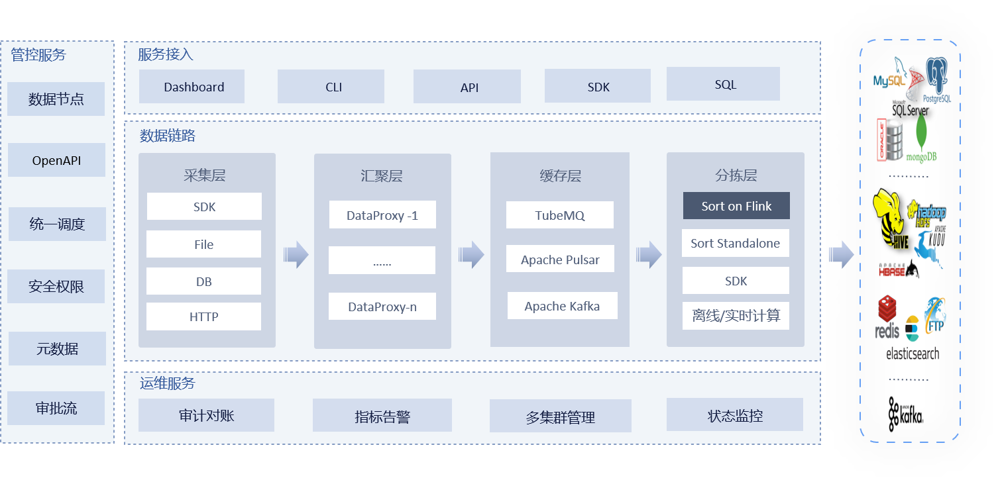
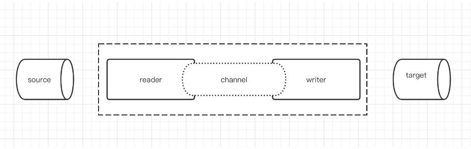
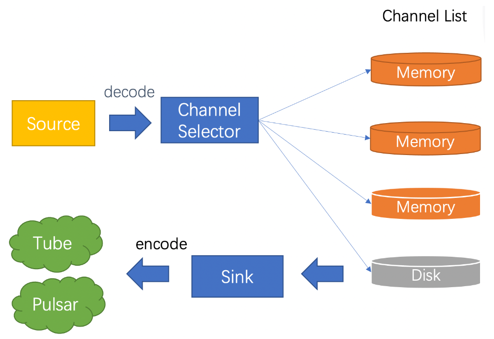

# Apache InLong

> Apache InLong（应龙）是一个一站式海量数据集成框架，将**数据采集、聚合、存储、排序数据处理的全流程**整合在一起，提供自动、安全、可靠和高性能的数据传输能力，同时支持批和流，方便业务构建基于流式的数据分析、建模和应用。

开源的ETL解决方案。

## 架构

- 通过 Flink Source/Sink 支持数据采集和存储；

## 模块

### inlong-agent

数据采集Agent。从指定目录或文件读取常规日志、逐条上报

### inlong-dataproxy

支持数据发送阻塞和落盘重发，可以将接收到的数据转发到不同的MQ（消息队列）

### inlong-tubemq

腾讯自研的消息队列服务，用户大数据场景下海量数据的高性能存储和传输

### inlong-sort

对从不同MQ消费到的数据进行ETL处理，然后汇聚并写入Hive、ClickHouse、HBase、Iceberg等存储系统。

或者，对从不同数据源读取的数据进行ETL处理，然后写入到指定的MQ（从ExtractNode写入LoadNode）

### inlong-manager

提供元数据、任务流、权限、OpenAPI等的数据服务管控能力

### inlong-dashboard

管理数据接入的前端页面

### inlong-audit

对InLong系统的Agent、DataProxy、Sort模块的入流量、出流量进行实时审计对账

## 组件介绍

#### Agent

##### 支持数据源

File、Sql、Binlog、Metrics等多种异构数据源

##### 架构介绍

InLong Agent本身作为数据采集框架，采用channel + plugin架构构建。将数据源读取和写入抽象成为Reader/Writer插件，纳入到整个框架中。

- Reader：Reader为数据采集模块，负责采集数据源的数据，将数据发送给channel。
- Writer： Writer为数据写入模块，负责不断向channel取数据，并将数据写入到目的端。
- Channel：Channel用于连接reader和writer，作为两者的数据传输通道，并起到了数据的写入读取监控作用

##### 采集分类

###### 文件

文件采集包含如下功能： 用户配置的路径监听，能够监听出创建的文件信息 目录正则过滤，支持YYYYMMDD+正则表达式的路径配置 断点重传，InLong-Agent重启时，能够支持自动从上次读取位置重新读取，==保证不重读不漏读==。

###### Sql

这类数据是指通过SQL执行的方式 SQL正则分解，转化成多条SQL语句 分别执行SQL，拉取数据集，拉取过程需要注意对mysql本身的影响 执行周期，这种一般是定时执行。

###### Binlog

这类采集通过配置mysql slave的方式，读取binlog，并还原数据 需要注意binlog读取的时候多线程解析，多线程解析的数据需要打上顺序标签 代码基于老版本的dbsync，主要的修改是将tdbus-sender的发送改为推送到agent-channel的方式做融合。

##### 安装配置

[安装部署 | Apache Inlong](https://inlong.apache.org/zh-CN/docs/modules/agent/quick_start)

##### 监控指标

[监控指标 | Apache Inlong](https://inlong.apache.org/zh-CN/docs/modules/agent/metrics)

#### DataProxy

充当采集端到消息队列的桥梁，当DataProxy收到消息时，首先发送到Memory Channel中进行压缩，并使用本地的Producer往后端消息队列发送数据。

当消息队列异常，出现发送发送失败时，DataProxy会将消息缓存到Disk Channel，即本地磁盘中。

DataProxy整体架构基于Apache Flume，扩展了Source层和Sink层，并对容灾做了优化处理。

##### 架构介绍

、

- Source层开启端口监听，通过netty server实现。解码之后的数据发到channel层
- channel层有一个selector，用于选择走哪种类型的channel，如果memory最终满了，会对数据做落地处理
- channel层的数据会通过sink层做转发，这里主要是将数据转为TDMsg1的格式，并推送到cache层（这里用的比较多的是tube）

##### 安装配置

[安装配置 | Apache Inlong](https://inlong.apache.org/zh-CN/docs/modules/dataproxy/overview)

DataProxy 支持配置化的 source-channel-sink，配置方式与 flume 的配置文件结构类似。配置文件放在 dataproxy-*.conf 文件中，目前支持 dataproxy-pulsar.conf 和 dataproxy-tube.conf 两种，用于区分不同的中间件类型，具体类型可以在启动时指定，默认（未指定时）使用 dataproxy-pulsar.conf 作为配置文件

##### 监控指标

[监控指标 | Apache Inlong](https://inlong.apache.org/zh-CN/docs/modules/dataproxy/overview)

DataProxy提供了JMX方式的监控指标Listener能力，用户可以实现MetricListener接口，注册后可以定期接收监控指标，用户选择将指标上报自定义的监控系统

#### TubeMQ

##### 架构

Portal：负责对外交互和运维操作的Portal部分；

Master：负责集群控制的Control部分，该部分由一个或多个Master节点组成。Master支持HA部署，实现节点间心跳保活、实时热备切换；

Broker：每个Broker节点对本节点内的Topic集合进行管理；

Client：负责数据生产和消费的Client部分，该部分以Lib形式对外提供。消费端支持Push、Pull两种数据拉去模式。数据消费行为支持顺序和过滤消费两种。

Zookeeper：负责offset存储的zookeeper部分

#### Sort

基于Apache Flink的ETL系统，支持多种数据源，支持简单的字段抽取，支持多种存储系统。

既支持和Manager一起配合使用，通过Manager进行系统元数据的管理，也可以在Flink环境下独立运行。

| Type         | Service                                    |
| ------------ | ------------------------------------------ |
| Extract Node | Pulsar                                     |
|              | MySQL                                      |
|              | Kafka                                      |
|              | MongoDB                                    |
|              | PostgreSQL                                 |
| Transform    | String Split                               |
|              | String Regular Replace                     |
|              | String Regular Replace First Matched Value |
|              | Data Filter                                |
|              | Data Distinct                              |
|              | Regular Join                               |
| Load Node    | Hive                                       |
|              | Kafka                                      |
|              | HBase                                      |
|              | ClickHouse                                 |
|              | Iceberg                                    |
|              | PostgreSQL                                 |
|              | HDFS                                       |
|              | TDSQL Postgres                             |

##### 安装部署

[安装部署 | Apache Inlong](https://inlong.apache.org/zh-CN/docs/modules/sort/quick_start)

#### Manager

统一管理平台，提供各基础配置（如数据流配置、消费配置、集群管理等）的维护入口。

用户可以哦通过管理平台创建数据采集任务、查看指标数据等。

##### 架构

#### Dashboard

InLong的管控端

需要先安装nodejs > = 12.0

#### Audit

InLong审计是独立于InLong的一个子系统，对InLong系统的Agent、DataProxy、Sort模块的入流量、出流量进行实时审计对账。对账的粒度有分钟、小时、天三种粒度。

通过审计对账，可以清晰的了解InLong 各个模块的传输情况，以及数据流是否有丢失或者重复。

1. 审计SDK嵌套在需要审计的服务，对服务进行审计，将审计结果发送到审计接入层。
2. 审计接入层将审计数据写到MQ(Pulsar或者TubeMQ)。
3. 分发服务消费MQ的审计数据，将审计数据写到MySQL、Elasticsearch。
4. 接口层将MySQL、Elasticsearch的数据进行封装。
5. 应用场景主要包括报表展示、审计对账等等。

#### 审计维度

| 机器ip | 容器ID | 线程ID | 日志时间(分钟) | 审计ID | inlong_group_id | inlong_stream_id | 条数 | 大小 | 传输时延(ms) |
| ------ | ------ | ------ | -------------- | ------ | --------------- | ---------------- | ---- | ---- | ------------ |
|        |        |        |                |        |                 |                  |      |      |              |

## 功能插件（for插件开发人员）

#### Agent插件

InLong Agent支持以插件的方式扩展新的采集类型

概念和模型

InLong Agent是一个数据采集框架，采用Job+Task架构模型，将数据源读取和写入抽象成为Reader/Sink插件

- Job：Job是Agent用以描述从一个源头到一个目的端的同步作业，是Agent数据同步的==最小业务单元==。
- Task：Task是把Job拆分得到的==最小执行单元==。

Task包含组件(和flume组将类似)：

- Reader: 数据采集模块，负责采集数据源的数据，并发送给Channel。
- Sink：数据写入模块，负责不断向Channel取数据，并将数据写入目的端。
- Channel：连接Reader和Sink，数据传入通道，并可以监控数据的写入和读取。

Job/Task/Reader/Sink/Channel 概念可以用下图表示：

工作流程：

- 用户提交 Job（通过 manager），Job 中定义了需要使用的 Source, Channel, Sink（通过类的全限定名定义）
- 框架启动 Job，通过反射机制创建出 Source
- 框架启动 Source，并调用 Source 的 Split 接口，生成一个或者多个 Task
- 生成一个 Task 时，同时生成 Reader（一种类型的 Source 会生成对应的 reader)，用户配置的 Channel 以及用户配置的 Sink
- Task 开始执行，Reader 开始读取数据到 Channel，Sink 从 Channel 中取数进行发送
- Job 和 Task 执行时所需要的所有信息都封装在 JobProfile 中

开发流程：

- 首先开发 Source , 实现 Split 逻辑，返回 Reader 列表
- 开发对应的 Reader ，实现读取数据并写入到 Channel 的逻辑
- 开发对应的 Sink , 实现从 Channel 中取数并写入到指定 Sink 中的逻辑

功能实现demo：

[Agent 插件 | Apache Inlong](https://inlong.apache.org/zh-CN/docs/design_and_concept/how_to_write_plugin_agent)

#### Sort插件

基于Apache Flink SQL的ETL服务。

组件概念：

ExtractNode：数据同步的来源端抽象

LoadNode：数据同步的去向端抽象

功能实现demo：

[Sort 插件 | Apache Inlong](https://inlong.apache.org/zh-CN/docs/design_and_concept/how_to_extend_data_node_for_sort)

#### Dashboard插件

功能实现demo：

[Dashboard 插件 | Apache Inlong](https://inlong.apache.org/zh-CN/docs/design_and_concept/how_to_write_plugin_dashboard)

#### Manager插件

##### [扩展读取节点](https://inlong.apache.org/zh-CN/docs/design_and_concept/how_to_extend_data_node_for_manager)

- 首先需要在 Sort 组件内支持该数据源，详情参考 [Sort 插件](https://inlong.apache.org/zh-CN/docs/design_and_concept/how_to_extend_data_node_for_sort)
- 在枚举类`org.apache.inlong.common.enums.TaskTypeEnum`中增加对应的枚举
- 在枚举类`org.apache.inlong.manager.common.enums.SourceType`中同样增加对应枚举
- 在`org.apache.inlong.manager.common.pojo.source`路径下创建文件夹，创建对应实体类
- 在`org.apache.inlong.manager.service.source`路径下，创建对应工具类
- 支持数据源到**ExtractNode**的转换函数，参考 `org.apache.inlong.manager.service.sort.util.ExtractNodeUtils`

##### [扩展写入节点](https://inlong.apache.org/zh-CN/docs/design_and_concept/how_to_extend_data_node_for_manager)

- 首先需要在 Sort 组件内支持该数据源，详情参考 [Sort 插件](https://inlong.apache.org/zh-CN/docs/design_and_concept/how_to_extend_data_node_for_sort)
- 在枚举类`org.apache.inlong.manager.common.enums.SinkType`中增加对应枚举
- 在`org.apache.inlong.manager.common.pojo.sink`路径下创建文件夹, 创建对应实体类
- 在`org.apache.inlong.manager.service.sink`路径下创建对应工具类
- 支持数据源到**LoadNode**的转换函数，参考代码 `org.apache.inlong.manager.service.sort.util.LoadNodeUtils`

