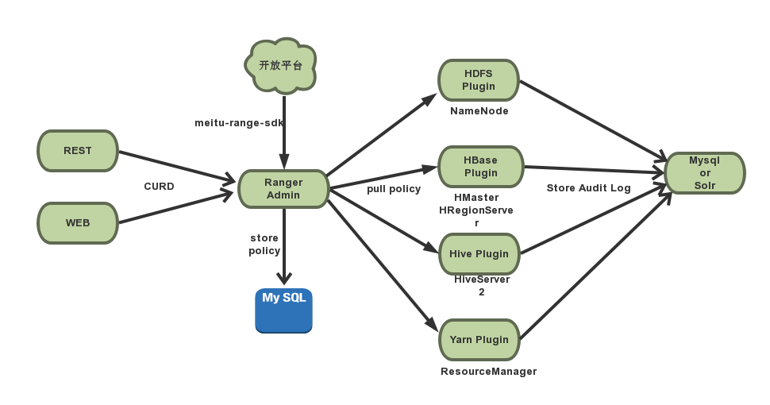
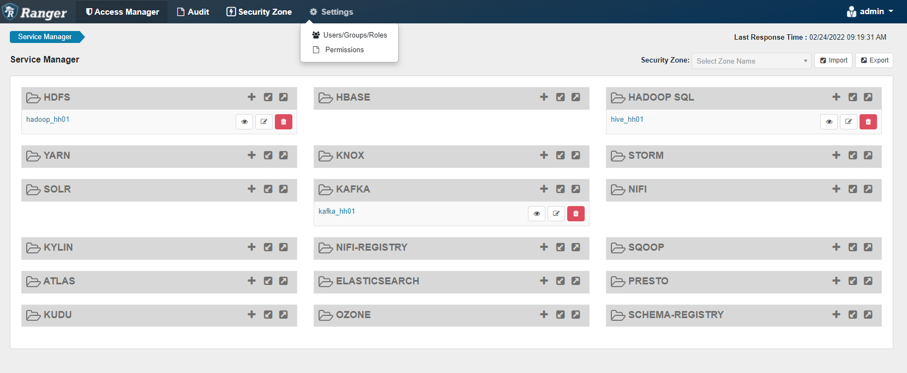
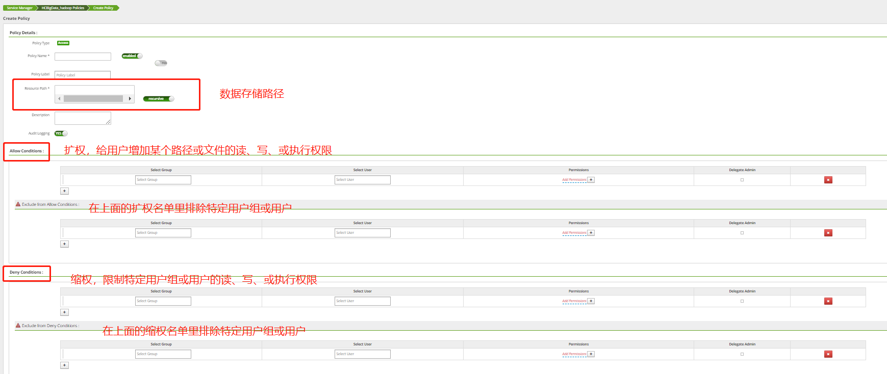

# Ranger

> Apache Ranger™ is a framework to enable, monitor and manage comprehensive data security across the Hadoop platform.

## 场景

Apache Ranger是一个Hadoop集群**数据安全管理**的框架，提供集中式的**授权管理及日志审计**。

- **提供了细粒度级（hive列级别）**
- **基于访问策略的权限模型**
- **权限控制插件式，统一方便的策略管理**
- **支持审计日志，可以记录各种操作的审计日志，提供统一的查询接口和界面**
- **丰富的组件支持(HDFS,HBASE,HIVE,YARN,KAFKA,STORM)**
- **支持和kerberos的集成**
- **提供了Rest接口供二次开发**

## 架构



### Ranger Admin

核心组件，独立的进程，RESTFUL形式提供用户及用户组、服务、策略的增删改查接口，同时内置一个Web管理页面。主要包括以下几个模块：

- 服务管理（service manager）：目前支持的服务有HDFS、Yarn、Hive、HBase、Kafka、Storm、Knox、Solr、Nifi等服务；

- 服务（service）：通过某一个服务管理如HDFS，创建一个服务service，如hadoopdev，通过这个服务，ranger控制台和具体环境的hdfs相关联；

- 策略（policy）：有了某个服务后，如hadoop，可以用这个服务创建相关的策略来管理权限；

- 审计管理（audit）：对所做的操作及权限进行审计，通过界面可以看到操作日志信息；

- 用户和用户组管理（users and groups）：可以增加删除修改用户或用户组信息以便对这些用户或用户组设置权限。



### Ranger XXX Plugin

嵌入到各系统执行流程中，**定期从RangerAdmin拉取策略，根据策略执行访问决策树，并且记录访问审计**

| 插件名称     | 安装节点              |
| ------------ | --------------------- |
| Hdfs-Plugin  | NameNode              |
| Hbase-Plugin | HMaster+HRegionServer |
| Hive-Plugin  | HiveServer2           |
| Yarn-Plugin  | ResourceManager       |

策略优先级：

- **黑名单排除 > 黑名单 >白名单**
- **白名单排除优先级高于白名单**

### Ranger UserSync

用户及用户组同步组件，独立的进程，支持Linux（Unix）本地用户、LDAP 及AD（windows的用户域）的用户及用户组信息同步到Ranger数据库。

### Ranger SDK

对接开放平台，实现对用户、组、策略的管理


## 权限模型

### 用户-资源-权限

- 用户：User或者Group；
- 资源：不同组件对应的业务资源不一样；
- 权限：由AllowACL和DenyACL来表达，类似黑白名单的机制；

| 插件名称 | 权限项                                                    |
| -------- | --------------------------------------------------------- |
| Hdfs     | Read Write Execute                                        |
| Hbase    | Read Write Create Admin                                   |
| Hive     | Select Create Update Drop Alter Index Lock Read Write All |
| Yarn     | submit-app admin-queue                                    |

### 实现

数据库设计


## 使用

### 插件安装

本质上是通过读取安装ranger插件时生成的配置文件以及插件自带的jar包，通过实现可扩展接口或代码注入方式来实现逻辑**嵌入到各个服务组件**，达到权限管理。

安装服务组件插件过程中，当执行`./enable-xxx-plugin.sh`时，主要执行了以下三个步骤：

（1）将插件自带的`conf`更新到安装的服务组件`conf`目录下，并修改相应的服务`conf`属性；

（2）将插件自带的lib更新到安装的服务组件`lib`目录下；

（3）将`install.properties`生成`.xml`文件，更新到安装的服务组件`conf`目录下。


### HDFS

#### HDFS配置

```xml
<property>
    <name>dfs.permissions.enabled</name>
    <value>true</value>
</property>
<property>
    <name>dfs.permissions</name>
    <value>true</value>
</property>
<property>
    <name>dfs.namenode.inode.attributes.provider.class</name>
    <value>org.apache.ranger.authorization.hadoop.RangerHdfsAuthorizer</value>
</property>
```

#### Ranger界面配置



### HBase

```xml
<property>
    <name>hbase.security.authorization</name>
    <value>true</value>
</property>
<property>
    <name>hbase.coprocessor.master.classes</name>
   <value>org.apache.ranger.authorization.hbase.RangerAuthorizationCoprocessor</value>
</property>
<property>
    <name>hbase.coprocessor.region.classes</name>
    <value>org.apache.ranger.authorization.hbase.RangerAuthorizationCoprocessor</value>
</property>
```

### Hive

```xml
<property>
    <name>hive.security.authorization.enabled</name>
    <value>true</value>
</property>
<property>
    <name>hive.security.authorization.manager</name>
    <value>org.apache.ranger.authorization.hive.authorizer.RangerHiveAuthorizerFactory</value>
</property>
```

### Yarn

```xml
<property>
    <name>yarn.acl.enable</name>
    <value>true</value>
</property>
<property>
    <name>yarn.authorization-provider</name>
    <value>org.apache.ranger.authorization.yarn.authorizer.RangerYarnAuthorizer</value>
</property>
```
