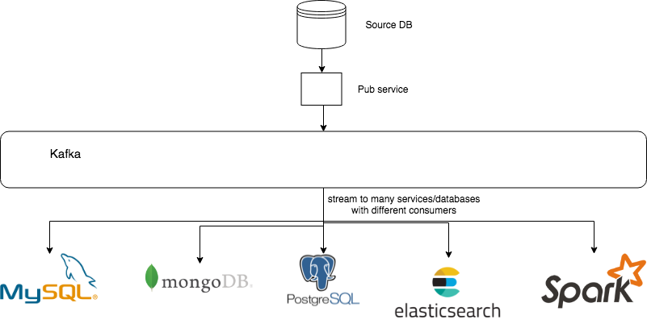

# CDC(Change Data Capture)

监测并捕获数据库的变动（包括数据或数据表的插入，更新，删除等），将这些变更按发生的顺序完整记录下来，写入到消息中间件中以供其他服务进行订阅及消费。

## 流程图

## 整体架构

### 数据源

数据库（即数据源）需要能完整地记录或输出数据库的事件（数据或数据表的变动）。

| 数据库名称 | 记录数据库时间的的机制                                       |
| ---------- | ------------------------------------------------------------ |
| MySQL      | [binlog](https://dev.mysql.com/doc/en/mysqlbinlog.html)      |
| PostgreSQL | [Streaming Replication Protocol](https://www.postgresql.org/docs/current/static/logicaldecoding-walsender.html) |
| MongoDB    | [oplog](https://docs.mongodb.com/manual/core/replica-set-oplog) |
| Oracle     | ogg                                                          |

### 发布服务（生产者）

解析数据源输出的流式数据，序列化成统一的封装格式，并输出到数据总线中。

| 名称                                                      | 支持的数据库                                   | 输出源                 | 数据格式 |
| --------------------------------------------------------- | ---------------------------------------------- | ---------------------- | -------- |
| [zendesk/maxwell](https://github.com/zendesk/maxwell)     | MySQL                                          | Kafka, RabbitMQ, Redis | JSON     |
| [debezium/debezium](https://github.com/debezium/debezium) | MySQL，MongoDB，PostgreSQL，Oracle，SQL Server | Kafka                  | Avro     |
| [alibaba/canal](https://github.com/alibaba/canal)         | MySQL                                          | Kafka, RocketMQ        | JSON     |

Apache Pulsar是存算分离的下一代消息队列/流式消息系统，支持CDC connector有：

- canal
- Debezium MySQL，MongoDB，PostgreSQL

### 数据总线（消息中间件）

数据总线这部分是一个消息中间件，大部分做 CDC 都会选用 Kafka（未来可能是**Apache Pulsar**）。

### 消费者

消费者部分根据场景而不同，通常只要使用**相应消息队列的客户端库实现消费者**，根据生产者生成的消息格式进行解析处理。
