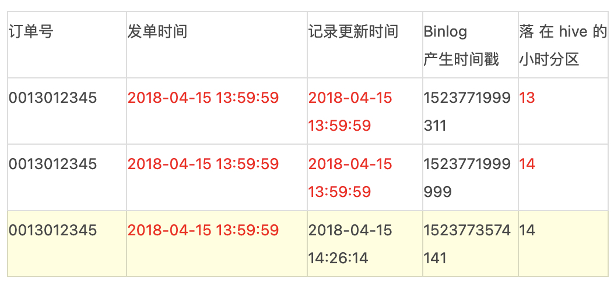

# 数据同步

## 对比

| 特征           | Apache SeaTunnel                                             | Datax          | Chunjun                            | Byzer          |
| :------------- | :----------------------------------------------------------- | :------------- | :--------------------------------- | :------------- |
| 引擎版本       | 2.3.1版本： Spark>=2.4.0，Flink>=1.12.0；  2.3.1之前版本： Spark>=2 and <3， Flink >=1.12 and<1.14 | 无依赖         | Flink1.8X-Flink1.12.X,高版本支持差 | Spark <= 3.3.0 |
| 开源协议       | Apache License                                               | Apache License | Apache License                     | Apache License |
| 语言           | java                                                         | java           | java                               | scala/java     |
| 引擎依赖       | 引擎解耦，可选Spark、 Flink、SeaTunnel Engine                | 无依赖         | Flink                              | Spark          |
| 支持执行模式   | 流/批                                                        | 批             | 流/批                              | 流/批          |
| 部署难度       | 较易                                                         | 较易           | 较易                               | 较易           |
| 精准一次性语义 | 部分连接器支持                                               | 不支持         | 部分连接器支持                     |                |

| 类型         | 数据源        | Apache SeaTunnel | Datax | Chunjun        | Byzer |
| :----------- | :------------ | :--------------- | :---- | :------------- | :---- |
| 类型         | 数据源        | Apache SeaTunnel | Datax | Chunjun        | Byzer |
| batch        |               |                  |       |                |       |
| 关系型数据库 | JDBC          | 读/写            | 读/写 | 部分数据库支持 | 读/写 |
| NoSQL数据库  | MongoDB       | 读/写            | 读/写 | 读/写          | 读    |
|              | Elasticsearch | 读/写            | 写    | 读/写          | 读    |
|              | Hbase         | 写               | 读/写 | 读/写          | 读    |
|              | Neo4j         | 读/写            | ×     | ×              | ×     |
|              | ...           |                  |       |                |       |
| 数仓数据存储 | Hive          | 读/写            | 读/写 | 写             | 读/写 |
|              | ClickHouse    | 读/写            | 写    | 读/写          | ×     |
|              | ApacheDoris   | 写               | 写    | 写             | ×     |
|              | ...           |                  |       |                |       |
| 文件数据源   | Text          | 读/写            | 读/写 | ×              | 读/写 |
|              | Csv           | 读/写            | 读/写 | ×              | 读/写 |
|              | Json          | 读/写            | ×     | ×              | 读/写 |
|              | Parquet       | 读/写            | ×     | ×              | 读/写 |
|              | orc           | 读/写            | ×     | ×              | ×     |
|              | ...           |                  |       |                |       |
| 时序数据库   | TDengine      | 读/写            | 读/写 | ×              | ×     |
|              | InfluxDB      | 读/写            | ×     | ×              | ×     |
| stream       |               |                  |       |                |       |
|              | http          | 读/写            | ×     | ×              | ×     |
|              | Mysql CDC     | 读               | ×     | mysql5.x       | 读    |
|              | Rabbitmq      | 读/写            | ×     | ×              | ×     |
|              | Sql Server    | 读               | ×     | 读             | ×     |
|              | Kafka         | 读/写            | ×     | 读/写          | 读/写 |
|              | ...           |                  |       |                |       |

|               | 优点                                                         | 缺点                                                   |
| ------------- | ------------------------------------------------------------ | ------------------------------------------------------ |
| **Byzer**     | 部署简单，支持流批；万物皆表；支持的数据源较多               | 强依赖Spark                                            |
| **Chunjun**   | 部署简单，支持流批                                           | 强依赖Flink，不支持高版本的Flink                       |
| **Datax**     | 无依赖，部署简单，相对比较稳定；支持的数据源较多             | 不支持流                                               |
| **Seatunnel** | 底层执行引擎可解耦，部署简单，支持流和批；支持数据源种类多；由于其高度封装的计算引擎架构，可以很好的与中台进行融合，对外提供分布式计算能力 | 最高版本支持spark、flink高版本，可能存在当前版本不稳定 |

## 类型

### 全量同步

**通过SparkSQL或者Flink SQL直连MySQL去Select表中的数据，将数据插入（覆盖）到Hive表**中。缺点如下：

- 性能瓶颈：随着业务规模的增长，Select From MySQL -> Spark -> Load to Hive这种数据流花费的时间越来越长，无法满足下游数仓生产的时间要求；
- 直接从MySQL中Select大量数据，对MySQL的影响非常大，容易造成慢查询，影响业务线上的正常服务；
- 由于需要清楚目标表所有数据，目标库一段时间内查不到数据。

### 增量同步

如果表中有时间戳，可以**通过时间戳过滤数据**，并插入到Hive表中，缺点如下：

- MySQL中发生 **Update/Delete 的数据无法很好地进行支持**；
- **表的Schema变更，无法很好支持**；

### 实时同步

[CDC（Change Data Capture）](./CDC.md)+ Merge的技术方案。

### 数据湖

针对**表的schema变更、需要保留表**的历史版本，可以通过数据湖进行存储实现，比如Apache Hudi、Apache Iceberge等。

## 校验

保障整个Binlog链路中数据完整性，记录着整个数据通道每一个流程的数据信息，如某一段时间内的数据总和等，包含以下功能：

- 为数据回溯提供元数据支持
- 校验数据丢失与延迟情况
- 校验数据完整性

## 细节

### 数据飘移的支持

存在很多类似的两种case，其采集周期存在一定的不确定性：

**case 1：**订单的Binlog日志中，当订单事件的更新时间在59分59秒左右时，数据有可能会落在下一个小时的分区，以至于当前小时数据没有统计到该条订单，同时下一个小时分区的数据也没有打上相应的事件标签。

**case 2：**支付结算系统，当天所有交易记录会在次日凌晨后结算完成，按照默认采集逻辑，当天的记录落在次日的变更内，无法有效支持当天核算。

解决方案：

- 能根据发单时间戳进行分区么？

- 按需配置偏移量。比如小时粒度默认为00:00 - 59:59之间的数据，配置5min的偏移，那么数据区间为00:00 - 04:59（次小时），多出来的部分可以有效解决数据漂移功能，同时为及时性提供了有效支撑。

### 分库分表的支持

分库分表的诉求，其规则也可能多种多样，如table_{城市区号}，table_{连续数字}，table_{日期}，如果逐个抽取并聚合，上下游的成本巨大。因此我们需要在数据规范层面，数据链路上保障能自动化收集这类数据。

- 默认情况下一个库的数据会收集到一个topic内，如果有分库存在也可以一并收集到一个topic内，保证逻辑上分库分表的数据物理上收集到一起。
- 按照/{db}/{table}/{year}/{month}/{day}/{hour}的路径结构（其中日期由Binlog时间格式化生成）落地到HDFS上，一个逻辑表的数据存储在一起。
- ETL处理阶段，取出上述路径下的Binlog日志，还原到Hive中。
