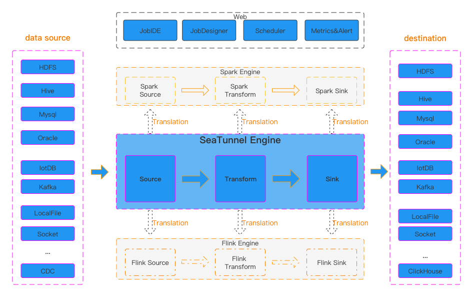

# [Apache Seatunnel](https://github.com/apache/seatunnel)

> 来自中国的数据集成平台成功进入 Apache 孵化器的项目。
>
> a distributed, high-performance data integration platform for the synchronization and transformation of massive data (offline & real-time).

## 架构

