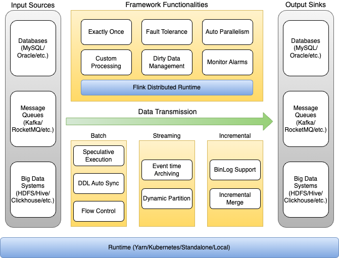

# [BitSail](https://github.com/bytedance/bitsail)

> 一款基于分布式架构的高性能数据集成引擎，支持多种异构数据源间的数据同步。
>
> 目前 BitSail 仅支持本地和Yarn上部署（2022/12/7），原生kubernetes）将在不久后支持。
>
> 仅支持flink的 `yarn-per-job` 模式提交

## 功能

**构数据源同步**：支持多种异构数据源间高性能、高可靠的海量数据同步，并支持不同数据源类型之间的转换

**湖仓一体**：支持**流批一体、湖仓一体**架构，用一套框架覆盖几乎所有数据同步场景

**分布式架构**：基于Hadoop生态，支持分布式水平扩展，通过一套架构解决**批式、流式、增量、全量**场景下的数据同步

**DDL自动同步**：支持上下游数据源之间灵活的表结构同步，包括表创建和列级别的增、删、改

**脏数据收集**：支持脏数据收集展示，并支持扩展脏数据存储方式

**高效开发**：独立于引擎的读写接口，开发成本低

## 架构

> Source[Input Sources] -> Framework[Data Transmission] -> Sink[Output Sinks]

- 框架层提供丰富的基础功能，并对所有同步场景生效，比如脏数据收集、自动并发度计算、流控、任务监控等

## 支持的数据源

| DataSource                       | Reader | Writer |
| -------------------------------- | ------ | ------ |
| Doris                            |        | ✅      |
| Druid                            |        | ✅      |
| ElasticSearch                    |        | ✅      |
| Fake                             | ✅      |        |
| FTP/SFTP                         | ✅      |        |
| Hive                             | ✅      | ✅      |
| Hadoop                           | ✅      | ✅      |
| HBase                            | ✅      | ✅      |
| Hudi                             | ✅      | ✅      |
| JDBC(MySQL/Oracle/PG/SQLServer） | ✅      | ✅      |
| Kafka                            | ✅      | ✅      |
| Kudu                             | ✅      | ✅      |
| MongoDB                          | ✅      | ✅      |
| Print                            |        | ✅      |
| Redis                            |        | ✅      |
| RocketMQ                         |        | ✅      |

## 安装

## 任务配置