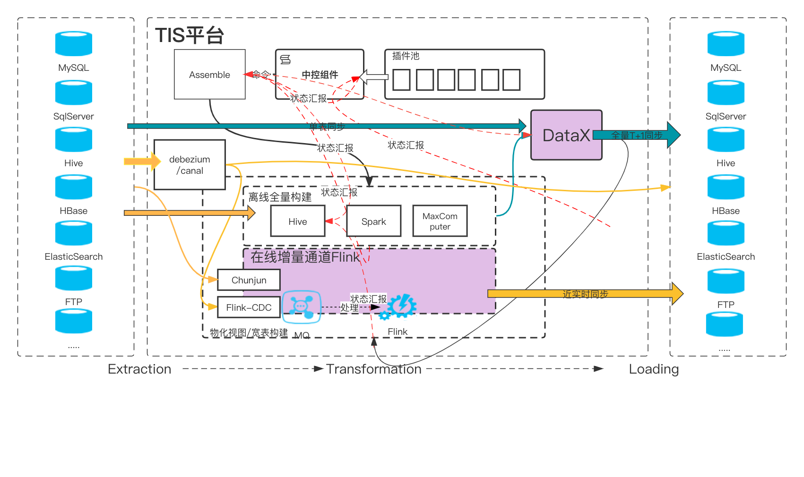

# [tis](https://github.com/qlangtech/tis)

> Support agile DataOps Based on **DataX** and **Flink-CDC**, **Chunjun** with **Web-UI**.

最新版本的TIS数据抽取组件是基于：

- [Alibaba DataX](https://github.com/alibaba/DataX)，并且在原生DataX之上添加了功能特性大大提高了DataX的可用性
- 实时数据同步框架 Flink-CDC 和 [Chunjun](./chunjun.md)

## 架构

## 读写

支持的数据库读写以及对应的底层实现：

| 类型          | 批量(DataX) |       | 实时             |                |
| ------------- | ----------- | ----- | ---------------- | -------------- |
|               | 读          | 写    | Source           | Sink           |
| Doris         |             | DataX |                  | ChunJun        |
| ElasticSearch |             | DataX |                  | TIS            |
| TiDBDataX     | DataX       |       |                  |                |
| RocketMQ      |             |       | TIS              |                |
| **Kafka**     |             |       | TIS              |                |
| Postgres      | *DataX*     | DataX | ChunJun          | ChunJun        |
| Oracle        | DataX       | DataX | ChunJun          | ChunJun        |
| FTP           | DataX       | DataX |                  |                |
| Clickhouse    |             | DataX |                  | ChunJun        |
| SqlServer     | DataX       | DataX |                  |                |
| **HDFS**      | DataX       | DataX |                  |                |
| **MySQL**     | DataX       | DataX | ChunJun/FlinkCDC | ChunJunChunJun |
| AliyunOSS     | DataX       | DataX |                  |                |
| **Hudi**      |             | TIS   |                  | TIS            |
| StarRocks     |             | DataX |                  | TIS            |
| MongoDB       | DataX       | DataX | FlinkCDC         |                |
| Cassandra     | DataX       | DataX |                  |                |
