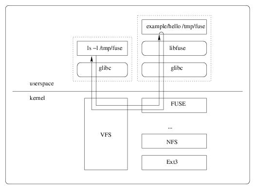

[toc]

# FUSE

> 用户空间文件系统（Filesystem in Userspace），用户可通过fuse在用户空间来定制实现自己的文件系统。

## 介绍

现存文件系统难以满足用户的特别需求，内核下定制开发文件系统难度较高，在用户空间可定制实现文件系统是有需求的。并且，用户空间下调试工具丰富，出问题不会导致系统崩溃，开发难度相对较低，开发周期较短。

fuse本身是**内核提供的一个功能**，内核开启fuse支持后，会在`/dev/fuse`设备节点（`char service`），应用层可以通过该设备节点完成用户态文件系统。

### 原理图

完整的fuse功能包括

a）用户态customize文件系统

b）用户态fuse库（libfuse）

c）内核支持（fs/fuse/*）

共3层结构协作完成。

### 调用过程

/mnt/fuse目录已经挂载了ZFUSE，准备在/mnt/fuse目录下创建第一个文件my.log。

1）ZFUSE挂载到/mnt/fuse，libfuse会fork出后台进程，用于读取管道文件消息。

2）用户使用ZFUSE文件系统，创建文件my.log

3）调用系统调用

4）经VFS交由fuse处理

5）fuse下的create处理，向管道发送带创建操作（FUSE_CREATE）的消息，当前进程A加入等待队列

6）libfuse下创建的后台进程读取到消息，解析操作数为FUSE_CREATE，对应到fuse_lib_create，即low level层接口。

7）fuse_lib_create中调用ZFUSE的上层接口zfuse.create，由ZFUSE来实现创建操作

8）完成创建后，通过libfuse中的fuse_reply_create向管道发送完成消息从而唤醒之前加入等待队列的进程A

9）进程A得到创建成功的消息，系统调用结束，/mnt/fuse/my.log文件创建成功

## [libfuse](https://github.com/libfuse/libfuse)

> The reference implementation of the Linux FUSE (Filesystem in Userspace) interface

## Java 的 Fuse

#### [jnr-fuse](https://github.com/SerCeMan/jnr-fuse)(Not Recommend)

>  FUSE implementation in Java using Java Native Runtime (JNR).
>
>  - 个人项目，活跃性较差，最新版本 2021 年 0.5.7.

基于 Jnr-Fuse 和 libfuse 实现的 Java Fuse。

- 定义自己的文件系统，只需要继承`FuseStubFS `类，并实现相关接口即可；

### [alluxio(jni-fuse)](https://github.com/Alluxio/alluxio)

> alluxio 的 jnr-fuse 和 jni-fuse 的性能对比见： [Alluxio FUSE 实现原理](https://zhuanlan.zhihu.com/p/361151559)

### [hcfs-fuse](https://github.com/opendataio/hcfsfuse)

> a fuse program which can access any hcfs(hadoop compatiable file system) implemented file system. Such as local filesystem, hdfs, ozone, alluxio, oss, cos, s3, and so on.

实现原理：基于 Hadoop FileSystem 实现了 Fuse 的接口，Fuse 支持

- [jnr-fuse](#jnr-fuse(Not Recommend))：使用 jnr-fuse，实现了`FuseStubFS`；
- [jni-fuse](#alluxio(jni-fuse))：使用 Alluxio 提供的 jni-fuse，实现了`AbstractFuseFileSystem `；