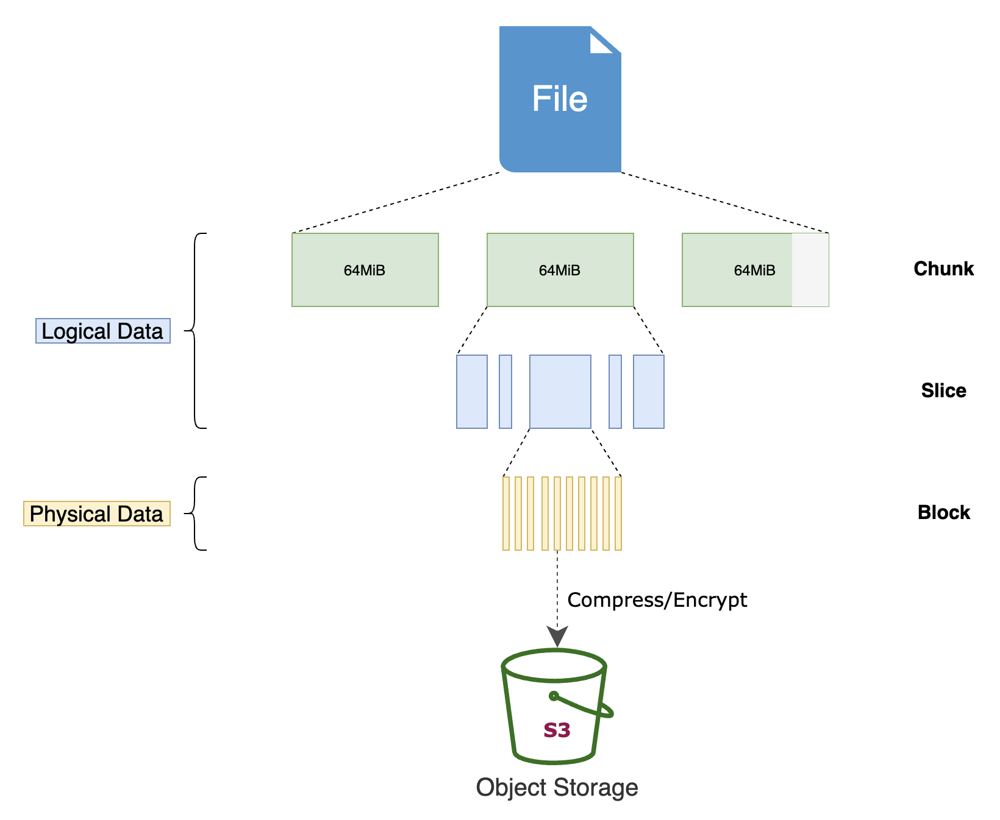

# JuiceFS

源码地址：https://github.com/juicedata/juicefs，Go语言开发。

## 场景

海量数据设计的分布式文件系统，使用对象存储来做数据持久化。云端共享文件系统，POSIX、HDFS、NFS 兼容。

云端，主流的存储是对象存储，在计算/存储分离的情况下，大数据计算框架（MR、Spark等）需要进行对象存储的适配。

文件系统：

**JuiceFS 则是把这些改进进一步抽象和产品化，让它们能够更好地服务于包括大数据在内的更多场景，帮助更多的公司改善云上大数据体验，而不用重复地去解决 S3 等对象存储带来的问题。**

- **大数据分析**：HDFS 兼容，没有任何特殊 API 侵入业务；与主流计算框架（Spark, Hadoop, Hive等）无缝衔接；无限扩展的存储空间；运维成本几乎为 0；完善的缓存机制，高于对象存储性能数倍。
- **机器学习**：POSIX 兼容，可以支持所有机器学习、深度学习框架；共享能力提升团队管理、使用数据效率。
- **容器集群中的持久卷**：Kubernetes CSI 支持；持久存储并与容器生存期独立；强一致性保证数据正确；接管数据存储需求，保证服务的无状态化。
- **共享工作区**：没有 VPC 限制，可以在任意主机挂载；没有客户端并发读写限制；POSIX 兼容已有的数据流和脚本操作。
- **数据备份**：POSIX 是运维工程师最友好的接口；无限平滑扩展的存储空间；跨云跨区自动复制；挂载不受 VPC 限制，方便所有主机访问；快照（snapshot）可用于快速恢复和数据验证。

## 特性

1. **POSIX 兼容**：像本地文件系统一样使用，无缝对接已有应用，无业务侵入性；
2. **HDFS 兼容**：完整兼容 [HDFS API](https://www.juicefs.com/docs/zh/community/hadoop_java_sdk)，提供更强的元数据性能；
3. **S3 兼容**：提供 [S3 网关](https://www.juicefs.com/docs/zh/community/s3_gateway) 实现 S3 协议兼容的访问接口；
4. **云原生**：通过 [CSI Driver](https://www.juicefs.com/docs/zh/community/how_to_use_on_kubernetes) 轻松地在 Kubernetes 中使用 JuiceFS；
5. **分布式设计**：同一文件系统可在上千台服务器同时挂载，高性能并发读写，共享数据；
6. **强一致性**：确认的文件修改会在所有服务器上立即可见，保证强一致性；
7. **强悍性能**：毫秒级延迟，近乎无限的吞吐量（取决于对象存储规模），查看[性能测试结果](https://www.juicefs.com/docs/zh/community/benchmark/)；
8. **数据安全**：支持传输中加密（encryption in transit）和静态加密（encryption at rest），[查看详情](https://www.juicefs.com/docs/zh/community/security/encrypt)；
9. **文件锁**：支持 BSD 锁（flock）和 POSIX 锁（fcntl）；
10. **数据压缩**：支持 [LZ4](https://lz4.github.io/lz4) 和 [Zstandard](https://facebook.github.io/zstd) 压缩算法，节省存储空间。

### 可观测性

JuiceFS 可以通过**自身的日志和分析工具**很清晰的展示出上层应用对存储的所有访问细节，**每个接口访问的关系，消耗的时间**，通过下面图形化的方式，一看就很容易发现到底是存储系统慢，还是上层应用的调用存储 API 的方式错了，造成了阻塞。

## 架构

Google File System的实现：

JuiceFS的实现三要素：

**将元数据服务改造为支持多引擎的插件式架构，可以利用已有的开源数据库实现元数据存储。**

Redis 作为第一个开源存储引擎：

1. 是全内存的，可以满足元数据的低延时和高 IOPS 要求；
2. 支持乐观事务，能够满足文件系统元数据操作的原子性要求；
3. 有丰富的数据结构，易于实现文件系统的诸多 API；
4. 有着非常广泛的社区和成熟的生态，运维 Redis 不会是一个问题；

### 元数据服务

元数据服务是个集群，通过 [Raft](https://raft.github.io/) 算法实现高可用并同时保证数据的强一致性。 元数据服务是专为文件系统优化的服务，非常高效和稳定。

*元数据（metadata）包含文件名、文件大小、权限组、创建修改时间和目录结构。*

### 挂载客户端

 `jfsmount`, 它**负责跟元数据服务和对象存储通信**，并通过 FUSE 实现 POSIX API。

使用内置的 API（open, read, write 等）访问数据时，会在底层通过系统调用经过**内核中的 VFS 以及 FUSE 模块转发到 `jfsmount`**, 再请求元数据服务或者对象存储完成操作。

## 原理

### 存储方式

JuiceFS 会将数据格式化以后存储在对象存储（云存储），同时会将数据对应的元数据存储在 Redis 等数据库中。

任何存入 JuiceFS 的文件都会被拆分成固定大小的 **"Chunk"**，默认的容量上限是 64 MiB。

每个 Chunk 由一个或多个 **"Slice"** 组成，Slice 的长度不固定，取决于文件写入的方式。

每个 Slice 又会被进一步拆分成固定大小的 **"Block"**，默认为 4 MiB。最后，这些 Block 会被存储到对象存储。

与此同时，JuiceFS 会将每个文件以及它的 Chunks、Slices、Blocks 等元数据信息存储在元数据引擎中。

使用 JuiceFS，文件最终会被拆分成 Chunks、Slices 和 Blocks 存储在对象存储。

### 写入流程

在处理写请求时，JuiceFS 先将数据写入 Client 的内存缓冲区，并在其中按 Chunk/Slice 的形式进行管理。

Chunk 是根据文件内 offset 按 64 MiB 大小拆分的连续逻辑单元，不同 Chunk 之间完全隔离。

每个 Chunk 内会根据应用写请求的实际情况进一步拆分成 Slices；当新的写请求与已有的 Slice 连续或有重叠时，会直接在该 Slice 上进行更新，否则就创建新的 Slice。

Slice 是启动数据持久化的逻辑单元，其在 flush 时会先将数据按照默认 4 MiB 大小拆分成一个或多个连续的 Blocks，并上传到对象存储，每个 Block 对应一个 Object；然后再更新一次元数据，写入新的 Slice 信息。

使用 1 MiB IO 顺序写 1 GiB 文件，数据在各个组件中的形式如下图所示：

> 图中的压缩和加密默认未开启。欲启用相关功能需要在 format 文件系统的时候添加 `--compress value` 或 `--encrypt-rsa-key value` 选项。

大文件内随机写的情况要复杂许多；每个 Chunk 内可能存在**多个不连续**的 Slice，使得一方面数据对象难以达到 4 MiB 大小，另一方面元数据需要多次更新。同时，当一个 Chunk 内已写入的 Slices 过多时，会触发 Compaction 来尝试合并与清理这些 Slices，这又会进一步增大系统的负担。因此，JuiceFS 在此类场景下会比顺序写有较明显的性能下降。

小文件的写入通常是在文件关闭时被上传到对象存储，对应 IO 大小一般就是文件大小。

对于这种不足一个 Block 的对象，JuiceFS 在上传的同时还会尝试写入到本地 Cache（由 `--cache-dir` 指定，可以是内存或硬盘），以期能提升后续可能的读请求速度。

由于写请求写入 Client 内存缓冲区即可返回，因此通常来说 JuiceFS 的 Write 时延非常低（几十微秒级别），**真正上传到对象存储的动作由内部自动触发（单个 Slice 过大，Slice 数量过多，缓冲时间过长等）或应用主动触发（关闭文件、调用 `fsync` 等）**。缓冲区中的数据只有在被持久化后才能释放，因此当写入并发比较大或者对象存储性能不足时，有可能占满缓冲区而导致写阻塞。具体而言，缓冲区的大小由挂载参数 `--buffer-size` 指定，默认为 300 MiB；其实时值可以在指标图的 usage.buf 一列中看到。

#### 回写（Writeback）模式

当对**数据的一致性和可靠性要求并不高**时，还可以在挂载时添加 `--writeback` 以进一步提升系统性能。回写模式开启后，Slice flush 仅需写到本地 Staging 目录（与 Cache 共享）即可返回，**数据由后台线程异步上传到对象存储**。请注意，JuiceFS 的回写模式与通常理解的先写内存不同，是需要将数据写入本地 Cache 目录的（具体的行为根据 Cache 目录所在硬件和本地文件系统而定）。换个角度理解，此时本地目录就是对象存储的缓存层。

回写模式开启后，还会默认跳过对上传对象的大小检查，激进地尽量将所有数据都保留在 Cache 目录。这在一些会产生大量中间文件的场景（如软件编译等）特别有用。此外，JuiceFS v0.17 版本还新增了 `--upload-delay` 参数，用来延缓数据上传到对象存储的时间，以更激进地方式将其缓存在本地。如果在等待的时间内数据被应用删除，则无需再上传到对象存储，既提升了性能也节省了成本。同时相较于本地硬盘而言，JuiceFS 提供了后端保障，在 Cache 目录容量不足时依然会自动将数据上传，确保在应用侧不会因此而感知到错误。这个功能在应对 Spark shuffle 等有临时存储需求的场景时非常有效

### 读取流程

JuiceFS 在处理读请求时，一般会**按照 4 MiB Block 对齐的方式去对象存储读取**，实现一定的预读功能。同时，**读取到的数据会写入本地 Cache 目录**，以备后用（如指标图中的第 2 阶段，blockcache 有很高的写入带宽）。显然，在顺序读时，这些提前获取的数据都会被后续的请求访问到，Cache 命中率非常高，因此也能充分发挥出对象存储的读取性能。此时数据在各个组件中的流动如下图所示：

**做大文件内随机小 IO 读取时，JuiceFS 的这种策略则效率不高**，反而会因为读放大和本地 Cache 的频繁写入与驱逐使得系统资源的实际利用率降低。不幸的是，此类场景下一般的缓存策略很难有足够高的收益。此时可考虑的一个方向是尽可能提升缓存的整体容量，以期达到能几乎完全缓存所需数据的效果；另一个方向则可以直接将缓存关闭（设置 `--cache-size 0`），并尽可能提高对象存储的读取性能。

**小文件的读取则比较简单，通常就是在一次请求里读取完整个文件**。由于小文件写入时会直接被缓存起来，因此类似 JuiceFS bench 这种写入后不久就读取的访问模式基本都会在本地 Cache 目录命中，性能非常可观。

## 性能

### HBase使用性能对比

YCSB 测试集，希望模拟线上生产环境中 HBase 集群恢复的场景，所以测试是在已经跑过一遍然后重启 HBase 的情况下进行。

#### 测试环境

- 使用 AWS EMR
- Core 节点 2 个，4 核 16G，500G EBS SSD
- Region server 内存 6G

#### 写入对比

S3 和 HDFS 写入性能基本一致。而 JuiceFS 则有大约 70% 的提升。 由于 HBase 使用的是 LSM 树，它会使用日志文件和一个内存存储结构把随机写操作转换为顺序写，因此主要考验的就是文件系统的顺序写能力，**JuiceFS 采用并发多线程写入，加上高性能的元数据能力**，所以比直接使用 S3 快很多。

#### 单条 GET 对比

可以看到，使用 S3 时启动非常缓慢，主要是因为**没有本地磁盘缓存**，需要依靠 HBase Bucket Cache（采用file模式） 来在磁盘上缓存数据，用来提高缓存命中率，而这部分数据在 RegionSever 重启后会丢失，所有的数据都必须去 S3 读取，需要大量时间重新预热。

JuiceFS 支持数据缓存，可以把热数据完全缓存在本地磁盘上面。因此在 HBase 重启时，热数据依然可以通过本地磁盘中的缓存快速启动。

如果使用 SSD 做本地缓存盘，可以天然实现冷热数据分离的效果，冷数据在使用很少的情况下会自动从缓存中被淘汰，热数据会一直留在本地缓存盘上。

**JuiceFS 在存储计算分离的情况下达到了 HDFS data locality 的性能水平**。

#### 更稳

使用 S3 做存储时，由于性能问题，WAL 并不能直接写在 S3 上，因此用户仍然需要额外维护一个 HDFS 集群来存放 WAL 数据。所以并没有彻底省去 HDFS 的搭建、监控、运维等工作量。

**S3 API 有一部分是最终一致性保证，且没有原子的 rename 操作。**