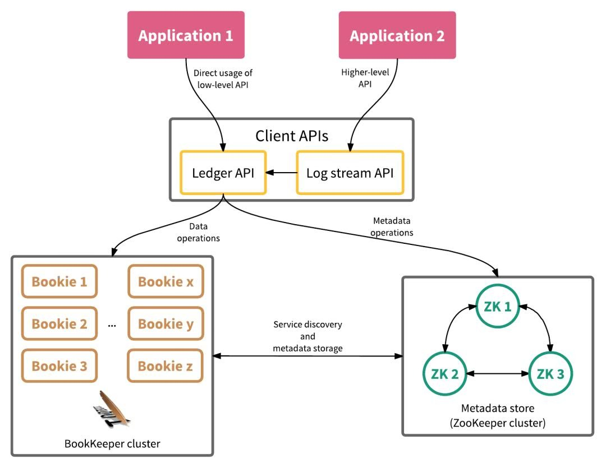
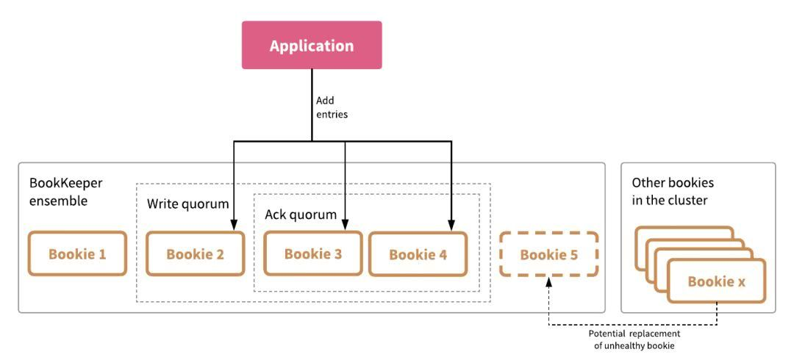

[toc]

# Apache Bookkeeper

> A scalable, fault-tolerant, and low-latency storage service optimized for real-time ( append-only )workloads.
>
> 提供日志条目流存储持久化的服务框架。

代码：https://github.com/apache/bookkeeper

## 场景

**流存储需求**

一个实时存储平台需要满足一下所有的需求：

- 客户端必须可以以**低延时（**小于5ms）读写流数据，即使同时还要确保数据的持久性存储
- 数据存储必须是持久的、一致的，以及可以容忍故障的
- 系统需要能够确保**数据读写顺序一致**
- 系统需要能够同时提供对**历史数据以及实时数据**的访问

## 概念

### entry(record) 

一条log，包含元数据，有如下字段：

| Field               | 类型   | 描述                    |
| ------------------- | ------ | ----------------------- |
| Ledger number       | long   | 属于的Ledger的ID标识    |
| Entry number        | long   | 标识自身的全局唯一ID    |
| Last confirmed (LC) | long   | 上一个entry的全局唯一ID |
| Data                | byte[] | 日志数据                |
| Authentication code | byte[] | 校验码                  |

### ledgers 

log流，BookKeeper中的基本存储单元。

一组Entries，每个**Entry有序的并且至多一次**写入到Ledgers中，Append-Only。

一旦写入Ledgers，将不能再修改。所以，写入保持有序写入是客户端应用应该考虑的事情。

### bookie 

每个独立的保存ledges的服务器。

### ensemble

一个Ensemble是一个Bookies集合，它们共同保存着一个Ledger的所有entries。通常一个Ensemble是整个Bookies集群的子集。

## 部署图



## 实现

### 复制

对所有数据都会复制和存储相同的多份拷贝——一般是三份或是五份——到不同的机器上，可以是同一数据中心，也可以是跨数据中心。

不像其他使用主/从或是管道复制算法在副本之间复制数据的分布式系统（例如Apache HDFS、Ceph、Kafka），Apache BookKeeper使用一种**多数投票并行复制算法在确保可预测的低延时的基础上复制数据**。



### Bookie中数据管理

管理数据以log-structured的形式，使用三种文件：journals, entry logs, index files。

#### Journals

存储BookKeeper的事务日志，在ledger发生更新前，bookie确定一条描述更新的事务被写道非易失性的存储中。

新的journal文件只在bookie启动时或者旧的journal文件到达阈值时才创建。

#### Entry logs

管理从BookKeeper客户端写入的entries，来自不同ledger的entries会被聚合并顺序写入，每个entry log的偏移以指针的形式存储在`ledger cache`中，以便快速查询。

新的entry log文件只在bookie启动时或者旧的entry log文件到达阈值时才创建。

旧的entry log文件当不跟任何active ledger关联时，会被GC Thread删除。

#### Index files

对每个ledger会创建一个索引文件，由一个header和多个index pages组成。索引页记录存储在entry log文件中数据的偏移量。

因为更新索引文件会带来随机的磁盘I/O，索引文件通过sync后台线程懒惰式更新（保证更新的速度）。在index pages持久化到磁盘前，需要被聚集到`ledger cache`中以便快速查询。

#### Ledger cache

Ledger indexes pages 缓存在内存池中，以便有效地管理磁盘头调度（allows for more efficient management of disk head scheduling)。


### Entries添加


### 元数据

第三方存储用于保存关于ledgers的信息还有可用的Bookies（相当于分布式协调）。
**目前BookKeeper利用ZooKeeper实现元数据存储**。


### Ledger管理者

ledger manager处理ledger的元数据（存储在ZK中），推荐使用Hierarchical Ledger Manager。

ZK存储路径：

```ini
# 如/{ledgers_root_path}/00/0000/L0001
{ledgers_root_path}/{level1}/{level2}/L{level3}
```

## API

### Ledger API

Ledger API提供了直接与Ledger交互的接口


### DistributedLog API

DistributedLog API不直接与ledger交互而是与Bookeeper集群交互

### 