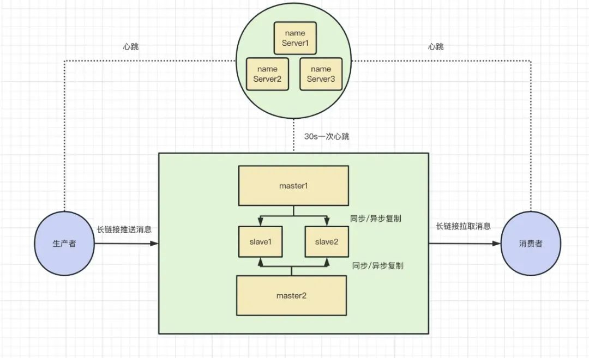
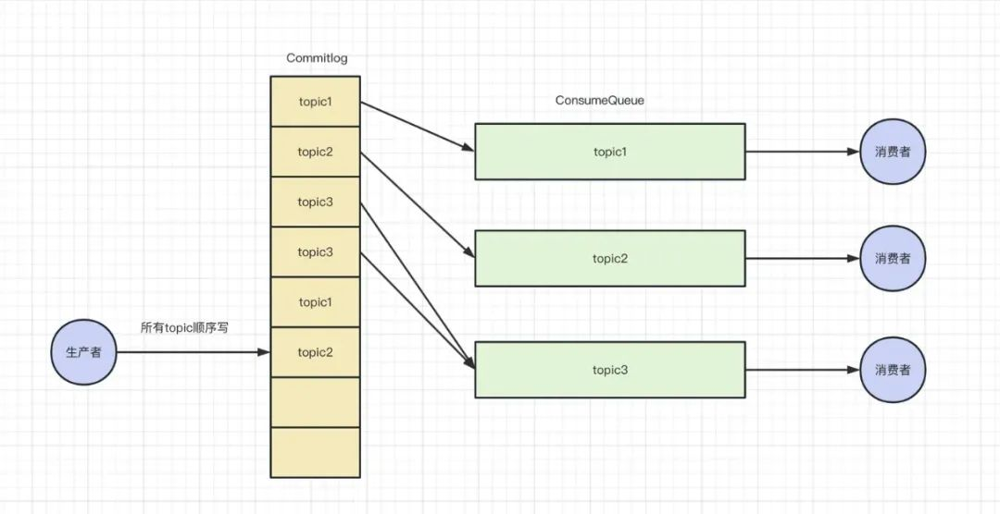
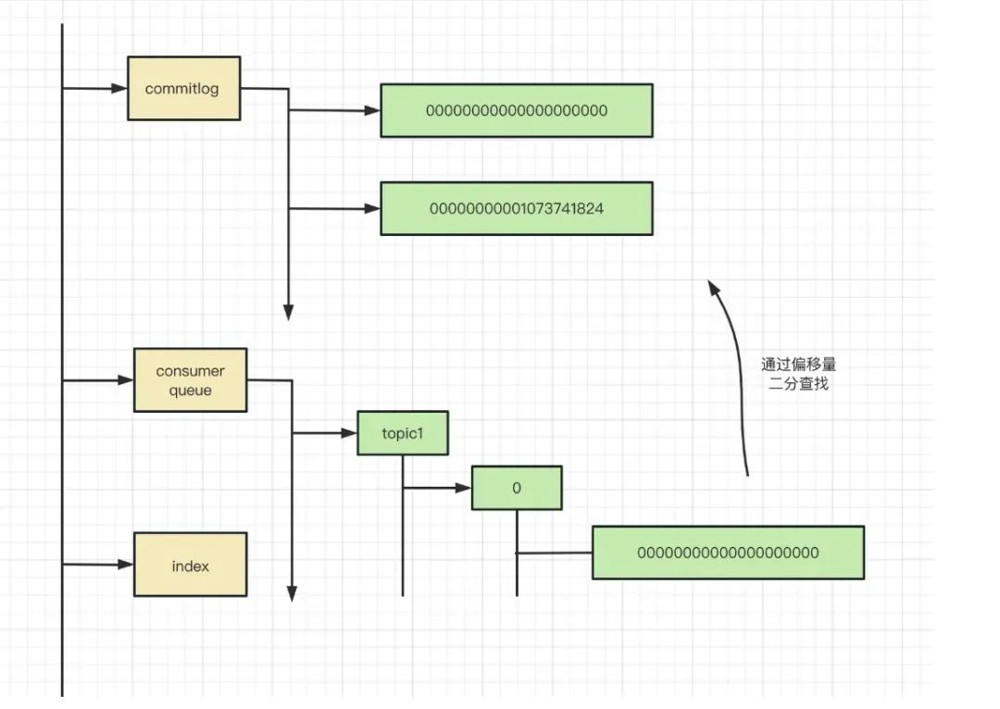
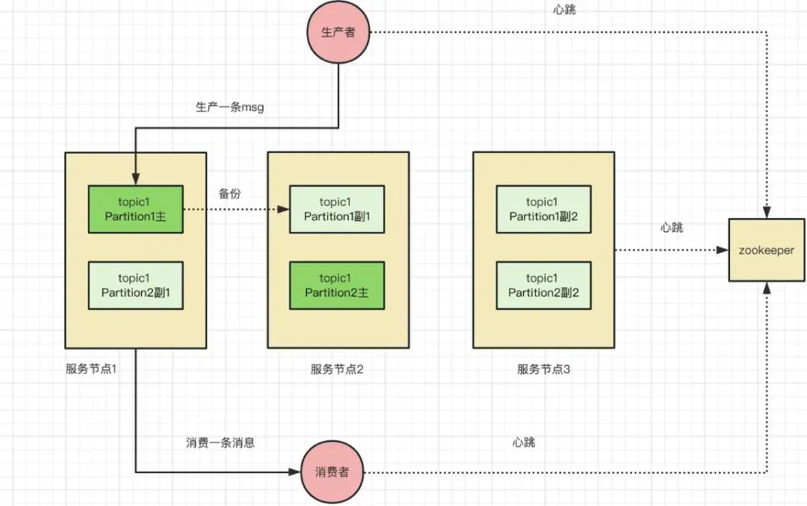
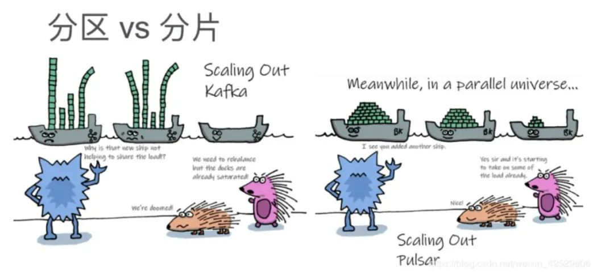
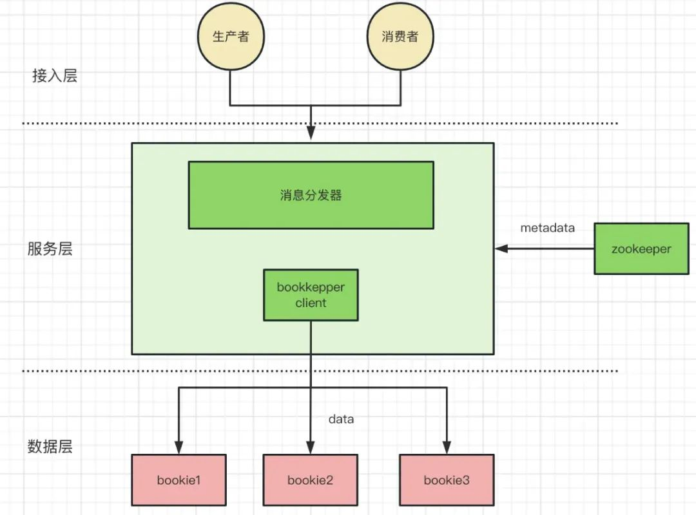

# 消息系统

（**解耦合**）2003 年到 2010 年之前：以 activemq 和 rabbitmq 为主的消息队列致力于解决**系统间解耦合和一些异步化的操作**的问题；

（**吞吐量与一致性**）2010 年到 2012 年期间：

- 大数据时代，消息队列设计的关键因素逐渐转向为吞吐量和并发程度，在日志收集和数据通道领域占据了重要地位。

- 阿里电商业务的兴起，Kafka 在可靠性、**一致性**、顺序消息、**事务消息**支持等方面已经无法满足阿里电商场景的需求，阿里的自研消息队列 RocketMQ；

（**平台化**）2012 以后：云计算、k8s、容器化等新兴的技术兴起，基本底层技术能力平台化，租户隔离机制、数据迁移、恢复、故障转移。

## 概念

主题（topic）

生产者（producer）

消费者（consumer）

分区（partition）

- 将大数据进行划分存储；

## 队列

### ActiveMQ（2003）

### RabbitMQ（2006）

### RocketMQ（2011）

元数据管理：轻量级的独立服务集群

**完全顺序写**：极致的消息写

- 将所有的 topic 消息存储在同一个文件中，确保所有消息发送时按顺序写文件，尽最大能力确保消息发送的高可用性与高吞吐量
- 不支持删除指定 topic 功能：对于某个 topic 的信息，在磁盘上的表现是一段非连续的区域

获取指定 topic 的信息：磁盘上的非连续的若干片段的高效率读取

- Commitlog：所有的消息都存储在 CommitLog 里面，单个 CommitLog 文件大小默认 1G
- ConsumeQueue （索引文件 1）：基于 topic 的 commitlog 索引文件
  - ConsumeQueue 里只存偏移量信息，大部分的 ConsumeQueue 能够被全部读入内存，速度极快

- IndexFile（索引文件 2，可选）：通过 key 或时间区间来查询消息，底层实现为 hash 索引

偏移量为什么是二分查找？？

## 流式

### Kafka（2010）

生产者数量为 1 ，消费者数量为 1 ，分区数为 2， 副本数为 3 ，服务节点数为 3 的架构图

- zookeeper：元数据存储，存储服务节点的信息以及路由信息；
- 分区的副本区分主从，写数据先写主分区，从分区（同步/异步复制）；

#### 局部顺序写

- 一个分区一个目录，数据追加写，其设计理念保证了 kafka 优秀的水平扩容能力；

磁盘顺序写盘：

- 追加写入的方式，顺序写盘

topic/partition 数量不能过大

- 单节点多个Partition目录，顺序写退化为随机写

### Pulsar（2012）

>  kafka 与 rocketmq，一个服务节点即是计算节点也是服务节点，节点有状态使得平台化、容器化困难、数据迁移、数据扩缩容等运维工作都变的复杂且困难。

kafka 对比 pulsar ：

- [Kafka扩容](https://zhuanlan.zhihu.com/p/106079497)：前两个节点已经满了，新加节点需要数据搬移和平衡，不能立即用。

  Pulsar：不同于 Kafka 物理和逻辑的绑定性，存储是平均分配的，每个 topic 分成小块，分布更均匀。加入新的节点后，可以立即使用

架构

**分层**：Pulsar 分离出了 **Broker（服务层）**和 **Bookie（存储层）**架构，**Broker 为无状态服务**，用于发布和消费消息，而 BookKeeper 专注于存储。

**分片** : 这种将存储从消息服务中抽离出来，使用**更细粒度的分片（Segment）**替代粗粒度的分区（Partition），为 Pulsar 提供了更高的可用性，更灵活的扩展能力。