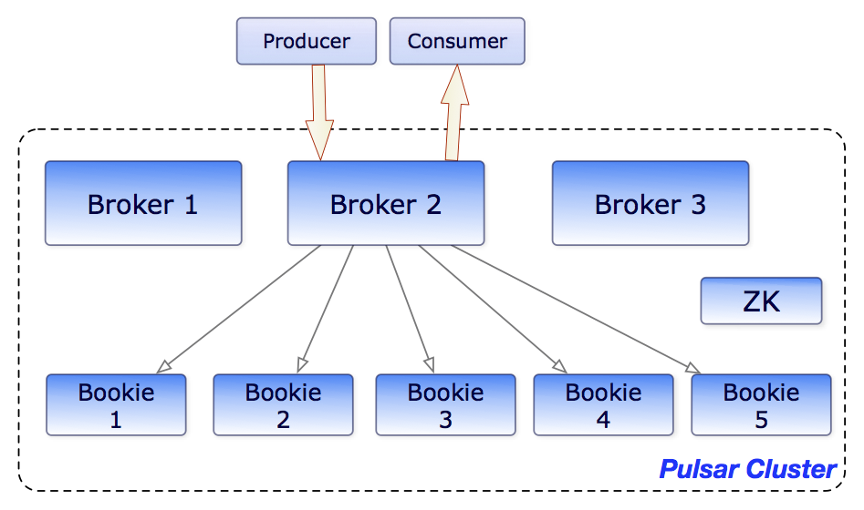

# Apache Pulsar

发音： [ˈpʌlsɑː(r)]

> Cloud-native distributed messaging streaming platform. 云原生分布式消息流平台

采用**计算与存储分离的分层架构（云原生）**设计，支持多租户、持久化存储、多机房跨区域数据复制，具有强一致性、高吞吐以及低延时的高可扩展流数据存储特性。

解决的场景：

- 百万级的Topics支持，低延迟、持久化、跨地域复制；
- 解除存储计算耦合，替换机器、服务扩容、数据re-balance；
- 减少文件系统的依赖，持久化（fsync）保持数据不丢失，性能下降太厉害；
- IO不隔离：消费者在清楚Backlog的时候会影响到其他生产者和消费者；
- 运维太痛苦：替换机器，服务扩容需要漫长的重新均衡数据的过程。

提供统一的 Queue（消息队列) 和 Stream 的接口。

kafka（stream）和rocketmq（queue）的区别：

？消息的顺序性，Producer内和Producer间的消息的顺序性？

## 架构

### Broker

### Producer

### Consumer

### Proxies

对Producer和Consumer屏蔽Broker，流量全走Proxyies。

NameSpace Bundles（对Topic进行Hash，在Broker的负载均衡），每个Broker的Bundle分配信息存储在ZK上。

## 存储设计

底层存储基于Apache BookKeeper。

### 分区

单个Topic分成多个Partition。

每个Partition都是一个Event Stream。

### 分片

Event Stream <- Segments <- Entrys <- Messages。

Segment和Entry是Apache BookKeeper的概念。

## API

### 订阅模式

#### Exclusive（默认）

#### FailOver（only one）

#### Shared（round-robin)

#### Key_Shared（same key, same consume）

IOT的Pulsar？

## 容错

### Client

### Broker

### Bookie

### 跨域复制

## 部署

## API

### CLI

### 

### Java

