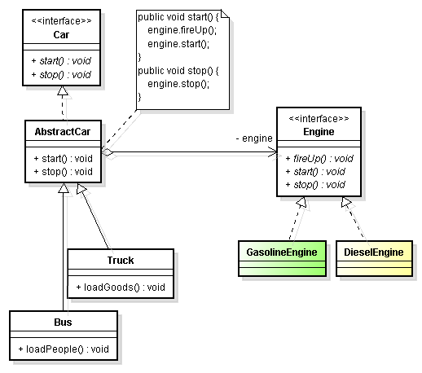

# 桥接模式

## 意图

将抽象部分与它的实现部分分离，使它们可以独立地变化。

## 适用性

继承机制将抽象部分与它的实现部分固定在一起，使得**难以对抽象部分和实现部分分别独立地进行修改、扩充和复用**。

- 在有多种可能会变化的情况下，用继承会造成类爆炸问题，扩展起来不灵活；
- 不希望抽象和实现部分有一个固定的绑定关系，如在程序运行时实现部分应该可以被选择或者切换；
- 对一个抽象的实现部分的修改应对客户不产生影响，即客户的代码不必重新编译；
- 一个类存在两个独立变化的维度，且这两个维度都需要进行扩展：
  - 三种颜色、三种形状，继承需要9个子类，组合需要6个子类；

示例：考虑卡车、巴士，汽油型和柴油型。两两组合之后，就会有四种车型：汽油型卡车，柴油型卡车，汽油型巴士和柴油型巴士。

## 类图

- **Abstraction**：定义抽象类的接口，维护一个指向 Implemetor 类型对象的指针；
- **RefinedAbstraction**：扩充由Abstraction定义的接口；
- **Implementor**：定义实现类的接口（不需要与Abstraction一致）；
- **ConcreteImplementor**：实现Implementor接口并定义具体实现。

## 优缺点

**优点：** 1、抽象和实现的分离。 2、优秀的扩展能力。 3、实现细节对客户透明。

**缺点：**桥接模式的引入会增加系统的理解与设计难度，由于聚合关联关系建立在抽象层，要求开发者针对抽象进行设计与编程。