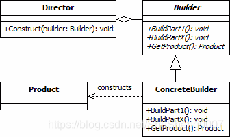

# 构造者模式

## 意图

将复杂对象的构建与它的表示分离，使得同样的构建过程可以创建不同的表示。

## 适用性

- 多个部件或者零件，都可以装配到一个对象中，但是产生的运行结果又相同；
- 产品类非常复杂，或者产品类中调用顺序不同产生了不同的作用；
- 初始化**复杂对象**，如说有很多参数，并且都有**默认值**时；

## 类

- Product：最终要生成的对象，例如 HttpClient 实例；
- Builder： 构建者的抽象基类（有时会使用接口代替），定义了**构建Product的抽象步骤**，和最终产品的方法`getProduct`；
- ConcreteBuilder：Builder的实现类，实现Builder的抽象接口；
- Director：决定如何构建最终产品的算法， 其会包含一个负责组装的方法`void Construct(Builder builder)`， 在这个方法中通过调用builder的方法，就可以设置builder，等设置完成后，就可以通过builder的 `getProduct() `方法获得最终的产品。

## 优缺点

相对于使用不同的构造函数和通过getter/setter构建实例，优势：

- 多个参数时，构造时的参数的顺序容易出错；
- setter方式对象的状态容易发生变化，因为已经有了对象实例，很难限制用户的setter的上下文。

**优点**

- 改变产品的内部表示，builder隐藏产品的表示和内部结构；
- 将构造代码和表示代码分开；
- 对构造过程更精细的控制；

## 相关设计模式

抽象工厂模式和Builder类似，可以创建复杂对象：

- Builder模式着重一步一步构造一个复杂对象，最后一步返回产品；
- 抽象工厂模式着重多个系列的产品对象（简单或者复杂的），产品是立即返回的。