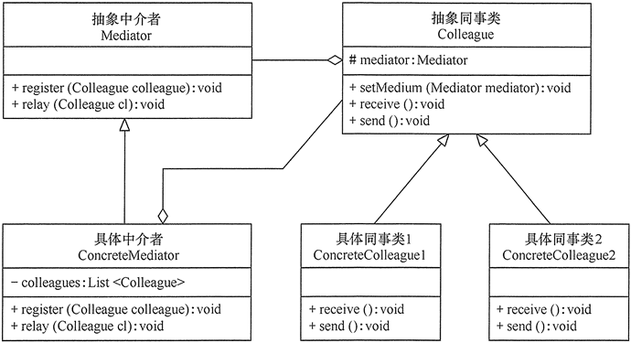

# 中介者模式

## 意图

用一个中介对象来封装一系列的对象交互，**中介者使各对象不需要显式地相互引用**，从而使其耦合松散，而且可以独立地改变它们之间的交互。

**多对多  <-> 一对多**

## 适用性

QQ游戏平台，聊天室、QQ群、短信平台和房产中介

1、系统中对象之间存在比较复杂的引用关系，导致它们之间的依赖关系结构混乱而且难以复用该对象。

 2、想通过一个中间类来封装多个类中的行为，而又不想生成太多的子类。

## 类图

1. 抽象中介者（Mediator）角色：它是中介者的接口，提供了同事对象注册与转发同事对象信息的抽象方法。
2. 具体中介者（Concrete Mediator）角色：实现中介者接口，定义一个 List 来管理同事对象，协调各个同事角色之间的交互关系，因此它依赖于同事角色。
3. 抽象同事类（Colleague）角色：定义同事类的接口，保存中介者对象，提供同事对象交互的抽象方法，实现所有相互影响的同事类的公共功能。
4. 具体同事类（Concrete Colleague）角色：是抽象同事类的实现者，当需要与其他同事对象交互时，由中介者对象负责后续的交互。

## 优缺点

**优点：** 1、降低了类的复杂度，将一对多转化成了一对一。 2、各个类之间的解耦。 3、符合迪米特原则。

**缺点：**中介者会庞大，变得复杂难以维护。