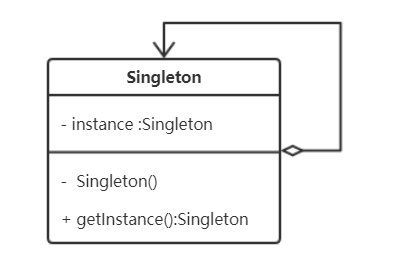

# 单例模式(Singleton)

## 意图

保证一个类只有一个实现，且提供一个访问它的全局访问点。


## 适用性

系统中有的类应该只有一份实例，比如一个全局的配置一个文件系统和窗口管理器等。


## 类图



## 优缺点

**优点**：

- **对唯一实例的受控访问**；
- 在内存里只有一个实例，减少了内存的开销，尤其是频繁的创建和销毁实例。

**缺点**：

- ？


## 实现（Java）

方案，均考虑线程安全：

### 饿汉式（推荐，静态成员变量初始化）

```java
//饿汉式
public class Singleton {
    private static Singleton instance = new Singleton();
    private Singleton() {}

    public static Singleton getInstance() {
        return instance;
    }
}
```

### 懒汉式（双重检查方式+volatile）

```java
//双重校验锁
public class Singleton {
    private volatile static Singleton instance;
    private Singleton() {}
    
    public static Singleton getInstance() {
        if (instance == null) {
            synchronized (Singleton.class) {
                if (instance == null) {
                    instance = new Singleton();
                }
            }
        }
        return instance;
    }
}
```

### 内部类（推荐）

不使用，引入Singleton不会初始化，使用时通过内部静态类的全局锁初始化，保证线程安全；

```java
//静态内部类
public class Singleton {
    private static class SingletonHolder {
        private static final Singleton INSTANCE = new Singleton();
    }
    private Singleton() {}

    public static final Singleton getInstance() {
        return SingletonHolder.INSTANCE;
    }
}
```

### 注意事项

- **线程安全**的考虑，构造器私有化；
- 当有多个可选的唯一实例时，通过子类的方式，可以通过环境变量配置或者注册表的形式，进行动态创建具体子类实现；
- **反序列化**时，可能会重新生成一个新的实例；
  - 实现`readResolve`方法，返回静态实例；
- 享有特权的客户端，通过`AccessibleObject.setAccessible`方法和反射机制可以**调用私有构造器**；
  - 方案：创建第二个实例的时候抛出异常