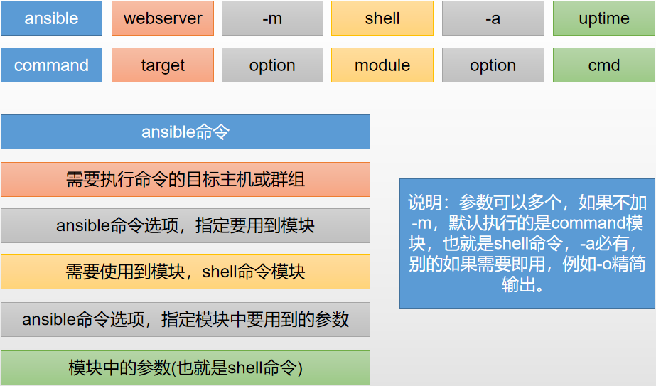

# Ansible

Ansible是基于模块工作的，本身没有批量部署的能力。真正具有批量部署的是ansible所运行的模块，ansible只是提供一种框架。主要包括：

(1) 连接插件connection plugins：负责和被监控端实现通信；

(2) host inventory：指定操作的主机，是一个配置文件里面定义监控的主机；

(3) 各种模块核心模块、command模块、自定义模块；

(4) 借助于插件完成记录日志邮件等功能；

(5) playbook：剧本执行多个任务时，非必需可以让节点一次性运行多个任务。


## 特性

简单的运维自动化工具，只需要使用`ssh`协议连接就可以来进行系统管理，自动化执行命令，部署等任务。

- **no agents**：不需要在被管控主机上安装任何客户端；

- **no server**：无服务器端，使用时直接运行命令即可；
- **modules in any languages**：基于模块工作，可使用任意语言开发模块；
- **yaml** ：使用yaml语言定制剧本playbook；
- **ssh by default**：基于SSH工作；
- **strong multi-tier solution**：可实现多级指挥。


## 组件

**Ansible**

- 是`Ansible`的命令工具，核心执行工具；一次性或临时执行的操作都是通过该命令执行。

**Ansible Playbook**

- 任务剧本（又称任务集），编排定义`Ansible`任务集的配置文件，由`Ansible`顺序依次执行，`yaml`格式。

**Inventory**

- `Ansible`管理主机的清单，机器的信息都存放在inventory组件，默认是`/etc/ansible/hosts`文件。

**Modules**

- `Ansible`执行命令的功能模块，`Ansible2.3`版本为止，共有`1039`个模块。还可以自定义模块。

**Plugins**

- 插件，模块功能的补充，常有连接类型插件，循环插件，变量插件，过滤插件，插件功能用的较少。

**API**

- 提供给第三方程序调用的应用程序编程接口。


## [使用](https://docs.ansible.com/ansible/latest/user_guide/index.html)

### Ansible命令格式



### Ansible playbook 命令

#### dry-run模式

该模式下，Ansible 不会真正地在实际环境中进行更新操作，而是显示在实际执行时哪些地方会被修改：

```shell
$ ansible-playbook -i development site.yml --check --diff
```


## [常用模块](https://docs.ansible.com/ansible/latest/modules/modules_by_category.html)

### Ping模块

测试IP是否可以访问

### Copy模块

远程拷贝

### Fetch模块

远程主机中的文件拷贝到本机中，在保存的时候使用hostname来进行保存。

### Shell模块

`/bin/sh`执行

### Command模块

运行系统命令。不支持管道符和变量等（"<", ">", "|", and "&"等）

### Raw模块

raw模块的功能与shell和command类似。但raw模块运行时不需要在远程主机上配置python环境。

command 和 shell 模块都是通过目标主机上的 python 代码启动  `/bin/bash` 来执行命令的，但目标主机上可能没有安装 python，这时只能使用 raw 模块在远程主机上直接启动

### Script 模块

在远程主机上执行脚本文件 ，和 raw 模块一样，不要求目标主机上已经装好 python。

### File模块

设置文件、链接、目录的属性，或者移除文件、链接、目录。

### Yum模块

安装包管理模块。

### Cron模块

管理计划任务。

```shell
# 新增一个定时任务
ansible all -m cron -a "name=check minute=5 job='pwd'"
# 删除定时任务
ansible all -m cron -a "name=check state=absent"
```

### User模块

useradd, userdel, usermod三个指令。指定password参数时，不能使用明文密码。

### Group模块

groupadd, groupdel, groupmod 三个指令。

### Synchronize模块

使用rsync同步文件。

### Service模块

通过`systemctl start/stop/status nginx.service`管理服务，示例：

```shell
# 确保nginx处于started 状态
$ ansible localhost -b -c local -m service -a "name=nginx state=started"
```


## AWX（可视化管理）

