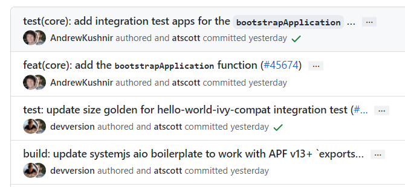
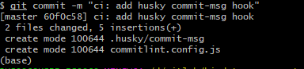
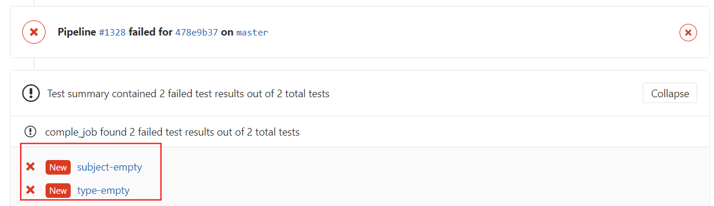

# Git Commit 规范

## 参考：[规范化git commit信息](https://blog.dteam.top/posts/2019-04/规范化git-commit信息.html#小结)

## 1. commit基本要求

[Git-Commit-Best-Practices](https://github.com/trein/dev-best-practices/wiki/Git-Commit-Best-Practices)这个项目总结了一个最基本的 git commit 实践:

- Commit Related Changes（ 提交相关的改变）
- Commit Often （经常提交）
- Don’t Commit Half-Done Work （只提交完成的工作）
- Test Your Code Before You Commit （提交前需要测试代码）
- Write Good Commit Messages（写良好的提交记录）
- Use Branches （使用分支）
- Agree on A Workflow （认同工作流）

## 2. 开源项目的Commit示例

Angular项目，可以很方便的生成[Release Notes](https://github.com/angular/angular/blob/master/CHANGELOG.md)



## 3. Commit 规范

commit 基本格式如下:

```json
<type>(<scope>): <subject>
<BLANK LINE>
<body>
<BLANK LINE>
<footer>
```

`type`用于说明 commit 的类别，只允许使用下面 7 个标识:

- `feat`：新功能（feature）
- `fix`：修补 bug
- `docs`：文档（documentation）
- `style`： 格式（不影响代码运行的变动）
- `refactor`：重构（即不是新增功能，也不是修改 bug 的代码变动）
- `test`：增加测试
- `chore`：构建过程或辅助工具的变动
- `ci` ：CI 相关的改动
- `perf` ：性能提升的代码改动（不新增功能）

通常`feat`和`fix`会被放入 changelog 中，其他(`docs`、`chore`、`style`、`refactor`、`test`)通常不会放入 changelog 中。

`scope`用于说明 commit 影响的范围，可选值。通常是文件、路径、功能等。

`subject`是 commit 目的的简短描述，不超过 50 个字符。

`Body`部分是对本次 commit 的详细描述，可以分成多行。

`Footer` 部分只用于两种情况:

- `Break Changes`：不兼容变动
- `Closes`：关闭Issue


## 4. 本地配置git commit规范检查

### 4.1 commit之后通过命令进行检查

在git commit的hook中加入[commitlint](https://github.com/conventional-changelog/commitlint)检测，不符合 commit 规范的提交在本地就无法提交进去。

```shell
# 1. 安装commitlint命令行和验证使用的规则config-conventional
npm install -g @commitlint/config-conventional @commitlint/cli

# linux shell 或者 windows git-bash环境执行echo命令
# 2.1 单个项目的配置文件，每个项目可以配置不同的commit lint规范
echo "module.exports = {extends: ['@commitlint/config-conventional']}" > commitlint.config.js

# 2.1 全局commitlint.config.js配置windows下暂时不知如何配置

# 3. 验证最新一条提交记录(必须添加上述配置，否则需要加上 -x "@commitlint/config-conventional")
commitlint -e

# 3.2 检查信息是否符合配置（linux shell 或者 windows git-bash）
echo "your commit message" | commitlint
```

### 4.2 集成git命令在commit时检查

[git-cz](https://github.com/streamich/git-cz) 是一个简化版的`commitizen+cz-conventional-changelog`组合，提供了开箱即用的功能，默认使用Angular规范，默认模板不填写scope部分内容。

```shell
# 安装git-cz包
npm install -g git-cz

# 以后所有使用git commit的地方都用git-cz或git cz命令提交代码
# 交互式使用，兼容git commit 的参数，比如-a, --amend
git cz 
```

### 4.3 添加git hook在commit时检查（推荐）

#### 4.3.1 NodeJS项目

NodeJS 项目直接使用 husky：

```
npm install -D husky
```

安装`@commitlint/cli`和`@commitlint/config-conventional`这两个包（建议安装到全局，这样所有项目都可以用）:

```
npm install -g @commitlint/cli @commitlint/config-conventional
```

然后在 package.json 添加 husky 配置:

```json
{
  "husky": {
    "hooks": {
      "commit-msg": "commitlint -x @commitlint/config-conventional -E HUSKY_GIT_PARAMS"
    }
  }
}
```

然后使用`git commit`会触发`husky`的hook，检测commit记录是否符合规范。

#### 4.3.2 其他类型项目

其它项目，手动添加 git hook，仍然使用`husky`

```shell
# 全局安装husky
npm install -g husky

# 1. 安装commitlint命令行和验证使用的规则config-conventional
npm install -g @commitlint/config-conventional @commitlint/cli
```

项目中初始化husky配置

```shell
# husky 对项目进行初始化，创建目录.husky目录和脚本husky.sh
husky install

# 添加commit-msg hook，执行`npx commitlint --edit $1` 命令，对commit message进行检验
husky add .husky/commit-msg "commitlint -x @commitlint/config-conventional --edit $1"

# 可选，如果不用-x @commitlint/config-conventional，则需要项目中配置commitlint.config.js文件
# echo "module.exports = {extends: ['@commitlint/config-conventional']}" > commitlint.config.js文件
```

执行git commit时（注意空格），会进行命令输出




删除 husky 和 git hook

```shell
npm uninstall husky && git config --unset core.hooksPath
```

## 5. CI 配置git commit 规范检查

第4部分内容是在开发本地做的，因此**需要禁止开发人员删除hook**。


在 gitlab ci 中运行以下命令检测当前提交是否符合 conventional-changelog 规范:

```yaml
image: node:latest

stages:
  - test

comple_job:
  stage: test
  script:
    - npm install "@commitlint/cli" "@commitlint/config-conventional" "commitlint-format-junit" 
    - npx commitlint -x @commitlint/config-conventional -o commitlint-format-junit -f ${CI_COMMIT_BEFORE_SHA} > commitlint_result.xml
  artifacts:
    name: "$CI_JOB_NAME-$CI_COMMIT_REF_NAME"
    reports:
      junit: commitlint_result.xml

```

- `$CI_COMMIT_BEFORE_SHA` 是 gitlab ci 的内置变量；

将 lint result 输出为 JUnit 格式，方便 Gitlab 在 merge request 的时候展示 lint 失败的结果，如下图所示。
