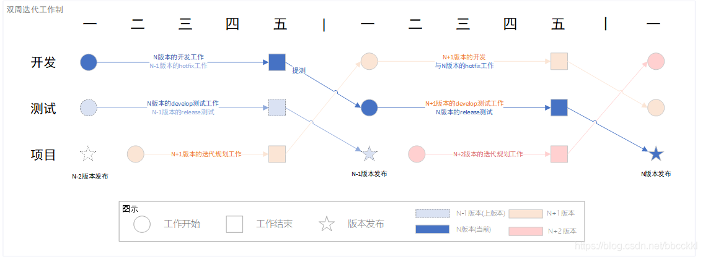

# Git 分支模型

## TrunkBased 分支模型

不稳定主干

- 使用**主干作为新功能开发**主线，**分支用作发布**；
- **被广泛的应用于开源项目**；
- 比较适合诸如传统软件产品的开发模式，比如微软的office等；
- **bug修改需要在各个分支中合并**；
- 新代码在主干上开发，因此如果主干不能达到稳定的标准，就不可以进行发布；
- 这种策略的好处是**没有分支合并的工作量**，因此比较简单；

## Git-flow 分支模型

稳定主干

- **master**: 主分支，主要用来版本发布。
- **hotfix**：线上 bug 紧急修复用到的临时分支。这个分支用来修复主线master的BUG
- **release**（预发布分支）：release 分支可以认为是 master 分支的未测试版。比如说某一期的功能全部开发完成，那么就将 develop 分支合并到 release 分支，测试没有问题并且到了发布日期就合并到 master 分支，进行发布。
- **develop**（相当于release的预分支）：日常开发分支，该分支正常保存了开发的最新代码。
- **feature**：具体的功能开发分支，只与 develop 分支交互。

### 主分支

master ：origin/master 为主分支，这个分支源码的 HEAD 一直指向 可用于生产环境 的状态；

dev： origin/develop 为主分支，这个分支源码的 HEAD 总是反映下一个版本的最新开发状况

### 辅助分支

多样化的辅助分支，支持成员间并行开发， 轻松跟踪功能开发、生产版本发布、还能快速修复生产环境中产生的 Bug 。

可能用到的**辅助分支分类**有：

- **功能分支**
- **发布分支**
- **修复 Bug 分支**

每个分支都有特殊的用途。这些分支的来源分支和他们要合并回的分支都有严格的定义。

#### 功能分支

| 分支类型 | 命名规范  | 创建自  | 合并到  | 说明   |
| -------- | --------- | ------- | ------- | ------ |
| feature  | feature/* | develop | develop | 新功能 |

功能分支（或称为特性分支）是被用来开发新功能的，这些新功能是要即将上线或更长时间后发布的。

功能分支合并到 dev 时，**保证最终出现在 dev 时是个单个 commit**；

#### 发布分支

| 分支类型 | 命名规范  | 创建自  | 合并到            | 说明                                              |
| -------- | --------- | ------- | ----------------- | ------------------------------------------------- |
| release  | release/* | develop | develop 和 master | 一次新版本的发布与生产环境中发现的紧急 bug 的修复 |

发布分支（Release branches） 支持新产品发布的准备，允许小错误修复以及为发布准备元数据（版本号，构建日期等）。

直到确定会推出发布版的这段时间里，新发布分支都会一直存在。

- 在此期间，bug 修复可能会应用到这个分支上（而不是 develop 分支）。
-  严禁在此分支添加大的新功能特性。 **这些分支必须合并回 develop 分支**，然后，等待下一个大版本的到来。

要发布分支的时候：

- 合并回 master 分支，出 tag 新版本；
- 合并回 dev 分支，保证 dev 版本最新；
- 删除该发布分支；

#### 修复BUG分支

| 分支类型 | 命名规范 | 创建自 | 合并到            | 说明                                              |
| -------- | -------- | ------ | ----------------- | ------------------------------------------------- |
| hotfix   | hotfix/* | master | develop 和 master | 一次新版本的发布与生产环境中发现的紧急 bug 的修复 |

本质是当有人准备对生产版本进行快速修复时，团队成员（在 develop 分支）可以继续工作。

修复 bug 分支创建于 master 分支。 例如，1.2 版本是当前生产环境的版本并且有 bug 。但是 develop 分支上的修改还不够稳定。这时我们可以创建一个修复 bug 分支来解决这个问题。

当完成一个修复 bug 分支之后，**bug 分支需要合并到 master 和 develop 分支上**，以保证在下一版本中也包含该 bug 修复。

### 优缺点

优点：

- 经过多次实践，并行特性开发良好；
- 适合大型项目开发，对小中型项目而言，过于繁杂，降低敏捷性；
- 公司协同性比较高的话适合使用，或者公司有专门的git管理部门统一管理分支

缺点：

- 从项目开始到上线过程中需要开的新分支过多不易维护，而且多分支容易出错；
- 分支越多，生命周期越短，这种出错的概率就越大；
- git-flow大量的合并冲突和对集成测试不友好。

## 阿里Aone-flow分支管理（定制）

> 兼顾了 TrunkBased 的“易于持续集成”和 GitFlow 的“易于管理需求”特点
>
> - 适用于单体量大的单个仓库，多人协同开发；

只使用三种分支类型：master分支、feature分支、release分支，以及三条基本规则

规则一：开始工作前，从主干创建特性分支

- 每个工作项（可以是一个人完成，或是多个人协作完成）对应一个特性分支，所有的修改都不允许直接提交到主干

规则二：通过合并特性分支，形成发布分支

- 从主干上拉出一条新分支，将所有本次要集成或发布的特性分支依次合并过去，从而得到发布分支。

规则三：发布到线上正式环境后，合并相应的发布分支到主干，在主干添加标签，同时删除该发布分支关联的特性分支。

阿里有工具，分支管理器会对feature_bugfix、feature_function1、feature_function2 等三个分支进行集成，并生成一个新的**【origin/release】**分支（如下图），而这个release分支就是专门服务于日常环境的发布分支了。

- 每当分支上有同学提交了代码并触发了流水线的重新运行，分支管理器变会对分支进行集成处理，形成包含最新分支代码的commit

## 实践

> 对于公司内部的项目：
>
> - 单体服务项目，每个人都需要具备自己的开发环境进行自测。
>   - 对于大型产品，每个开发不可能具备独立的开发环境测试；
>     - 如果共用开发环境，则多人同时开发不同特性，其部署/合并在测试时会出现被覆盖等问题；
> - 对于微服务类似的项目，单个微服务应该同时应该只有一个人进行开发。

### 单体服务模式（TODO）

### 微服务模式

> 每个仓库同一时间只会有一个人进行功能特性开发

在其迭代开发过程中的分支模型。

- feature 分支

  - 开发人员进行功能开发，推送到开发环境并进行测试，自测通过后，提交PR到 dev 分支；

- dev 分支

  - feature分支的代码 review合并到dev后，出版本，部署到测试环境；
  - 测试人员进行测试，出现问题，则开发在 feature 分支进行修复，自测后再提交 PR到 dev；

如果包含 release 分支：（即保持 master 生产可用）

- release分支：

  - 版本的所有feature都开发完成，基于 dev 拉出 release-* 的分支，此后，dev 分支可以接收下一版本的feature合并；
  - 测试基于 release - * 进行回归测试，测试出现bug，则提交修复到该 release分支；

- master 分支；

  - release 分支测试通过后，提交代码到 master 出版本，并更新 dev 跟 master 一致；

如果不包含 release 分支：

- master 分支：（dev不能接受下一版本的代码PR）
  - 版本的所有feature都开发完成，将 dev 提交 PR 到 master；
  - 测试基于master，进行回归测试，测试出现bug，则提交修复PR到master；
  - 测试通过后，master 打 tag 出版本，更新 dev 保持一致；

## 双周迭代制

- 开发：进行N迭代 (当前迭代) 的开发与N-1版本 (上个版本) 的hotfix工作，并在每周五进行统一提测；
- 测试：进行N迭代 (当前迭代) 的develop环境测试与N-1迭代 (上个迭代) 的 release 环境测试，在每周五前完成N-1版本的测试工作；
- 项目：进行N+1 (下个迭代) 的迭代规划工作与上两个迭代(N-2)的迭代发布工作；

