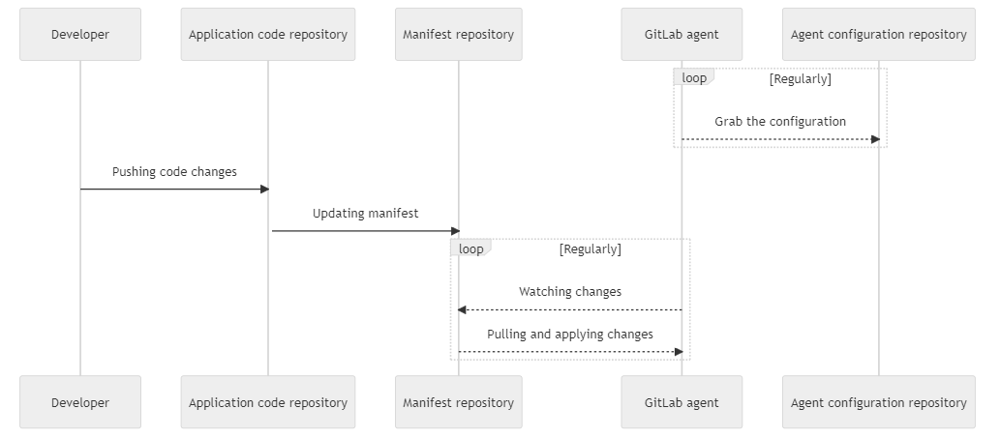

# Gitlab CD

> https://docs.gitlab.com/ee/topics/release_your_application.html

## K8s Cluster

### Gitops(Pull-Based)

>  https://docs.gitlab.com/ee/user/clusters/agent/gitops.html
>
> - Moved from GitLab Premium to **GitLab Free in 15.3**

通过在 K8s 集群部署 Agent，监听

### CI Push-Based

> https://docs.gitlab.com/ee/user/clusters/agent/ci_cd_workflow.html
>
> - Moved to **GitLab Free in 14.5.**

直接在`.gitlab-ci.yml`中选择Agent的K8s context 并运行 kubectl命令，部署到 K8s 环境

- 多环境支持不好；