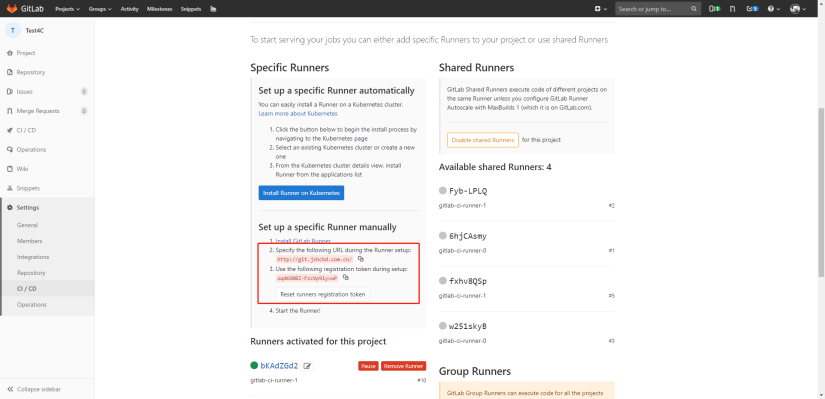
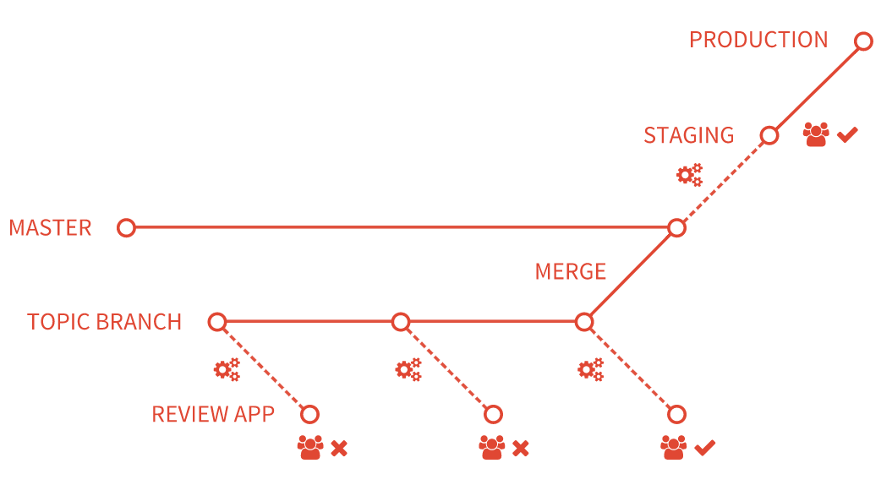

# Gitlab CI

## Runner

> https://docs.gitlab.com/runner/install/

### Docker-Runner

Gitlab-runner 安装：更好的管理方式是k8s

* 拉取镜像

```shell
docker pull gitlab/gitlab-runner
```

* 启动gitlab-runner

```shell
docker run -d --name gitlab-runner --restart always \
    -v /mnt/gitlab-runner/config:/etc/gitlab-runner \
    -v /var/run/docker.sock:/var/run/docker.sock \
    gitlab/gitlab-runner
```

* 注册到gitlab 
  根据gitlab admin中的runner的信息，填写以下信息

```shell
docker run --rm -t -i -v /mnt/gitlab-runner/config:/etc/gitlab-runner gitlab/gitlab-runner register \
  --non-interactive \
  --url "http://172.16.1.181:8090/" \
  --registration-token "DA1wNdAchnBFH_frXa9N" \
  --executor "docker" \
  --docker-image alpine:latest \
  --description "docker-runner" \
  --tag-list "docker,test"
```

如果出现了no route to host异常，需要在宿主机上添加端口防火墙(原因见docker章节**No Route to Host** 问题)

```shell
firewall-cmd --zone=public --add-port=8090/tcp --permanent
firewall-cmd --reload
```

### K8s-Runner

#### Yaml 安装

Yaml配置原件：[gitlab-runner.yaml](./materials/gitlab-runner.yaml)，注意修改 gitlab 地址和 runner token，提前创建 gitlab 名空间。

注意:

- **replicas**: Runner实例数

- **CI_SERVER_URL**: gitlab服务器地址
- **GITLAB_CI_TOKEN**: gitlab项目token
  - token需要base转换: `echo oqdKGRBZ-FzcVp9iyvwP | base64 -w0`





创建 runner：`kubectl create -f gitlab-runner.yaml`


#### Helm 安装

https://docs.gitlab.com/runner/install/kubernetes.html


## .gitlab-ci.yml 配置

需要在项目中创建 `.gitlab-ci.yml` 文件，下面是个示例，其中tags是创建gitlab-runner时指定的tags，匹配上才会有runner执行CI：

```yaml
image: maven:latest
stages:
  - build
  - test
  - run
variables:
  MAVEN_OPTS: "-Dmaven.repo.local=.m2/repository"
cache:
  paths:
    - .m2/repository/
    - target/
build:
  stage: build
  script:
    - mvn $MAVEN_CLI_OPTS compile
  only:
    - master
  tags:
    - test
test:
  stage: test
  script:
    - mvn $MAVEN_CLI_OPTS test
  only:
    - master
  tags:
    - test
deploy:
  stage: deploy
  script:
    - echo "deploy over..."
  only:
    - master
  tags:
    - test
```

- **Pipeline**：相当于一次构建任务，里面可以包含多个流程，如安装依赖、运行测试、编译、部署测试服务器、部署生产服务器等。
  - 任何提交或者 Merge Request 的合并都可以触发 Pipeline 构建；
- **Stages**：表示一个构建阶段。一次 Pipeline 中可定义多个 Stages
  - 所有 Stages 会顺序运行，即当一个 Stage 完成后，下一个 Stage 才会开始
  - 只有当所有 Stages 完成后，该构建任务才会成功
  - 如果任何一个 Stage 失败，那么后面的 Stages 不会执行，该构建任务失败


### Pipeline

**Branch pipelines** that run for Git push events to a branch, like new commits or tags.

**Tag pipelines** that run only when a new Git tag is pushed to a branch.

**Merge request pipelines** that run for changes to a merge request, like new commits or selecting the Run pipeline button in a merge request’s pipelines tab.

**Scheduled pipelines**.

| Variables                                  | Branch | Tag  | Merge request | Scheduled                                                    |
| :----------------------------------------- | :----- | :--- | :------------ | :----------------------------------------------------------- |
| `CI_COMMIT_BRANCH`                         | Yes    |      |               | Yes                                                          |
| `CI_COMMIT_TAG`                            |        | Yes  |               | Yes, if the scheduled pipeline is configured to run on a tag. |
| `CI_PIPELINE_SOURCE = push`                | Yes    | Yes  |               |                                                              |
| `CI_PIPELINE_SOURCE = scheduled`           |        |      |               | Yes                                                          |
| `CI_PIPELINE_SOURCE = merge_request_event` |        |      | Yes           |                                                              |
| `CI_MERGE_REQUEST_IID`                     |        |      | Yes           |                                                              |

### Jobs

表示构建工作，即某个 Stage 里面执行的工作。一个 Stage 中可定义多个 Jobs

- 默认，**相同 Stage 中的 Jobs 会并行执行**

- 相同 Stage 中的 Jobs 都执行成功时，该 Stage 才会成功
  
- 如果任何一个 Job 失败，那么该 Stage 失败，即该构建任务失败

可以通过`needs`字段改变执行顺序。

- 同一个stage的：job1 和 job2 是可以并行的。
- job1之后将会启动 job3 (立即执行, 不会等待job2完成作业)
- job2之后将会启动 job4 (立即执行, 不会等待job1完成作业)

```yaml
stages:
    - stage-1
    - stage-2

job-1:
    stage: stage-1
    needs: []
    script: 
      - echo "job-1 started"
      - sleep 5
      - echo "job-1 done"

job-2:
    stage: stage-1
    needs: []
    script: 
      - echo "job-2 started"
      - sleep 60
      - echo "job-2 done"

job-3:
    stage: stage-2
    needs: [job-1]
    script: 
      - echo "job-3 started"
      - sleep 5
      - echo "job-3 done"

job-4:
    stage: stage-2
    needs: [job-2]
    script: 
      - echo "job-4 started"
      - sleep 5
      - echo "job-4 done"
```

### variables

GitLab CI/CD 预先定义的变量：https://docs.gitlab.com/ee/ci/variables/predefined_variables.html

`.gitlab-ci.yaml`中定义变量：

- jobs 中定义 `variables`为`{}`表明不需要全局变量；

```yaml
variables:
  GLOBAL_VAR: "A global variable"

job1:
  variables:
    JOB_VAR: "A job variable"
  script:
    - echo "Variables are '$GLOBAL_VAR' and '$JOB_VAR'"
    
job1:
  variables: {}
  script:
    - echo This job does not need any variables
```


### 将变量传递到其它job

> create a new environment variables in a job, and pass it to another job in a later stage. 

```yaml
build-job:
  stage: build
  script:
    - echo "BUILD_VARIABLE=value_from_build_job" >> build.env
  artifacts:
    reports:
      dotenv: build.env

test-job:
  stage: test
  script:
    - echo "$BUILD_VARIABLE"  # Output is: 'value_from_build_job'
```


### cache

> https://docs.gitlab.com/ee/ci/caching/

cache是用来指定 **jobs 之间**可以缓存的文件和目录

- Locally defined cache overrides globally defined options；

- 不同的 `key` 下的缓存也不会相互影响；

- cache 在同一个项目的不同的 pipeline 之间也实现共享；

- 不同的项目不能共享 cache；

- 如果整个 pipeline 配置全局的 cache，意味着每个 **job 在没有特殊配置的情况下会使用全局的配置**

  - 对整个 job 的 cache 禁用

    ```yaml
    job:
      cache: {}
    ```

默认的配置是 `cache:policy` 中的 `pull-push` 策略：

- pull：每个 job 会在开始执行前将对应路径的文件下载下来；
- push：任务结束前重新上传，不管文件是否有变化；
- 可以单独指定 pull 或者 push；

```yaml
rspec:
  stage: test
  cache:
    paths:
      - vendor/bundle
    policy: pull
  script:
    - bundle exec rspec ...
```

示例：maven项目配置缓存

```yaml
image: nnntln/3.6.1-jdk-8:latest

variables:
   MAVEN_OPTS: -Dmaven.repo.local=/cache/maven.repository
cache:
   key: PortalReportBackend
   paths:
     - /root/.m2/repository

stages:
  - build
  - execute

build:
  stage: build
  script: /usr/lib/jvm/java-8-openjdk-amd64/bin/javac Hello.java
  artifacts:
    paths:
     - Hello.*

execute:
  stage: execute
  script: /usr/lib/jvm/java-8-openjdk-amd64/bin/java Hello
```

#### 分布式 cache


### artifacts 

> Use artifacts to pass intermediate build results between stages. 
>
> - Subsequent jobs in later stages of the same pipeline can use artifacts.
> - Different projects cannot share artifacts.
> - Artifacts expire after 30 days by default. You can define a custom [expiration time](https://docs.gitlab.com/ee/ci/yaml/index.html#artifactsexpire_in).
> - The latest artifacts do not expire if [keep latest artifacts](https://docs.gitlab.com/ee/ci/pipelines/job_artifacts.html#keep-artifacts-from-most-recent-successful-jobs) is enabled.
> - Use [dependencies](https://docs.gitlab.com/ee/ci/yaml/index.html#dependencies) to control which jobs fetch the artifacts

`artifacts` is used to specify **a list of files and directories which should be attached to the job** when it succeeds, fails, or always.

The artifacts will be **sent to GitLab** after the job finishes and will be **available for download** in the GitLab UI.

- 默认30天有效期，可以指定[`expire_in`字段](https://docs.gitlab.com/ee/ci/yaml/index.html#artifactsexpire_in)；

#### job artifacts

> https://docs.gitlab.com/ee/ci/pipelines/job_artifacts.html

job 的制品，可以在 Pipeline界面进行下载

```yaml
pdf:
  script: xelatex mycv.tex
  artifacts:
    paths:
      - mycv.pdf
    expire_in: 1 week
```

**Keep artifacts from most recent successful jobs**

By default artifacts are always **kept for successful pipelines for the most recent commit on each ref**. 

- 最新的artifacts 不会受`expire_in`字段影响；

**Keep the latest artifacts for all jobs in the latest successful pipelines**

By default the artifacts of the most recent pipeline for each Git ref  are locked against deletion and kept regardless of the expiry time.

- 默认流水线的 artifacts 不受过期时间影响；
- 此设置优先于项目级别设置（Keep artifacts from most recent successful jobs）

#### Pipeline artifacts

> Pipeline artifacts are different to job artifacts because they are not explicitly managed by .gitlab-ci.yml definitions.

Pipeline artifacts are used by the [test coverage visualization feature](https://docs.gitlab.com/ee/ci/testing/test_coverage_visualization.html) to collect coverage information.


### When to Run

> https://docs.gitlab.com/ee/ci/jobs/job_control.html

手动触发 job：

- 需要在 Pipeline 界面进行点击对应的Job的阶段的按钮，才会执行；
- Pipeline 界面的 “Run Pipeline" 也不会触发`when: manual` 修饰的Job；

```yaml
when: manual
```


**rules**： include or exclude jobs in pipelines

```yaml
job:on-schedule:
  rules:
    - if: $CI_PIPELINE_SOURCE == "schedule"
  script:
    - make world

job:
  rules:
    - if: $CI_PIPELINE_SOURCE == "push"
    - if: $VAR == "string value"
      # Include the job and set to when:manual if any of the follow paths match a modified file.
      changes:  
        - Dockerfile
        - docker/scripts/*
      when: manual
      allow_failure: true
  script:
    - make build
```


**only**：includes the job if **all** of the keys have at least one condition that matches.

**except**：excludes the job if **any** of the keys have at least one condition that matches.


```yaml
job:
  only:
    # use special keywords, 等价于 only:refs
    - tags
    - triggers
    - schedules
    # 分支
    - master
    # 通过变量控制是否执行，支持 && ||
    variables:
      - $CI_COMMIT_MESSAGE =~ /skip-end-to-end-tests/
    # 通过文件的改动控制是否执行
    changes:
      - "*.md"
    # 
```


## Environments and deployments

> 将环境信息和部署信息进行关联，方便进行查看和管理。

环境就像CI作业的标记，描述代码的部署位置。当作业将代码版本部署到环境时，会创建部署，因此每个环境都可以有一个或多个部署。

- Provides a full history of deployments to each environment.
- Tracks your deployments, so you always know what is deployed on your servers.


## Review Apps

> https://docs.gitlab.cn/jh/ci/review_apps/index.html
>
> - Gitlab 需要集成 K8s 

Review Apps 是一种协作工具，可帮助提供展示产品更改的环境。

- 为您的合并请求启动动态环境，提供对功能分支中所做更改的自动实时预览。
- 允许设计师和产品经理查看您的更改，而无需检查您的分支并**在沙盒环境中运行**您的更改。




在前面的例子中：

- 每次将提交推送到 `topic branch` 时都会构建一个 Review App。
- 审核人在通过第三次审核之前未通过两次审核。
- 审核通过后，`topic branch` 被合并到默认分支，在那里它被部署到 staging。
- 在 staging 被批准后，合并到默认分支的更改将部署到生产中。

