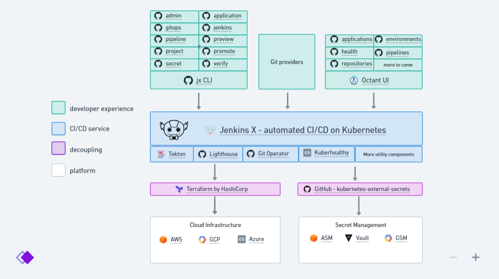

# Jenkinsx

> All In One CI/CD including everything you need to start exploring **Kubernetes**.

Jenkins X 是基于 Kubernetes 的CI&CD平台，使用GO语言开发，作为Jenkins的一个子项目。

- 使用Tekton作为默认执行引擎；
- 采用CLI和API优先的方法；
- 预览环境能够让开发人员协同验证各种变更。

## 开源集成

[Tekton](https://tekton.dev/) Cloud Native pipeline orchestration

[Kuberhealthy](https://github.com/kuberhealthy/kuberhealthy) Periodic health checks of the systems

[Nexus](./nexus.md) **[optional]** artifact repository


## 基础设施

GitOps

Secret Management

Pipelines

ChatOps


## 架构



**Cluster Repo**


**Project APP**


### [Git Operator](https://github.com/jenkins-x/jx-git-operator)

> `jx-git-operator` is an operator which polls a git repository for changes and triggers a Kubernetes `Job` to process the changes in git.

#### Boot Job 

- 默认的Job文件路径在`versionStream/git-operator/job.yaml`；
- 在启动时运行，并在任何git 提交到用于GitOps存储库（安装Git Operator时指定）时运行。

- Boot Job 会运行 Generate Step 和 Apply Step；

**Generate Step**

运行的场景：

- 启动时；
- Pull Request的每次commit；
- 提交到主分支且不是Pull Request的合并的commit；

运行时做的事情：

- `jx-values.yaml`
- `helmfile.yaml`
- `helm template`命令对charts生成k8s资源；
- 拷贝生成的资源到**config-root/namespaces/\${myns}/\${chart_name}/\*.yaml**
- Secret 资源转换成 ExternalSecret，可以被git check；

**Apply step**

- 在Generate Step后面执行，本质上是对 `config-root`中的资源执行`kubectl apply`；


？？Cluster Repo 和 Create Project 是啥区别 ？？

> 每个kubernetes集群都有一个git存储库，这样所有名称空间中的所有kubernete资源都可以由GitOps管理。


### [Jenkins-x Lighthouse](https://github.com/jenkins-x/lighthouse)

Lighthouse 是一个**基于 webhooks 的轻量级 ChatOps 工具** , 通过 Git 仓库的 webhooks 可以**触发 Jenkins X 流水线 、Tekton 流水线 、Jenkins 任务**, 支持 GitHub、GitHub Enterprise、BitBucket Server 和 GitLab。


## 安装

使用 Git Operator 进行 JenkinsX 的安装和部署

### K8s环境

> https://jenkins-x.io/v3/admin/platforms/on-premises/

1.  下载jx 3.x命令 [Download and install the jx 3.x binary](https://jenkins-x.io/v3/guides/jx3/)

2. Ingress

3. Storage：需要有默认的`storage class`；

4. 基于 [jx3-gitops-repositories/jx3-kubernetes](https://github.com/jx3-gitops-repositories/jx3-kubernetes/generate) template 创建集群的Git存储库，并git clone下来；

5. [安装Operator](https://jenkins-x.io/v3/admin/setup/operator/)：在本地git仓库中，执行`jx admin operator --username mygituser --token mygittoken`；如果不在git仓库中，则需要指定`--url=https://github.com/myorg/env-mycluster-dev.git`

   > This command will use helm to install the [git operator](https://github.com/jenkins-x/jx-git-operator) which will trigger a Job to install Jenkins X (and re-trigger a Job whenever you commit to your git repository)

6. `jx project quickstart` 两个repo的关联是啥？

```shell
$ ./jx project quickstart
Installing plugin jx-project version 0.2.54 for command jx project from https://github.com/jenkins-x-plugins/jx-project/releases/download/v0.2.54/jx-project-linux-amd64.tar.gz into /root/.jx3/plugins/bin
```


```shell
$ ./jx admin log
Installing plugin jx-admin version 0.2.1 for command jx admin from https://github.com/jenkins-x-plugins/jx-admin/releases/download/v0.2.1/jx-admin-linux-amd64.tar.gz into /root/.jx3/plugins/bin
```


```shell
$ jx admin operator
Installing plugin helm version 3.6.2 for command jx helm from https://get.helm.sh/helm-v3.6.2-linux-amd64.tar.gz into /root/.jx3/plugins/bin
```


### 环境

默认的`Staging`和`Production`环境映射到名空间 `jx-staging`和`jx-production`；


### 配置

Gitop仓库中的`jx-requirements.yml`定义默认的环境信息。

#### 多集群


#### 仓库自定义环境

> use different sets of environments for different microservices 

### 多集群支持


## 使用

### CLI

#### jx admin

commands for creating and upgrading **Jenkins X environments** using GitOps

#### jx application

Command for viewing deployed Applications across Environments

### UI

