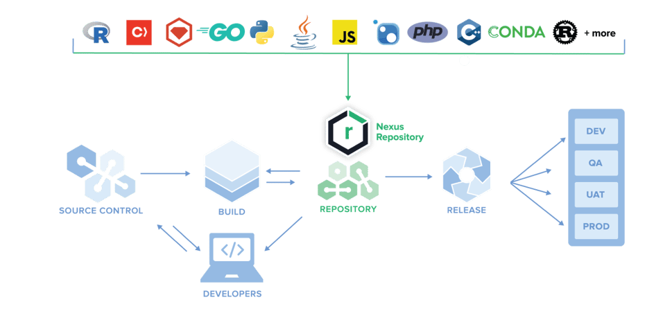

# Nexus

> [Nexus](https://www.sonatype.com/nexus/repository-oss) ：Manage binaries and build artifacts across your software supply chain.

以下以 [Nexus 3](https://help.sonatype.com/repomanager3) 为例：

## 功能

- 支持 apt, conda, docker, go, helm, maven, npm, pypi, r, raw, rubygem, yum的源管理

### Raw repositories

在Nexus 3中支持一种新的方式：raw repositories：

- 利用这种方式，任何文件都可以像Maven管理对象文件那样被管理起来，对所有的artifacts进行统一集成管理。

可以通过 shell，进行上传处理：

`curl -v --user 'admin:admin123' --upload-file ./nacos-server-2.0.3.zip http://172.16.1.217:8081/repository/website/a/weba-0.1.zip`

链接可以直接访问并下载。

## 安装

https://help.sonatype.com/repomanager3/product-information/download

