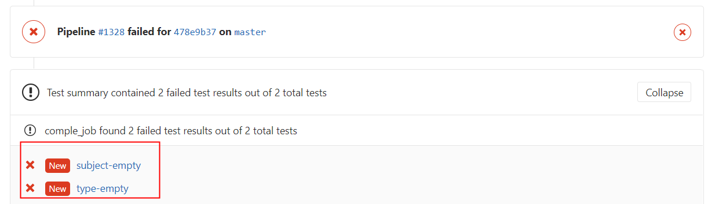

# 自动版本发布

## 规范化 git commit 信息

> 参考：[规范化git commit信息](https://blog.dteam.top/posts/2019-04/规范化git-commit信息.html#小结)
>
> 用于识别 Feat, Fix, Test 等特性。

### 1. commit基本要求

[Git-Commit-Best-Practices](https://github.com/trein/dev-best-practices/wiki/Git-Commit-Best-Practices)这个项目总结了一个最基本的 git commit 实践:

- Commit Related Changes（ 提交相关的改变）
- Commit Often （经常提交）
- Don’t Commit Half-Done Work （只提交完成的工作）
- Test Your Code Before You Commit （提交前需要测试代码）
- Write Good Commit Messages（写良好的提交记录）
- Use Branches （使用分支）
- Agree on A Workflow （认同工作流）

### 2. 开源项目的Commit示例

Angular项目，可以很方便的生成[Release Notes](https://github.com/angular/angular/blob/master/CHANGELOG.md)


### 3. Commit 规范

commit 基本格式如下:

```json
<type>(<scope>): <subject>
<BLANK LINE>
<body>
<BLANK LINE>
<footer>
```

`type`用于说明 commit 的类别，只允许使用下面 7 个标识:

- `feat`：新功能（feature）
- `fix`：修补 bug
- `docs`：文档（documentation）
- `style`： 格式（不影响代码运行的变动）
- `refactor`：重构（即不是新增功能，也不是修改 bug 的代码变动）
- `test`：增加测试
- `chore`：构建过程或辅助工具的变动
- `ci` ：CI 相关的改动
- `perf` ：性能提升的代码改动（不新增功能）

**通常`feat`和`fix`会被放入 changelog 中，其他(`docs`、`chore`、`style`、`refactor`、`test`)通常不会放入 changelog 中。**

`scope`用于说明 commit 影响的范围，可选值。通常是文件、路径、功能等。

`subject`是 commit 目的的简短描述，不超过 50 个字符。

`Body`部分是对本次 commit 的详细描述，可以分成多行。

`Footer` 部分只用于两种情况:

- `Break Changes`：不兼容变动
- `Closes`：关闭Issue

示例：

```shell
feat(python): add greedy_snake.py

Closes #73
```


### 4. 本地配置git commit规范检查

#### 4.1 commit之后通过命令进行检查

在git commit的hook中加入[commitlint](https://github.com/conventional-changelog/commitlint)检测，不符合 commit 规范的提交在本地就无法提交进去。

```shell
# 1. 安装commitlint命令行和验证使用的规则config-conventional
npm install -g @commitlint/config-conventional @commitlint/cli

# linux shell 或者 windows git-bash环境执行echo命令
# 2.1 单个项目的配置文件，每个项目可以配置不同的commit lint规范
echo "module.exports = {extends: ['@commitlint/config-conventional']}" > commitlint.config.js

# 2.1 全局commitlint.config.js配置windows下暂时不知如何配置

# 3. 验证最新一条提交记录(必须添加上述配置，否则需要加上 -x "@commitlint/config-conventional")
commitlint -e

# 3.2 检查信息是否符合配置（linux shell 或者 windows git-bash）
echo "your commit message" | commitlint
```

#### 4.2 集成git命令在commit时检查

[git-cz](https://github.com/streamich/git-cz) 是一个简化版的`commitizen+cz-conventional-changelog`组合，提供了开箱即用的功能，默认使用Angular规范，默认模板不填写scope部分内容。

```shell
# 安装git-cz包
npm install -g git-cz

# 以后所有使用git commit的地方都用git-cz或git cz命令提交代码
# 交互式使用，兼容git commit 的参数，比如-a, --amend
git cz 
```

#### 4.3 添加git hook在commit时检查（推荐）

##### NodeJS项目

NodeJS 项目直接使用 husky：

```
npm install -D husky
```

安装`@commitlint/cli`和`@commitlint/config-conventional`这两个包（建议安装到全局，这样所有项目都可以用）:

```
npm install -g @commitlint/cli @commitlint/config-conventional
```

然后在 package.json 添加 husky 配置:

```json
{
  "husky": {
    "hooks": {
      "commit-msg": "commitlint -x @commitlint/config-conventional -E HUSKY_GIT_PARAMS"
    }
  }
}
```

然后使用`git commit`会触发`husky`的hook，检测commit记录是否符合规范。

##### 其他类型项目

其它项目，手动添加 git hook，仍然使用`husky`

```shell
# 全局安装husky
npm install -g husky

# 1. 安装commitlint命令行和验证使用的规则config-conventional
npm install -g @commitlint/config-conventional @commitlint/cli
```

项目中初始化husky配置

```shell
# husky 对项目进行初始化，创建目录.husky目录和脚本husky.sh
husky install

# 添加commit-msg hook，执行`npx commitlint --edit $1` 命令，对commit message进行检验
husky add .husky/commit-msg "commitlint -x @commitlint/config-conventional --edit $1"

# 可选，如果不用-x @commitlint/config-conventional，则需要项目中配置commitlint.config.js文件
# echo "module.exports = {extends: ['@commitlint/config-conventional']}" > commitlint.config.js文件
```

执行git commit时（注意空格），会进行命令输出


删除 husky 和 git hook

```shell
npm uninstall husky && git config --unset core.hooksPath
```

### 5. gitlab CI 配置 git commit 规范检查

第4部分内容是在开发本地做的，因此**需要禁止开发人员删除hook**。

在 gitlab ci 中运行以下命令检测当前提交是否符合 conventional-changelog 规范:

```yaml
image: node:latest

stages:
  - test

compile_job:
  stage: test
  script:
    - npm install "@commitlint/cli" "@commitlint/config-conventional" "commitlint-format-junit" 
    - npx commitlint -x @commitlint/config-conventional -o commitlint-format-junit -f ${CI_COMMIT_BEFORE_SHA} > commitlint_result.xml
  artifacts:
    name: "$CI_JOB_NAME-$CI_COMMIT_REF_NAME"
    reports:
      junit: commitlint_result.xml

```

- `$CI_COMMIT_BEFORE_SHA` 是 gitlab ci 的内置变量；

将 lint result 输出为 Junit 格式，方便 Gitlab 在 merge request 的时候展示 lint 失败的结果，如下图所示。


## semantic-release 自动发布

> 更适合在 CI 环境中运行，自带支持各种 git server 的认证支持，如 Github，Gitlab，Bitbucket 等等，此外，还支持插件，以便完成其他后续的流程步骤，比如自动生成 git tag 和 release note 之后再 push 回中央仓库，自动发布 npm 包等等。

大致的工作流如下:

- 提交到**特定的分支**触发 release 流程
- 验证 commit 信息，生成 `release note`，打 `git tag`
- 其他后续流程，如生成`CHANGELOG.md`，`npm publish`等等（通过插件完成）


`npm install -g @semantic-release`

- 默认安装 "@semantic-release/commit-analyzer"，"@semantic-release/github"，"@semantic-release/npm"， "@semantic-release/release-notes-generator"

### 版本号更新逻辑


**版本号更新的逻辑**：只有 **feat** 和 **fix** 提交才会触发版本升级

- 如果包含 feat 记录，版本由1.**0**.0升级到了1.**1**.0
- 只有 fix 记录，版本由1.1.**0**升级到了1.1.**1**
- feat 且 commit footer内有`BREAKING CHANGE:` 提交将会升级主版本号,版本由1.2.0升级到了2.0.0


### Git 仓库认证

> https://github.com/semantic-release/semantic-release/blob/master/docs/usage/ci-configuration.md#authentication

Gitlab 仓库需要配置 `GL_TOKEN` or `GITLAB_TOKEN`

### 生命周期

| Step              | Description                                                  |
| ----------------- | ------------------------------------------------------------ |
| Verify Conditions | Verify all the conditions to proceed with the release.       |
| Get last release  | Obtain the commit corresponding to the last release by analyzing [Git tags](https://git-scm.com/book/en/v2/Git-Basics-Tagging). |
| Analyze commits   | Determine the type of release based on the commits added since the last release. |
| Verify release    | Verify the release conformity.                               |
| Generate notes    | Generate release notes for the commits added since the last release. |
| Create Git tag    | Create a Git tag corresponding to the new release version.   |
| Prepare           | Prepare the release.                                         |
| Publish           | Publish the release.                                         |
| Notify            | Notify of new releases or errors.                            |


### 插件

#### @semantic-release/commit-analyzer(自带)

> analyze commits with [conventional-changelog](https://github.com/conventional-changelog/conventional-changelog)

- 默认`preset`使用 angular 形式的commit规范；


#### @sematic-release/release-notes-generator(自带)

>  generate changelog content with [conventional-changelog](https://github.com/conventional-changelog/conventional-changelog)

通过`conventional-changelog`插件，生成从上个release到现在的变更信息。

- 默认`preset`使用 angular 形式的commit规范；


#### [@semantic-release/changelog ](https://github.com/semantic-release/changelog ) 

> Create or update a changelog file in the local project directory **with the changelog content created** in the [generate notes step](https://github.com/semantic-release/semantic-release#release-steps).

创建或更新changelog文件（默认路径为 `CHANGELOG.md`）

```shell
$ npm install @semantic-release/changelog -D
```

- 如果和`@semantic-release/git`和`@semantic-release/npm`共用，则其位置必须在最前面。


#### [@semantic-release/git ](https://github.com/semantic-release/git) 

- 支持将某些文件反向 push 回中央仓库（并添加`skip ci` commit 信息跳过 CI ）
- 默认的文件为`['CHANGELOG.md', 'package.json', 'package-lock.json', 'npm-shrinkwrap.json']`

配置，`.releaserc`

```json
{
  "plugins": [
    ["@semantic-release/git", {
          // 配置哪些文件会被 add 推送回仓库
          "assets": ["Dockerfile", "./build/userservice.yaml","./build/version.md", "CHANGELOG.md"],
          // 自定义 commit 信息的格式
          "message": "chore(release): ${nextRelease.version} [skip ci]\n\n${nextRelease.notes}"
     }
    ],
  ]
}
```


#### [@semantic-release/gitlab](https://github.com/semantic-release/gitlab) 

>  publish a GitLab release

默认会通过 `CI_API_V4_URL`内置的环境变量识别 Gitlab 的地址

- 如果 Gitlab SSL 没配置好，可能会出现 404 的问题，此时通过CI/CD重新定义该变量，解决问题。

```json
{
    "plugins": [
        "@semantic-release/commit-analyzer",
        "@semantic-release/release-notes-generator",
        "@semantic-release/changelog",
        "@semantic-release/git",
        ["@semantic-release/gitlab", {
            "assets": [
                {"path": "README.md", "label": "CSS distribution"}
            ]
        }]
    ]
}
```

assets 字段

| Property   | Description                                                  | Default                              |
| ---------- | ------------------------------------------------------------ | ------------------------------------ |
| `path`     | **Required**, unless `url` is set. A [glob](https://github.com/isaacs/node-glob#glob-primer) to identify the files to upload. | -                                    |
| `url`      | Alternative to setting `path` this provides the ability to add links to releases, e.g. URLs to container images. Supports [Lodash templating](https://lodash.com/docs#template). | -                                    |
| `label`    | Short description of the file displayed on the GitLab release. Ignored if `path` matches more than one file. Supports [Lodash templating](https://lodash.com/docs#template). | File name extracted from the `path`. |
| `type`     | Asset type displayed on the GitLab release. Can be `runbook`, `package`, `image` and `other` (see official documents on [release assets](https://docs.gitlab.com/ee/user/project/releases/#release-assets)). Supports [Lodash templating](https://lodash.com/docs#template). | `other`                              |
| `filepath` | A filepath for creating a permalink pointing to the asset (requires GitLab 12.9+, see official documents on [permanent links](https://docs.gitlab.com/ee/user/project/releases/#permanent-links-to-release-assets)). Ignored if `path` matches more than one file. Supports [Lodash templating](https://lodash.com/docs#template). | -                                    |

#### [@semantic-release/exec](https://github.com/semantic-release/exec)

> execute custom shell commands.

```shell
$ npm install @semantic-release/exec -g
```

配置（`.releaserc`）

```json
{
  "plugins": [
    "@semantic-release/commit-analyzer",
    "@semantic-release/release-notes-generator",
    ["@semantic-release/exec", {
      "verifyConditionsCmd": "./verify.sh",
      "publishCmd": "./publish.sh ${nextRelease.version} ${branch.name} ${commits.length} ${Date.now()}"
    }],
  ]
}
```

生命周期

| Step               | Description                                                  |
| ------------------ | ------------------------------------------------------------ |
| `verifyConditions` | Execute a shell command to verify if the release should happen. |
| `analyzeCommits`   | Execute a shell command to determine the type of release.    |
| `verifyRelease`    | Execute a shell command to verifying a release that was determined before and is about to be published. |
| `generateNotes`    | Execute a shell command to generate the release note.        |
| `prepare`          | Execute a shell command to prepare the release.              |
| `publish`          | Execute a shell command to publish the release.              |
| `success`          | Execute a shell command to notify of a new release.          |
| `fail`             | Execute a shell command to notify of a failed release.       |

#### [google](https://github.com/google)/[semantic-release-replace-plugin](https://github.com/google/semantic-release-replace-plugin)

>  update version strings throughout a project. 

修改特定文件中的版本号信息。

```shell
$ npm install @google/semantic-release-replace-plugin -D
```

配置

```
{
  "plugins": [
    "@semantic-release/commit-analyzer",
    [
      "@google/semantic-release-replace-plugin",
      {
        "replacements": [
          {
            "files": ["foo/__init__.py"],
            "from": "__VERSION__ = \".*\"",
            "to": "__VERSION__ = \"${nextRelease.version}\"",
            "results": [
              {
                "file": "foo/__init__.py",
                "hasChanged": true,
                "numMatches": 1,
                "numReplacements": 1
              }
            ],
            "countMatches": true
          }
        ]
      }
    ],
    [
      "@semantic-release/git",
      {
        "assets": ["foo/*.py"]
      }
    ]
  ]
}
```


### Gitlab CI 使用

- 项目工程中添加`.releaserc`配置
  - 默认的插件顺序是`commit-analyzer, release-notes-generator, npm, github, `


```javascript
{
  "plugins": [
    "@semantic-release/commit-analyzer",
    "@semantic-release/release-notes-generator",
    "@semantic-release/changelog",
    "@semantic-release/git"
  ]
}
```

- `.gitlab-ci.yml` 配置（gitlab-runner运行环境为powershell)

```yaml
# lint 过程用于检测 commitlint 结果
# release 过程用于自动化产生 git tag 和 CHANGELOG.md

stages:
  - lint
  - compile
  - release

commitlint:
  stage: lint
  image: node:lts
  script: 
    # 可以将下面的包内置到镜像中，不必每次都安装，提升CI效率
    - npm install -g @commitlint/cli @commitlint/config-conventional commitlint-format-junit
    - if("${CI_COMMIT_BEFORE_SHA}" -eq "0000000000000000000000000000000000000000") { npx commitlint -x @commitlint/config-conventional -f HEAD^ -o commitlint-format-junit > commitlint_result.xml}else{ npx commitlint -x @commitlint/config-conventional -f "${CI_COMMIT_BEFORE_SHA}" -o commitlint-format-junit > commitlint_result.xml}
  artifacts:
    name: "$CI_JOB_NAME-$CI_COMMIT_REF_NAME"
    reports:
      junit: commitlint_result.xml

compile:
  stage: compile
  image: maven
  srcipt:
    # 这里需要获取版本号
    - mvn package

release:
  stage: release
  image: node:lts
  script:
    - npm install -g semantic-release @semantic-release/gitlab @semantic-release/changelog @semantic-release/git
    - npx semantic-release
  # 仅在中央仓库的分支发生提交时才触发 release 流程
  only:
    - master
```

- gitlab项目**环境变量配置**（GITLAB_TOKEN或者GL_TOKEN）


效果图：


#### 版本号的阶段

- `npm semantic-release` 会根据 commit 记录生成下一个版本号，git插件会修改相关文件并推回 git 仓库；
- 对于 mvn / npm 项目，需要获取版本号再进行打包和发布；

造成问题：如果先进行`semantic-release`会导致仓库变更，但 编译/打包 失败


#### 微服务的流程

后端 Java 流程：（采用 [master/dev/feature](./git_branch_model.md) 分支模型）

- dev 分支 快照版本（不发布release）：测试环境监听并部署最新；
  - 通过根据当前 VERSION.txt，拼上 commit sha 或者 timestamp 作为版本号；
  - `mvn package`：编译出 ZIP 包
    - 指定版本编译包
    - 快照包发送到 nexus 仓库
  - `build docker image`：根据 ZIP 包构建镜像，并推送到镜像仓库；
    - docker build 根据版本生成镜像
    - 镜像推送到镜像仓库
  - 问题：dev分支的版本号信息一直是错误的，因为没有回推
    - master 出完版本后，提交merge request，将 master 合并到dev（因为仅合并 `chore(release): 1.0.0 [skip ci]`commit，不会触发CI pipeline）
  
- master 分支 发布版本：
  - 通过 `npx semantic --dry-run --no-ci` 生成版本信息
  - `mvn package`：
    - 指定版本编译包
    - 快照包发送到 nexus 仓库
  - `build docker image`：根据 ZIP 包构建镜像，并推送到镜像仓库；
  - `npx semantic-release`（最后执行）
    - 分析 commit ，生成新版本号，生成 CHANGELOG.md；
    - 推送文件变更回 GIT 仓库（@semantic-release/git）；
    - 发布版本（@semantic-release/gitlab）；
      - 制品库的链接（mvn / image /npm / python / go 等）；


### argocd  结合

argocd 采用监听 git 仓库**特定分支的特定目录下的Yaml**的形式，自动进行部署。

采用 [master/dev/feature](./git_branch_model.md) 分支模型 进行开发：

- 开发环境：监听特性分支的变动；
  - argocd 监听的分支名不支持正则，如何处理？；
  - 开发环境主动推送？
- 测试环境：监听 dev 分支的 yaml 变动； 
- 生产环境：监听 master 分支的 yaml 变动；


