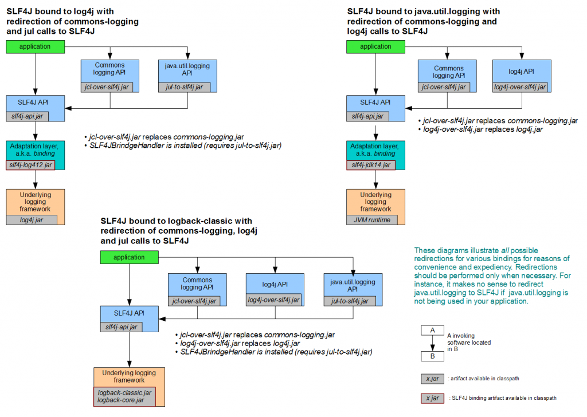

[toc]

# Logging Adapter

日志适配器，提供抽象的接口，底层可以对接不同的日志实现，做到接口和实现的解耦。


## Apache Common Logging

网址：http://commons.apache.org/proper/commons-logging/，也称为 **JCL（Jakarta Commons Logging）**；2014年最新（可以废弃）

### 使用

```xml
<dependency>
  <groupId>commons-logging</groupId>
  <artifactId>commons-logging</artifactId>
  <version>1.2</version>
</dependency>
```

### 配置

`commons-logging.properties`

```properties
org.apache.commons.logging.Log=
```

1. 先找配置文件，再找系统属性；
2. 再找log4j，再找JDK log；
3. 都没有，使用SimpleLog；

### 支持的底层日志

- 封装 **log4j 和 JDK Logger**，无需关注使用哪个日志，不配置则优先寻找 log4j ；
- common-logging通过**动态查找**的机制，在程序运行时自动找出真正使用的日志库。
- 使用了**ClassLoader寻找**和载入底层的日志库， 导致了**像OSGI这样的框架无法正常工作**，因为OSGI的不同的插件使用自己的ClassLoader。 OSGI的这种机制保证了插件互相独立，然而却使Apache Common-Logging无法工作。


## Slf4j

### 架构


### 支持的底层日志

slf4j（Simple Logging Facade for Java）是日志框架的抽象，java.util.logging，log4j 和 logback 是具体实现。

- **logback**是直接实现`org.sl4j.Logger`接口，**没有内存和计算的额外开销**；
- **slf4j** 在**编译时静态绑定真正的Log库**，因此可以在OSGI中使用。
- **slf4j** 支持**参数化的log字符串**



### 使用

slf4j api 调用 log4j 时需要适配层：

- log4j 1.x：*slf4j-log4j12*
- **log4j 2.x :  log4j-slf4j-imp**
  - log4j-slf4j-impl should be used with SLF4J 1.7.x releases or older.
  - log4j-slf4j18-impl should be used with SLF4J 1.8.x releases or newer.