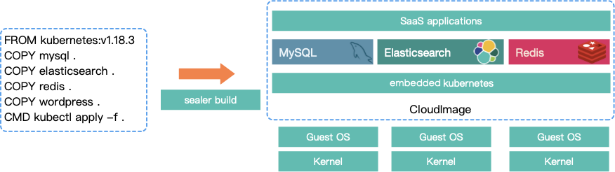
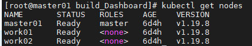
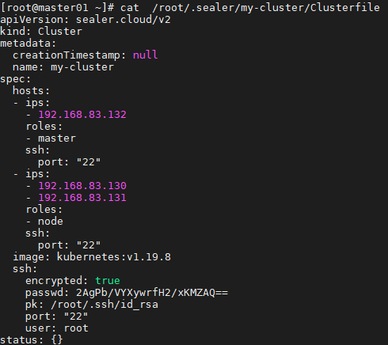
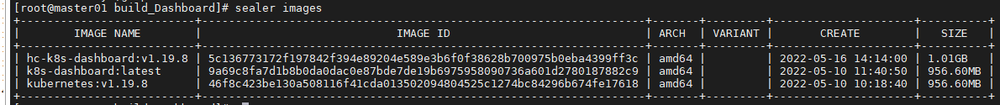
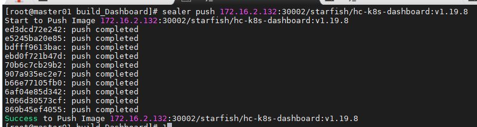
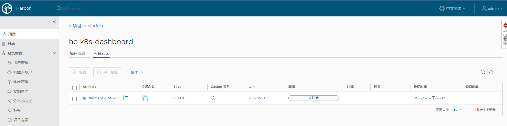

# Sealer（集群交付）

> 把整个集群看成一台服务器，把kubernetes看成云操作系统，吸取docker设计精髓实现分布式软件镜像化构建、交付、运行。

## 简介

> 官方地址：https://github.com/sealerio/sealer/blob/main/docs/README_zh.md

**Docker 镜像很好地解决了单应用的打包问题，但是没有解决分布式应用的镜像问题。**

**Helm 这类编排工具解决了编排问题，没有解决打包问题。**

sealer[ˈsiːlər] 是一款分布式应用打包交付运行的解决方案，通过把分布式应用及其数据库中间件等依赖一起打包以解决应用整个集群整体交付问题。

 sealer构建出来的产物我们称之为"集群镜像"，集群镜像里内嵌了一个kubernetes，解决了分布式应用的交付一致性问题。 集群镜像可以push到registry中共享给其他用户使用，也可以在官方仓库中找到非常通用的分布式软件直接使用。

Docker可以把一个**操作系统的 rootfs+应用 build成一个容器镜像**，sealer**把kubernetes看成操作系统**，在这个更高的抽象纬度上做出来的镜像就是集群镜像。 



## 概念

- **CloudImage** : 类似Docker镜像，但是rootfs是k8s，包含应用的所有依赖（如docker 镜像，yaml 文件 或者 helm chart等)；
- **Kubefile** : 描述如何构建CloudImage的文件；
- **Clusterfile** : 配置文件，使用CloudImage运行一个集群的配置；
- **applicationImage**：应用镜像， 不含底层的k8s，但是只能部署在sealer安装的k8s集群中；


# 1. sealer 使用(v0.8.5)

## 1.1 安装k8s集群demo

sealer可以通过一条命令安装一个kubernetes集群，仅需要提供IP列表和ssh访问密码

- 需要一个干净linux集群
- masters：master地址列表，支持单机和master集群
- nodes：node地址列表，可以为空
- passwd：ssh访问密码，更多配置如端口号不一致或者每台主机不一致可以使用`Clusterfile`，进行额外配置

```bash
# 安装sealer
wget https://github.com/sealerio/sealer/releases/download/v0.8.5/sealer-v0.8.5-linux-amd64.tar.gz && \
tar zxvf sealer-v0.8.5-linux-amd64.tar.gz && mv sealer /usr/bin
# 安装kubernetes集群
sealer run kubernetes:v1.19.8 --masters 192.168.0.2,192.168.0.3,192.168.0.4 --nodes 192.168.0.5,192.168.0.6,192.168.0.7 --passwd xxx
```



## 1.2 增加节点

```shell
# 增加master节点
sealer join --masters 192.168.0.2
# 增加node节点
sealer join --nodes 192.168.0.3
# 删除master节点
sealer delete --masters 192.168.0.2
# 删除node节点
sealer delete --nodes 192.168.0.3
```

## 1.3 释放集群

基础设置的一些源信息会被写入到Clusterfile中，存储在`/root/.sealer/[cluster-name]/Clusterfile`中, 所以可以这样释放集群：

```shell
sealer delete -f /root/.sealer/my-cluster/Clusterfile
# 或
sealer delete --all
```

- Clusterfile内容格式



# 2. 定制化交付

## 2.1 构建一个包含dashboard的自定义集群镜像

经常会有这样的需求，就是有些用户需要集群带上dashboard, 有些人需要calico有些有需要flannel，那如何让用户自定义自己想要的集群？ 

Sealer最出色的地方是可以非常方便的让用户自定义一个集群的镜像，通过像Dockerfile一样的文件来描述和build。

这里以构建一个包含dashboard的集群镜像为例，[recommended.yaml](https://raw.githubusercontent.com/kubernetes/dashboard/v2.6.0/aio/deploy/recommended.yaml)就是包含dashboard的deployment service等yaml文件。

- 这里需要提前在服务器登陆阿里云镜像仓库账号

Kubefile文件内容：

```dockerfile
FROM registry.cn-qingdao.aliyuncs.com/sealer-io/kubernetes:v1.19.8
COPY recommended.yaml manifests/recommended.yaml
CMD kubectl apply -f manifests/recommended.yaml
```

- 通过sealer命令构建镜像

```bash
sealer build -t hc-k8s-dashboard:v1.19.8 .
```

- 通过sealer命令查看镜像

```bash
sealer images
```



- 镜像制作完成后可以推送到Harbor镜像仓库中，推送前需先登陆harbor仓库

```bash
sealer push 172.16.2.132:30002/starfish/hc-k8s-dashboard:v1.19.8
```





## 2.2 运行第一步构建好的定制镜像

- 一行命令运行

```bash
sealer run 172.16.2.132:30002/starfish/hc-k8s-dashboard:v1.19.8 --masters 192.168.0.2,192.168.0.3,192.168.0.4 --nodes 192.168.0.5,192.168.0.6,192.168.0.7 --passwd xxx
```
