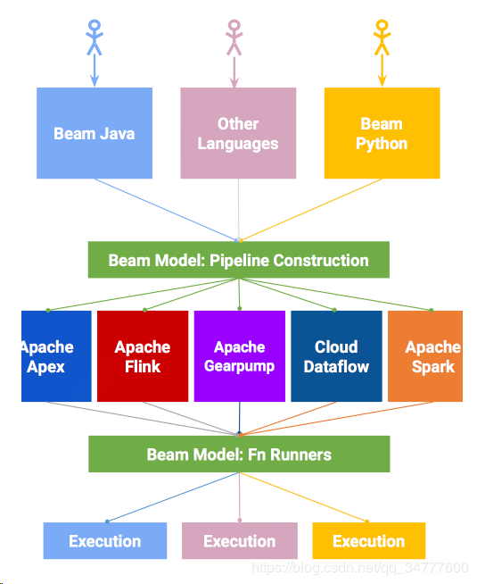

# Apache Beam 

Beam是一个统一的**编程框架**，支持**批处理和流处理**，并可以将用Beam编程模型构造出来的程序，在多个计算引擎（[Apache Apex(retired)](https://apex.apache.org), [Apache Flink](https://en.wikipedia.org/wiki/Apache_Flink), [Apache Spark](https://en.wikipedia.org/wiki/Apache_Spark), [Google Cloud Dataflow](https://en.wikipedia.org/w/index.php?title=Google_Cloud_Dataflow&action=edit&redlink=1)等）上运行。

## 架构

Beam的编程模型是Google的工程师从MapReduce, FlumeJava, 和Millwheel等多个大数据处理项目中抽象出来的，如果想详细了解可以参考相关的报考和论文，[Streaming 101](https://www.oreilly.com/ideas/the-world-beyond-batch-streaming-101)，[Streaming 102](https://www.oreilly.com/ideas/the-world-beyond-batch-streaming-102) 和 [VLDB 2015 paper](http://www.vldb.org/pvldb/vol8/p1792-Akidau.pdf)。这个编程模型主要包括如下几个核心概念：

- PCollection：数据集，代表了将要被处理的数据集合，可以是有限的数据集，也可以是无限的数据流。
- PTransform：计算过程，代表了将输入数据集处理成输出数据集中间的计算过程，
- Pipeline：管道，代表了处理数据的执行任务，可视作一个有向无环图（DAG），PCollections是节点，Transforms是边。
- PipelineRunner：执行器，指定了Pipeline将要在哪里，怎样的运行。