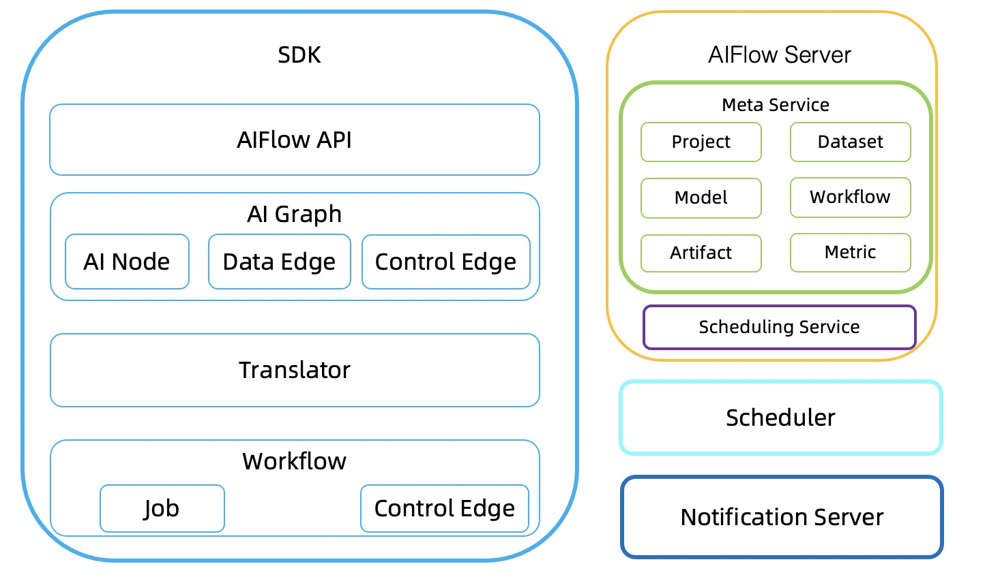
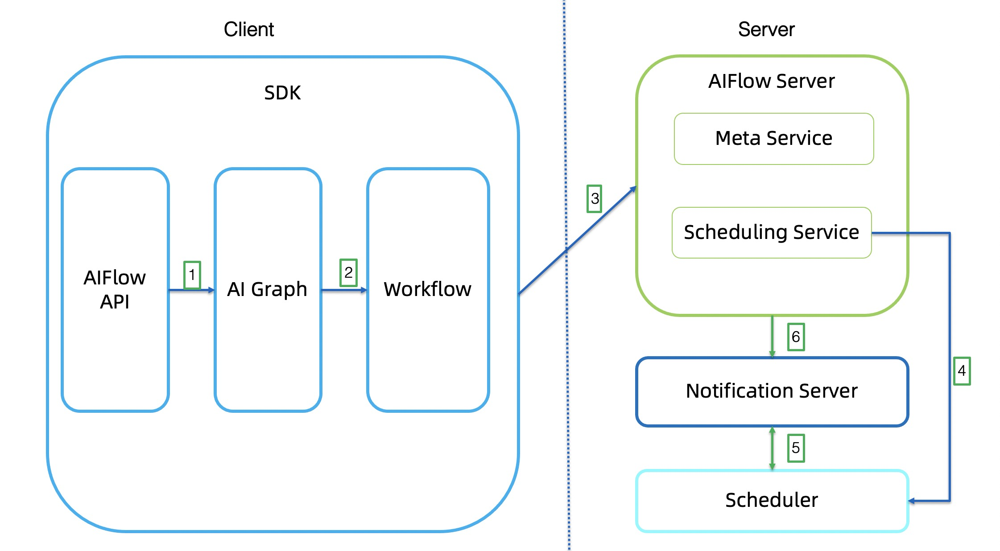
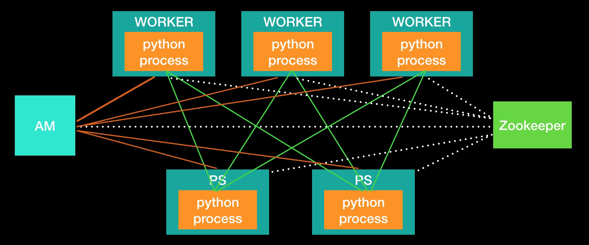

# Flink AI Extend

## Flink AI Flow

> [AI Flow](https://github.com/flink-extended/ai-flow) is an open source framework that bridges big data and artificial intelligence.

### 架构

#### SDK

AIFlow SDK provides the API of workflow operation and the client of the Meta Service and Scheduling Service. The SDK mainly consists of four parts: AIFlow API, AI Graph, Translator and Workflow.

#### AIFlow API

AIFlow API provides the functions like defining a machine learning workflow, workflow operation(submit, start, stop, etc.), sending/listening events, managing the metadata.

#### AI Graph

AI Graph is a logical graph generated by the user-defined AIFlow application.

#### Workflow

Workflow defines a set of execution rules for Jobs.

#### Translator

Translator converts an AI Graph to a Workflow.

#### AIFlow Server

AIFlow Server provides metadata management and scheduling services.

#### Notification Server

 Notification Server provides capabilities the event publishing and subscription.

#### Scheduler

Scheduler provides the function of executing workflow.

### 原理

工作流程：

1. Generates an AI Graph by the AIFlow API.
2. Translates an AI Graph to a Workflow.
3. Submits the Workflow to Scheduling Service and register metadata to Meta Service.
4. Scheduling Service calls scheduler to execute workflow.
5. When the Scheduler runs the workflow, it will publish and subscribe events to Notification Server.
6. AIFlow server sends events to Notification Server, such as model version generation events, etc

## Deep Learning on Flink

> [Deep Learning on Flink](https://github.com/flink-extended/dl-on-flink/tree/master/deep-learning-on-flink) aims to integrate Flink and deep learning frameworks (e.g. TensorFlow, PyTorch, etc).

## 架构

1. AM registers its address to zookeeper.
2. Worker and Ps get AM address from zookeeper.
3. Worker and Ps register their address to AM.
4. AM collect all Worker and Ps address.
5. Worker and Ps get cluster information.
6. Worker and Ps start algorithm python process.