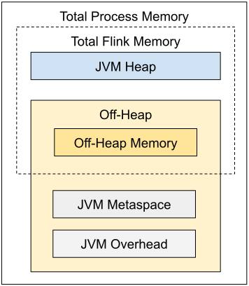
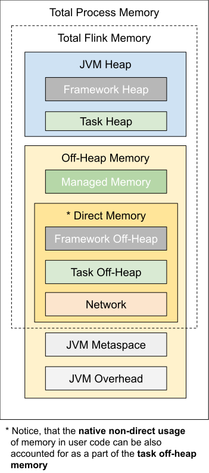

# 配置

### 依赖Jar包提交

**run 提供 -C 这个选项，来支持提交classpath**：

- 此处的classpath的url必须是一个能够在client，JM和TM都被访问到的位置；
- 此位置从client端的提交到JM的分发到TM的访问的过程中，不会发生文件移动的动作；
- url支持的协议包括file,ftp,gopher,http,https,jar,mailto,netdoc，亦即java中URL类支持的协议类型。注意：**不能放在hdfs上**。

所以，如果要想使用-C这个选项，一般有两个做法：

- **手动将classpath中的位置在每个节点上进行部署**。
- 使用共享存储，此共享存储可以被所有节点的角色访问。

**fat jar的方式，通过 run 的 -j 参数**

## 内存

**jobmanager.memory.process.size**：*JobManager* (JobMaster / ResourceManager / Dispatcher) 进程的内存大小；

- ***jobmanager.memory.heap.size***
- ***jobmanager.memory.off-heap.size***：默认128 mb
- ***jobmanager.memory.jvm-metaspace.size***：默认256 mb
- ***jobmanager.memory.jvm-overhead.min***，***jobmanager.memory.jvm-overhead.max***，***jobmanager.memory.jvm-overhead.fraction***：默认，最小192mb，最大1gb，比例为0.1；

**taskmanager.memory.process.size**：TaskManager进程的内存大小

- ***taskmanager.memory.framework.heap.size***：默认128 mb，一般不用动；
- ***taskmanager.memory.task.heap.size***： run operators and user code
- ***taskmanager.memory.managed.size***：***taskmanager.memory.managed.fraction***：默认Flink Memory的0.4
  - 流式作业的RocksDB state backend；
  - 作业的sort，hash tables 和 中间结果的缓存；
  - Python进程中执行UDF；
- ***taskmanager.memory.framework.off-heap.size***：Flink framework，一般不用动；
- ***taskmanager.memory.task.off-heap.size***：Flink application to run operators，用户代码分配的off-heap内存；
- ***taskmanager.memory.network.min(64m)***, ***taskmanager.memory.network.max(1gb)***,***taskmanager.memory.network.fraction(0.1)***：Task建数据激励交换的保留的direct memory（如用于网络传输的buffer）

## 并行度

**taskmanager.numberOfTaskSlots**：TaskManager的slot个数（默认为1），TaskManager中有多个槽可以帮助分摊并行任务或管道中某些常量开销（JVM、应用程序库或网络连接），类似Spark的Executor的核数。

**parallelism.default**

## 操作链的配置

https://ci.apache.org/projects/flink/flink-docs-release-1.13/docs/dev/datastream/operators/overview/#task-chaining-and-resource-groups