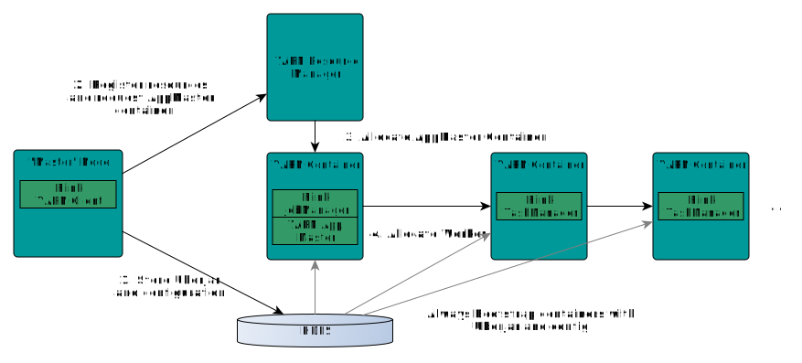

# Deploy

## 部署模式

三种部署模式：

- **Application Mode**：资源隔离，多个job组成一个application运行在同一个集群上，比如如果main()方法有多个execute()，这些作业将视为同一个应用，运行在同一集群中。
  - main()方法在集群上（JobManager）执行而不是客户端

- **A Per-Job Mode**：为每个提交的作业启动一个集群，该集群仅可用于该作业，一旦作业完成集群将会释放。作业之间互不影响。
  - main()方法在client侧执行
  - `bin/flink run -t yarn-per-job -c main方法的类路径 jar包地址`
  
- **Session Mode**：启动一个长期运行的集群，该集群可以接收多个作业的提交，即使所有作业完成后，集群仍然继续运行直到手动停止。
  - main()方法在client执行；
  - **同一个 TaskManager 上可能运行很多作业**，如果其中一个发生故障导致 TaskManager 宕机，在这个上的所有作业都会受到影响；
  - 适合于单个规模小、执行时间短的大量作业。


对比Spark：

- Applicatoin Mode和Per-Job Mode 对应 Spark的 client 模式 和 cluster 模式；
- Session Mode 为 Spark 的Standalone模式，但是在Yarn上Spark没有Session模式；


## Yarn

### Flink Session

启动 Flink 集群：

```shell
bin/yarn-session.sh -jm 1024 -tm 1024 -s 1 -nm flink-session -d
```

- `-nm`配置appmaster进程的名字；

提交作业到 Flink 集群运行：

```
./bin/flink run -m yarn-cluster ./examples/batch/WordCount.jar
```

Session 模式具体的工作流程：

- 用户使用Flink run命令执行程序时，程序会被编译成jobgraph，提交到AppMaster
- Slot资源通过 AppMaster 内部的 ResourceManager 跟Yarn进行通信，申请 TM

- TM与JobManager内部的SlotPool通信，协调task的分发执行



要使得flink运行于yarn上，flink要能找到hadoop配置，因为要连接到yarn的resourcemanager和hdfs。可以使用下面的策略来指定hadoop配置：

- 查看`YARN_CONF_DIR`，`HADOOP_CONF_DIR`或者`HADOOP_CONF_PATH`是否设置，按照顺序检查的。然后，假如配置了就会从该文件夹下读取配置。
- 如果上面环境变量都没配置，使用`HADOOP_HOME`环境变量，配置路径是`$HADOOP_HOME/etc/hadoop;`

### FAQ

异常1：The number of requested virtual cores per node 20 exceeds the maximum number of virtual cores 8 available in the Yarn Cluster. Please note that the number of virtual cores is set to the number of task slots by default unless configured in the Flink config with 'yarn.containers.vcores.'


异常2：Could not build the program from JAR file.

原因分析：

flink1.8没有包括hadoop相关的包。

解决办法：

官网下载flink-shaded-hadoop-2-uber-2.8.3-9.0.jar，放到flink_home/lib目录下