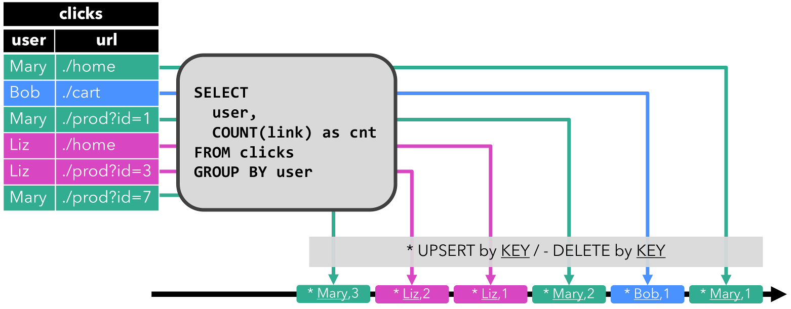

# 动态表

**将SQL和Table的API转为流处理，允许Flink在无界流上实现相同的语义**。

## 数据流上的关系查询

|                        关系代数 / SQL                        |                           流处理                           |
| :----------------------------------------------------------: | :--------------------------------------------------------: |
|               关系（或表）是有界（多）元组集。               |                    流是无限的元组序列。                    |
| 对批处理数据（例如，关系数据库中的表）执行的查询可以访问完整的输入数据。 | 流式查询在启动时无法访问所有数据，并且必须“等待”数据流入。 |
|            批处理查询在生成固定大小的结果后终止。            |  流查询根据接收到的记录不断更新其结果，并且永远不会完成。  |

 A materialized view is defined as a SQL query caching the query result.

*Eager View Maintenance* is a technique to update a materialized view as soon as its base tables are updated.


eager view maintenance and SQL queries on streams：

- 流上`INSERT`，`UPDATE`和`DELETE`DML语句构成的数据库表结果，被称为`changelog stream`；
- 物化视图定义为 SQL 查询。要更新视图，查询必须持续处理视图基本关系的变更日志流；
- 物化视图是流式 SQL 查询的结果。


## 动态表和持续查询

*动态表*是 Flink 的 Table API 和 SQL 支持流式数据的核心概念，随时间而变化。

- 查询时，动态表会产生一个*连续查询*，查询不会终止，产生动态结果（另一张动态表）；
- 查询不断更新其（动态）结果表以反映其（动态）输入表的变化；
- 连续查询输出在语义上始终等同于在输入表的快照上以批处理模式执行的同一查询的结果。


下图形象化了流、动态表、连续查询的关系：


1. 流被转换为动态表。
2. 在动态表上评估连续查询，产生一个新的动态表。
3. 生成的动态表被转换回流。


## 流上的表定义

### Update and Append Queries

查询是生成仅附加表还是更新表有一些含义：

- 进行更新更改的查询通常必须维护更多状态；
- 追加表到流的转换与更新表的转换不同。

### Query Restrictions

许多（但不是全部）语义上有效的查询可以评估为对流的连续查询。一些查询的计算成本太高，1）因为它们需要维护的状态大小，2）因为计算更新太昂贵。

-  **状态大小**：连续查询处理的数据总量可能非常大，**需要更新先前发出的结果的查询需要维护所有发出的行以更新它们**；

  ```sql
  # 随着用户量的增长，总行数会越来越多
  SELECT user, COUNT(url)
  FROM clicks
  GROUP BY user;
  ```

- **计算更新：**一些查询需要重新计算和更新大部分发出的结果行

  ```sql
  # 基于最后的点击时间，进行排名
  SELECT user, RANK() OVER (ORDER BY lastAction)
  FROM (
    SELECT user, MAX(cTime) AS lastAction FROM clicks GROUP BY user
  );
  ```


## 表到流转换

动态表可以像普通数据库表一样，通过INSERT、UPDATE和DELETE更改不断修改。它可能是一个只有一行且不断更新的表，也可能是一个没有UPDATE和DELETE修改的仅插入表，或者介于两者之间的任何表。

当将动态表转换为流或将其写入外部系统时，需要对这些更改进行编码。Flink的Table API和SQL支持三种方式来编码动态表的变化：

- **Append-only stream（追加流）**：仅由INSERT更改修改的动态表可以通过发出插入的行转换为流。
- **Retract stream（撤回流）**：具有两种类型消息的流，即**添加消息和撤回消息**。通过将INSERT更改编码为添加消息、DELETE更改编码为撤销消息、UPDATE更改编码为已更新(前一个)行的撤销消息以及更新(新)行的附加消息，动态表被转换为撤销流。下图显示了将动态表转换为缩回流的过程。


- **Upsert stream（）**：具有两种类型消息的流，**upsert消息和delete消息**。转换为upsert流的动态表需要一个(可能是复合的)唯一键。具有唯一键的动态表通过将INSERT和UPDATE更改编码为upsert消息，将DELETE更改编码为DELETE消息，从而转换为流。与回退流的主要区别是UPDATE更改使用单个消息编码，因此效率更高。



将动态表转换为DataStream时，只支持追加和收回流。


## 查询配置

但是，对于一些连续的查询，您必须限制它们所维护的状态的大小，以避免在接收无边界的输入流时耗尽存储空间。它取决于输入数据和查询本身的特征，是否需要限制状态大小，以及它是否以及如何影响计算结果的准确性。

Flink的Table API和SQL接口提供参数来调优连续查询的准确性和资源消耗。这些参数是通过`TableConfig`对象指定的，该对象可以从`TableEnvironment`中获得。

```java
StreamExecutionEnvironment env = StreamExecutionEnvironment.getExecutionEnvironment();
StreamTableEnvironment tableEnv = StreamTableEnvironment.create(env);

// obtain query configuration from TableEnvironment
TableConfig tConfig = tableEnv.getConfig();
// set query parameters
tConfig.setIdleStateRetentionTime(Time.hours(12), Time.hours(24));

// define query
Table result = ...

// create TableSink
TableSink<Row> sink = ...

// register TableSink
tableEnv.registerTableSink(
  "outputTable",               // table name
  new String[]{...},           // field names
  new TypeInformation[]{...},  // field types
  sink);                       // table sink

// emit result Table via a TableSink
result.executeInsert("outputTable");

// convert result Table into a DataStream<Row>
DataStream<Row> stream = tableEnv.toAppendStream(result, Row.class);
```

### 空闲状态保持时间

许多查询在一个或多个键属性上聚合或联接记录。当在流上执行这样的查询时，连续查询需要收集记录或维护每个键的部分结果。如果输入流的键域是不断变化的，即**活动键值是随时间变化的**，那么随着观察到越来越多不同的键，连续查询将积累越来越多的状态。然而，**键通常在一段时间后变为非活动的，它们相应的状态变得陈旧和无用**。

Idle State Retention Time参数定义在删除键之前，键的状态在不更新的情况下保留多长时间。

通过删除键的状态，连续查询完全忘记它以前见过这个键。如果处理一个具有键的记录(其状态之前已被删除)，则该记录将被视为具有相应键的第一个记录。

有两个参数可以配置空闲状态保留时间：

- 最小空闲状态保留时间定义了在删除非活动键之前，该键的状态至少保留了多长时间；
- 最大空闲状态保留时间定义了在删除非活动键之前，其状态最多保留多长时间；

清理状态需要额外的簿记，对于minTime和maxTime的较大差异，簿记的成本会更低。**“minTime”与“maxTime”的时间差至少为5分钟**。