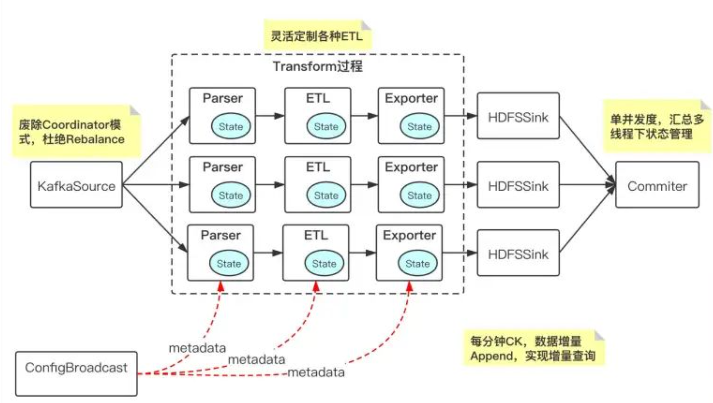
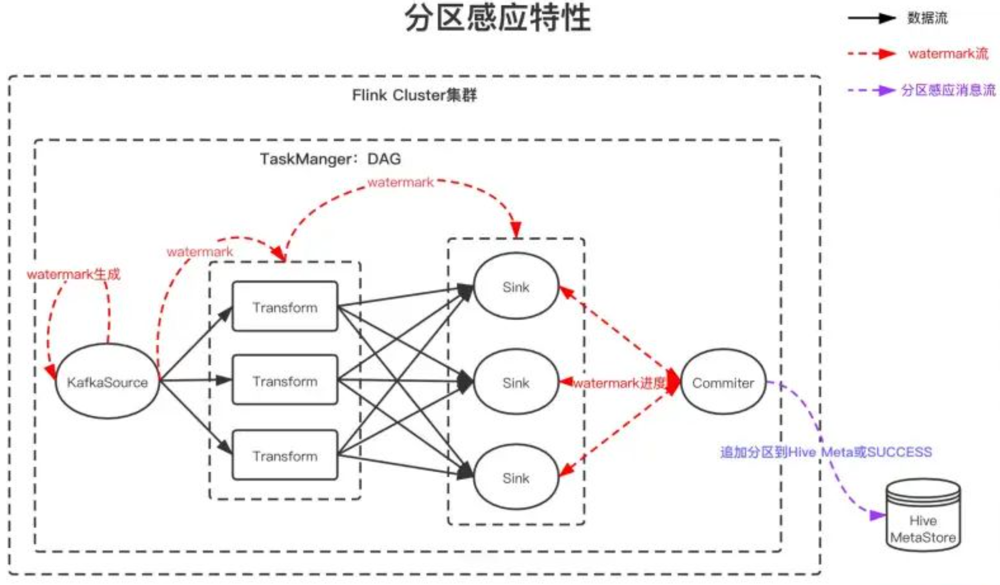
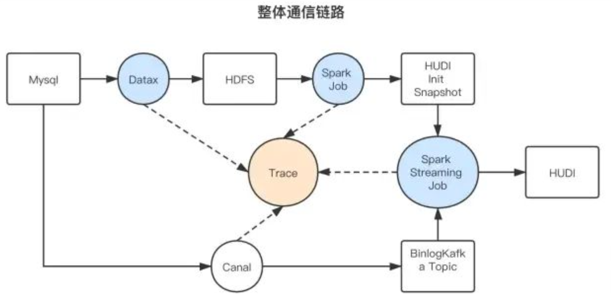
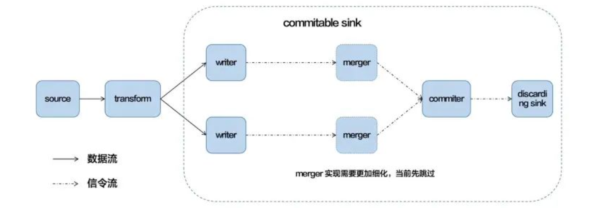
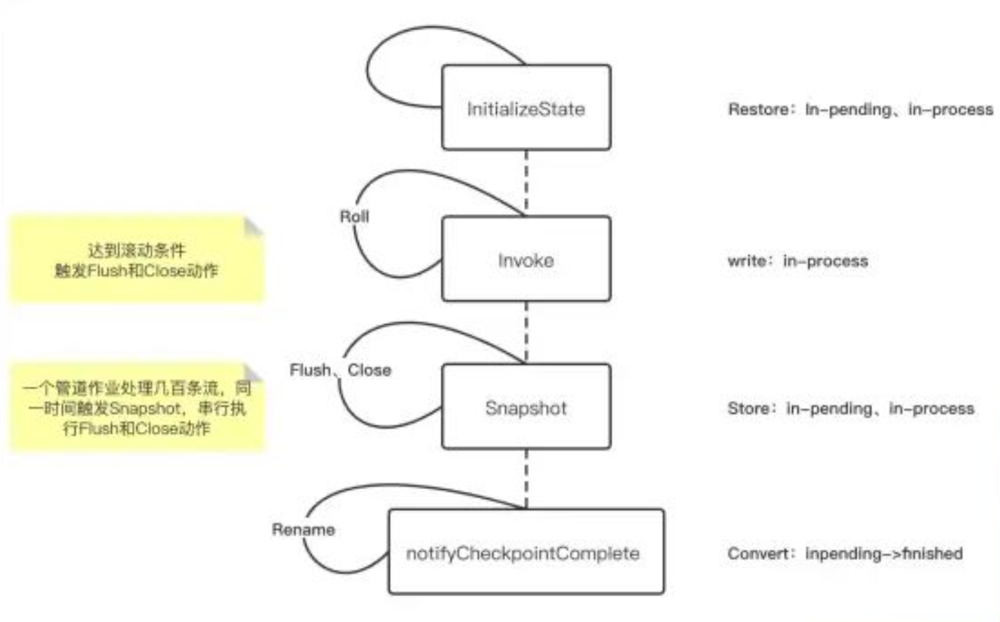

# Flink 实战

- ？？通过 watermark 处理数据分区的进度去下发一条事件驱动的消息拉起下一个离线或者实时的作业？？

## [Flink在bilibili大数据与AI方向的探索与实践](https://mp.weixin.qq.com/s/BjMgiy3QKTltWjvJA9kHdw)

### 整体链路

- ConfigBroadcast 的模块来解决管道元数据实时更新、热加载的问题；
- 每分钟会进行一次 checkpoint，针对增量的实际数据进行 Append，这样就可以提供分钟级的查询。

### 分区感应

- 首先在 Source 会基于消息当中的 Eventime 来生成 Watermark，Watermark 会经过每一层的处理传递到 Sink，最后会通过 Commiter 模块，以单线程的方式来汇总所有 Watermark 消息的进度；
- 当Commiter模块发现全局 Watermark 已经推进到下个小时的分区的时候，它会下发一条消息到 Hive MetaStore，来通知上小时分区数据 ready，从而可以让**下游的调度可以更快的通过消息驱动的方式**来拉起作业的运行。

### CDC管道

- 流批作业联动
  - 首先是通过 Datax 将 MySQL 的数据全量一次性同步到的 HDFS；
  - 通过 spark 的 job，将数据初始化成 HUDI 的初始快照；
- 保障数据不丢不重
  - Canal 写 Kafka ，开启事务的机制，保证数据在传输过程当中的不丢不重；
  - 全局唯一 id 加毫秒级的时间戳，Streaming job 做去重；
- 全链路质量监控
  - 实现Trace，基于ClickHouse存储，统计各个环节IO；

### 稳定性 - 小文件的合并

- 每分钟的 Checkpoint，文件数的放大非常严重；
  - 引入 merge 的 operater 来实现文件的合并，基于并发度横向合并，一个 writer 会对应一个 merge；

### HDFS 通信

作业堆积比较严重的问题，实际分析其实主是和 HDFS 通信有很大的关系；

- 四个关键的步骤：初始化 state、Invoke、Snapshot 以及 Notify Checkpoint complete

  - 核心问题主要发生在 Invoke 阶段，达到文件的滚动条件时触发 flush 和 close（NameNode通信阻塞）

  - Snapshot 阶段，一个管道上百条流一旦触发 Snapshot，串行执行 flush 和 close 也会非常的慢

解决方案：

- 减少了文件的斩断（close次数）， **Snapshot 阶段，通过文件续写**的方式替代close；
- 异步化 close，针对 Invoke 和 Snapshot 的 close，将状态管理到 state 当中，通过初始化 state 来进行文件的恢复
- 针对多条流，Snapshot 还做了并行化的处理

### 稳定性-分区容错

- 实际在管道多条流的情况下，有些流的数据并不是每个小时都是连续的， Watermark 没有办法正常推进，引发**空分区**的问题；
  - 引入 PartitionRecover 模块，它会根据 Watermark 来推进分区的通知；
  - 针对有些流的 Watermark，如果在 ideltimeout 还没有更新的情况下，Recover 模块来进行分区的追加。在每个分区的末尾到达的时候，加上 delay time 来扫描所有流的 Watermark，由此来进行兜底。

- 在传输过程当中，当 **Flink 作业重启的时候，会遇到一波僵尸的文件**
  - 在 DAG 的 commit 的节点，去做整个分区通知前的僵尸文件的清理删除，来实现整个僵尸文件的清理
  - 