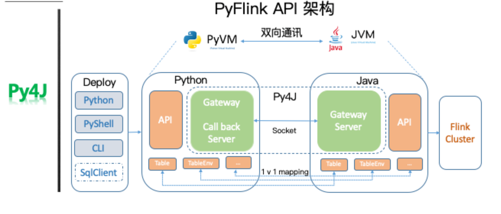

# PyFlink

## 原理

- 采用 Py4j，将 Java API 映射为 Python API，保持和 Java 一样的语义；
- Python UDF（Apache Beam的实现和思路）；



## Shell

```shell
# MINI Cluster
bin/pyflink-shell.sh local

# Remote Cluster
bin/pyflink-shell.sh remote 172.16.2.125 8081
```

### pyflink-shell.sh 指定 jobmanager

通过 

```shell
# 值为`remote -m 172.16.2.125:8081`
export SUBMIT_ARGS=${OPTIONS[@]}
```

然后在 java_gateway.py 中获取

```python
submit_args = os.environ.get("SUBMIT_ARGS", "local")
command += shlex.split(submit_args)
# ...
# command 内容为['/home/experiment/.conda/envs/flink/lib/python3.7/site-packages/pyflink/./bin/pyflink-gateway-server.sh', '-c', 'org.apache.flink.client.python.PythonGatewayServer', 'remote', '-m', '172.16.2.125:8081']
p = Popen(command, stdin=PIPE, preexec_fn=preexec_func, env=env)
```

在 `pyflink-gateway-server.sh `中

```shell
# exec /home/experiment/.conda/envs/flink/lib/python3.7/site-packages/pyflink/bin/flink run -m 172.16.2.125:8081 -c org.apache.flink.client.python.PythonGatewayServer
exec "$FLINK_BIN_DIR"/flink run ${ARGS[@]} -c ${DRIVER}
```

`flink run` 启动类 `org.apache.flink.client.cli.CliFrontend`，在 remote 环境里执行 PythonGatewayServer 类，其是个py4j的类（它获取的ExecutionEnvironment就是remote环境）。

简言之，**在 import pyflink 前，可以通过shell或python设置环境变量SUBMIT_ARGS**，直接在python中获取到remote环境。


### 额外的 Jar 依赖

如果pyflink中需要调用到第三方的jar包，需要指定参数`-C classpaths`


## Yarn

> per job 模式废弃

Application Mode

```shell
./bin/flink run-application -t yarn-application \
      -Djobmanager.memory.process.size=1024m \
      -Dtaskmanager.memory.process.size=1024m \
      -Dyarn.application.name=<ApplicationName> \
      -Dyarn.ship-files=/path/to/shipfiles \
      -pyarch shipfiles/venv.zip \
      -pyclientexec venv.zip/venv/bin/python3 \
      -pyexec venv.zip/venv/bin/python3 \
      -pyfs shipfiles \
      -pym word_count
```

Session 模式

```shell
$ ./bin/flink run \
      --target yarn-session
      --python examples/python/table/word_count.py
```

