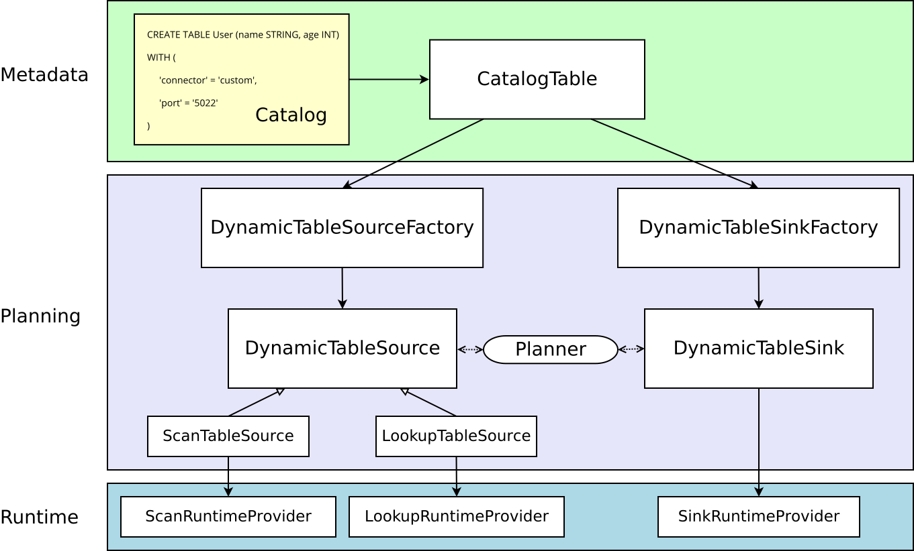

# User-defined Sources & Sinks 

动态表是Flink的Table & SQL API的核心概念，用于统一处理有界和无界数据。

因为动态表只是一个逻辑概念，所以Flink并不拥有数据本身。相反，动态表的内容存储在外部系统(如数据库、键值存储、消息队列)或文件中。

动态Source和动态Sink可用于从外部系统读写数据，下文全部称为连接器（connectors）。

## 概览

在许多情况下，实现者不需要从头开始创建新的连接器，而是希望稍微修改现有的连接器或挂钩到现有的堆栈中。

下文解释了表连接器的一般架构，从 API 中的纯声明到将在集群上执行的运行时代码。

**实心箭头显示在转换过程中对象如何从一个阶段转换为其他对象**。

### 元数据

Table API和SQL是声明式APIs。因此，执行`CREATE TABLE`语句导致对于**目标catalog更新元数据**。

对于大多数catalog实现，不会为此类操作修改外部系统中的物理数据。特定于连接器的依赖项不必出现在类路径中。`WITH`子句中声明的选项既不经过验证也不以其他方式解释。

动态表的元数据（通过 DDL 创建或由catalog提供）表示为`CatalogTable`，必要时表名会被解析成`CatalogTable`。

### Planning

### Runtime

## 扩展点