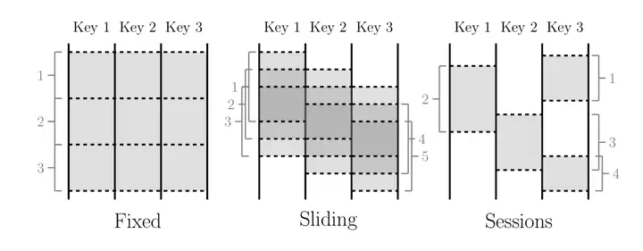
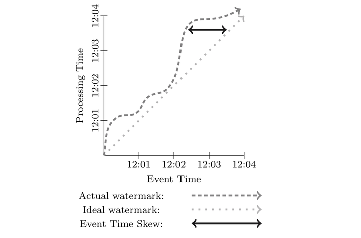
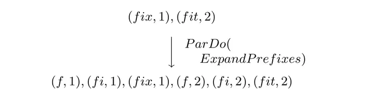
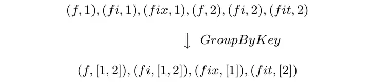
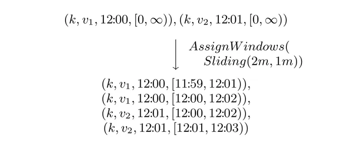
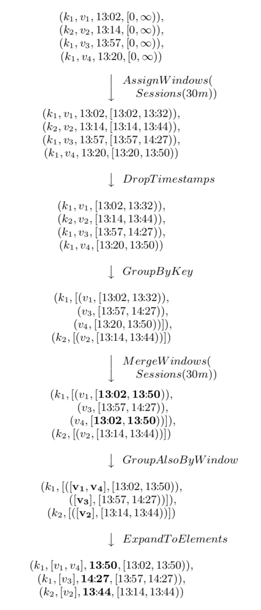

# Google DataFlow

> The dataflow model: a practical approach to balancing correctness, latency, and cost in massive-scale, unbounded, out-of-order data processing.  2015 VLDB.

> Flink 和 Spark Structired Streaming 都是参考 Google Dataflow 实现。

## 1. Overview

Google Dataflow 模型旨在提供一种统一批处理和流处理的系统。

Dataflow 模型的核心点在于：

- 对于**无序的流式数据提供基于 event-time 的顺序处理**、基于数据本身的特征进行窗口聚合处理的能力，以及平衡正确性、延迟、成本之间的相互关系。

解构数据处理的四个维度，方便我们更好的分析问题：

- - **What** results are being computed.
  - **Where** in event time they are been computed.
  - **When** in processing time they are materialized.
  - **How** earlier results relate to later refinements.

将数据处理中的逻辑概念和底层物理实现解耦

- **Windowing Model**，支持非对齐的 event time 的窗口聚合
- **Triggering Model**，提供强大和灵活的声明式 API 来描述 Trigger 语义，可以根据事件处理的运行时特征来决定输出次数。
- **Incremental Processing Model**，将数据的更新整合到上面的 **Window** 模型和 **Trigger** 模型中。
- **Scalable implementation**，基于 MillWheel 流式引擎和 Flume 批处理引擎实现的 Google Dataflow SDK，用户无需感知底层系统。
- **Core Principle**，模型设计的核心原则。

## 2. 核心概念

>  Dataflow 模型一般将有限/无限数据集合称为 Bounded/Unbounded Dataset，而 Streaming/Batch 用来特指执行引擎。

### 2.1 Window

在处理无限数据集的时候有限操作需要窗口，比如 **aggregation**，**outer join**，**time-bounded** 操作。

- 窗口大部分都是基于时间来划分，但是也有基于其他存在逻辑上有序关系的数据来划分。

窗口模型主要有三种：**Fixed Window**，**Sliding Window**，**Session Window**。

#### 2.1.1 Fixed Window

Fixed Window（Tumbling Window）：特定的时间长度在无限数据集合上翻滚形成；

- 每个 Window 没有重叠，例如小时窗口就是 12:00:00 ~ 13:00:00 一个窗口，13:00:00 ~ 14:00:00 一个窗口；

#### 2.1.2 Sliding Window

滑动窗口：由两个参数确定，窗口大小和滑动间隔。

- 示例：每分钟开始一个小时窗口对应的就是窗口大小为一小时，滑动间隔为一分钟；
- 滑动间隔一般小于窗口大小，也就是说窗口之间会有重叠；

#### 2.1.3 Session Window

会话窗口， 一般用来捕捉一段时间内的行为；

- 比如 Web 中一段时间内的登录行为为一个 Session，当长时间没有登录，则 Session 失效，再次登录重启一个 Session；
- 用超时时间来衡量，只要在超时时间内发生的事件都认为是一个 Session Window；

### 2.2 Time Domain

- **Event Time**，事件发生的时间。
- **Processing TIme**，事件在系统中的处理时间

在现实中，由于通信延迟、调度延迟等，往往导致 Event Time 和 Processing Time 之间存在差值（skew），且动态变化。**skew 一般使用 watermark 来进行可视化**，如下图。

## 3. Dataflow Model

### 3.1 Core Primitives

Dataflow 针对 (key, value) 数据对提供了两种基本的操作原语：**ParDo** 和 **GroupByKey**。

- **ParDo**，(key, value) 上的 transformation 操作，类似 Spark RDD 中的 map （一个 kv 产生一个 kv）和 flatMap 算子（一个 kv 产生不定个数的 kv）。形式化定义如下

- **GroupByKey** 类似 Spark 中的聚合算子，形式化定义如下。与 **ParDo** 不同（**ParDo** 可以天然的应用到无限数据流）， **GroupByKey** 这种聚合操作需要结合窗口一起使用。

### 3.2 Window

支持 **GroupByKey** 聚合的系统一般是在底层将其实现为 **GroupByKeyAndWindow**。

Dataflow 在这上面的改进主要在于支持非对齐的窗口：

- 将所有的窗口当成非对齐窗口来处理；
- 所有的窗口操作可以分解成下面两步：分配和合并
  - Set AssignWindows(T datum) 将数据分配到 0 个或多个窗口中。
  - Set MergeWindows(Set windows) 窗口合并操作，这个是流数据处理中非常有用。

为了支持基于 event time 的窗口聚合操作，数据的表示不再使用 (***key***, ***value***) 数据对，而是用 (***key***, ***value***, ***event_time***, ***window***) 四元组来表示。在数据进入系统中的时候，系统会默认给数据分配一个全局的 window。

#### 3.2.1 **Window Assignment**

从模型的角度来看，窗口分配是将数据拷贝到对应的窗口。下图是一个窗口大小为 2 分钟，滑动间隔为 1 分钟的滑动窗口示例。

- 将每个 data 分配到对应的窗口中；

#### 3.2.3 Window Merge

窗口合并用在 **GroupByKeyAndWindow** 操作中，下面用一个超时时间为 30 分钟的会话窗口的例子来说明，如下图。

- 所有数据的窗口都被初始化为 0 到无穷大。然后所有数据都被分配到一个由自己的时间戳 `timestamp` 和 `timestamp + 30min` 的窗口中。

### 3.3 Triggers & Incremental Processing

DataFlow 是构建基于 event time 的非对齐窗口，有两个问题需要解决：

- 和其他流式系统的语义保持兼容，需要提供基于 processing time 和基于 tuple 的窗口
  - 将 processing time 当成 event time 处理
- 窗口数据的完整性：由于 event time 是无序，数据可能晚到，要等待多久呢？
  - 使用一种全局的 event time 进度指标，比如 watermark 来处理；
  - 如何设置 watermark 是个很难的问题，因为由于多种原因，数据到达可快可慢。

传统的数据处理模式，使用 Lambda 架构来解决：

- 先用流式系统保证时效性和近似的准确性，然后再使用批处理系统异步执行来保证数据的完整性。

Dataflow 对于这个问题的处理使用一种叫做 "Trigger" 的机制

- 通过 Trigger 控制窗口数据输出结构，而对于尚未到达的事件可以使用不同的处理策略
- **Discarding**：窗口数据 Trigger 之后直接丢弃
- **Accumulating**：Trigger 之后，窗口的结果数据被保存下来以支持后面的数据进行更新
- **Accumulating & Retracting**：在第二种的基础上提供了回退操作，也就是在之后再 Trigger 的时候，先触发一次撤回操作，再下发新的结果

## 4. 总结

前面提到数据处理解构出来的四个维度，我们现在来看一下如何解决。

- **What** results are being computed. => **Transformation**
- **Where** in event time they are been computed. => **Window**
- **When** in processing time they are materialized. => **Watermark and Trigger**
- **How** earlier results relate to later refinements. => **Discarding, Accumulating, Accumulating & Retracting.**

## 5. 参考文献

1. Google DataFlow Paper Reading, https://github.com/legendtkl/paper_reading/blob/main/realtime-compute/Google_DataFlow.md