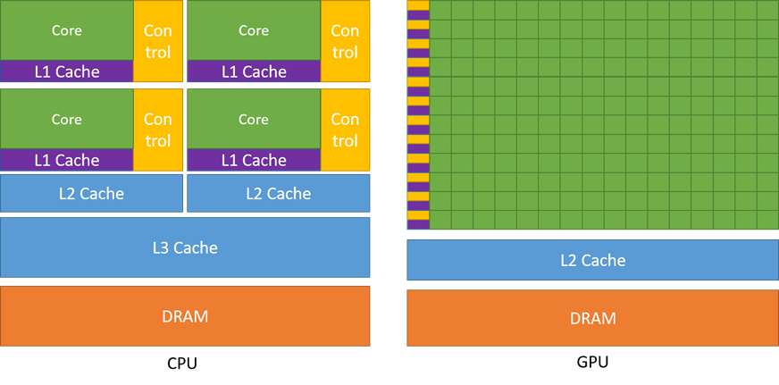
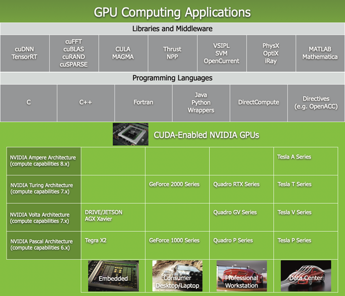
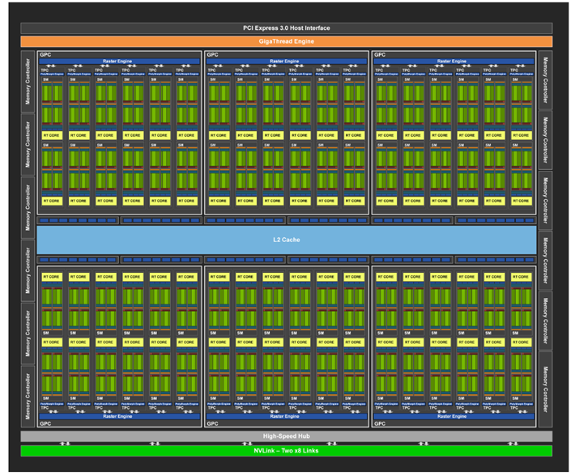
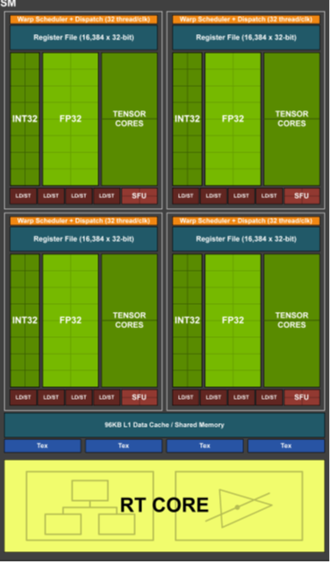
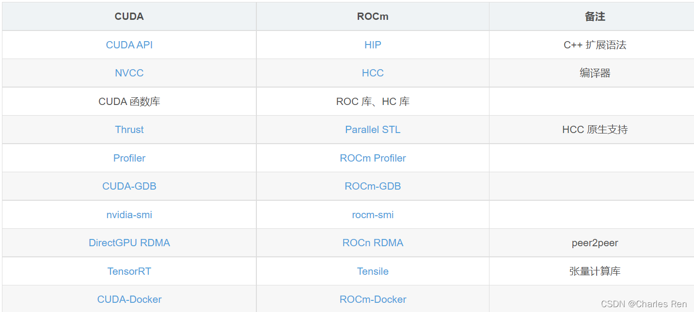

# GPU

## CPU与GPU体系结构对比

## GPU计算应用

> Nvidia GPU架构变迁史
>
> https://www.expreview.com/68156.html
> https://www.cnblogs.com/timlly/p/11471507.html

## 硬件概念

- 显存：GPU的内存，
- SP：最基本的处理单元，streaming processor，也称为Cuda core
- SM：多个SP加上其他的一些资源组成一个streaming multiprocessor，也叫GPU大核，其他资源如：warp scheduler，register，shared memory等。

[Tesla T4](https://www.nvidia.cn/content/dam/en-zz/Solutions/Data-Center/tesla-t4/t4-tensor-core-datasheet.pdf)：[Turing ](https://www.nvidia.com/content/dam/en-zz/Solutions/design-visualization/technologies/turing-architecture/NVIDIA-Turing-Architecture-Whitepaper.pdf)[架构](https://www.nvidia.com/content/dam/en-zz/Solutions/design-visualization/technologies/turing-architecture/NVIDIA-Turing-Architecture-Whitepaper.pdf)（第7代），目前已经演进到第8 代Ampere;

**Turing TU102 Full GPU with 72 SM Units **

**Turing TU102 Streaming Multiprocessor (SM) **

## 编程语言

### CUDA

NVIDIA GPU的编程语言，见 [Cuda编程](./cuda/program.md)

### ROCm(HIP)

> ROCm 的目标是建立可替代 CUDA 的生态（图1），并在源码级别上对 CUDA 程序的支持。

AMD GPU的编程语言，见[HIP编程](./rocm/hip.md)

