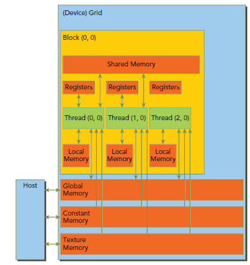

# 编程

## 内存

### 架构



- Registers
  - kernel中没有什么特殊声明的自动变量都是放在寄存器中，当数组的索引是constant类型且在编译期能被确定的话，数组也是放在寄存器中；
  - 寄存器变量是每个线程私有的，一旦thread执行结束，寄存器变量就会失效；避免register spilling到local memory上；
  - [每个thread使用的寄存器数量是255个](https://docs.nvidia.com/cuda/cuda-c-programming-guide/index.html#features-and-technical-specifications__technical-specifications-per-compute-capability)；
- Local memory：在local memory中的变量本质上跟global memory在同一块存储区；
  - 不能确定它们是用常量索引的数组或任何超过寄存器限制的变量；
  - 较大的结构体或者数组，也就是那些可能会消耗大量register的变量；
  - 每个线程的local memory大小为512KB；
- Shared memory：
  - 以block为单位分配，[根据计算力不同其大小也不同](https://docs.nvidia.com/cuda/cuda-c-programming-guide/index.html#features-and-technical-specifications__technical-specifications-per-compute-capability)；
  - 获取shared memory的数据前必须先用__syncthreads()同步；
  - 划分为不同的bank，不同bank的数据可以同时获取，同一个bank的数据同时获取需要按序；（32个bank）
- Constant memory：
  - 64KB；
  - 初始化必须在host端使用cudaMemcpyToSymbol函数；
- Texture and Surface memory 
- Global Memory


**新的共享内存架构(Turing)**

统一shared memory，L1 and texture caching。


### 内存修饰

变量定义时，可以用以下进行修饰

**`__device__`** ：存储在设备上，默认为global memory

- **`__shared__` **： shared memory
  - block级的生命周期，block内所有线程共享
- **`__constant__`** ：constant memory
  - 类型可以是变量、数组，但不能是指针；
- **`__managed__`** ：变量在设备和主机上都能引用及操作

**`__restrict__ `**：C99 中消除指针别名问题

- 定义指针变量，表明该变量没有别名；
- 更好的编译器优化；

### L2 Cache

L2 cache是Global memory的缓存，从Cuda 11.0起，计算力8.0以上的device可以控制L2 cache的存储，获取global memory更高带宽和更低延迟。

*TODO：使用*

### Shared Memory

比global memory更低的延迟，可以用来减少频繁的global memory访问，见[矩阵乘法示例优化](#矩阵乘法)。

### Page-Locked Host Memory

分配page-locked(pinned)主机内存， 相对于malloc分配的常规页内存（可以被交换到磁盘上）。

- cudaHostAlloc()和cudaHostFree()函数。

- cudaHostRegister()可以page-lock由malloc函数申请的内存。

- page-locked的主机内存和device内存间的拷贝可以和kernel执行并发；
- 需要在内存中有连续的空间，如果内存紧张，可能分配时间会很长或者失败。

#### Portable 内存

cudaHostAllocPortable

分页锁定内存块可以与系统中的任何设备一起使用（多GPU卡系统）。

#### Write-Combining 内存

cudaHostAllocWriteCombined 

避免使用主机的L1和L2缓存，当成只写内存，因此读取会比较慢。

#### Mapped 内存

cudaHostAllocMapped 

分页锁定内存块可以映射到device内存。

### 函数

- Device上的内存有两种分配形式：**Linear memory** 或 **CUDA arrays**。

- - Linear memory  : 使用 cudaMalloc，cudaFree和cudaMemCpy，计算力6.0之后地址空间在X86_64为47位；
    - Linear memory也可以使用cudaMallocPitch() 和 cudaMalloc3D()，自动对2D/3D数组padding对齐；
  - Cuda Arrays是对Texture memory的不透明的内存布局优化实现；

```c++
// cudaMallocPitch，2D数组示例 Host code
int width = 64, height = 64;
float* devPtr;
size_t pitch;
cudaMallocPitch(&devPtr, &pitch, width * sizeof(float), height);
MyKernel<<<100, 512>>>(devPtr, pitch, width, height);
// Device code
__global__ void MyKernel(float* devPtr, size_t pitch, int width, int height) {
    for (int r = 0; r < height; ++r) {
        float* row = (float*)((char*)devPtr + r * pitch);  // important
        for (int c = 0; c < width; ++c) {
            float element = row[c];
        }
    }
}
```

#### Device内存

分配：

- cudaMalloc

销毁

- cudaFree

#### Host内存


#### 内存数据传递

**`cudaError_t cudaMemcpy ( void* dst, const void* src, size_t count,cudaMemcpyKind kind )`**

- `kind`可以为：cudaMemcpyHostToDevice，cudaMemcpyDeviceToHost，cudaMemcpyDeviceToDevice，cudaMemcpyHostToHost

**`__host__ cudaError_t cudaMemcpyToSymbol ( const T& symbol, const void* src, size_t count, size_t offset = 0, cudaMemcpyKind kind = cudaMemcpyHostToDevice )`**

- `symbol` is a variable that resides in global or constant memory space. 
- Copies data to the given symbol on the device

**`__host__ cudaError_t cudaMemcpyFromSymbol ( void* src, const T& symbol, size_t count, size_t offset = 0, cudaMemcpyKind kind = cudaMemcpyDeviceToHost)`**

- `symbol` is a variable that resides in global or constant memory space. 

- Copies data from the given symbol on the device

## Kernel

> **所有CUDA kernel的启动都是异步的，当CUDA kernel被调用时，控制权会立即返回给CPU。**


kernel按照线程网格（Grid）的概念在显卡硬件（GPU）上执行。当要执行这些任务的时候，每一个Grid又把任务分成一部分一部分的block，block再分线程来完成。

### Kernel<<<Dg, Db, Ns, S>>>(param1, param2, ...)

- Dg：grid的尺寸，说明一个grid含有多少个block，dim3/int类型
- Db：block的尺寸，说明一个block含有多少个thread，dim3/int类型
- Ns：可选参数，如果kernel中由动态分配内存的shared memory，需要在此指定大小，以字节为单位；
- S：可选参数，表示该kernel处在哪个流当中。

[不同GPU计算力中kernel的grid、block的限制](https://docs.nvidia.com/cuda/cuda-c-programming-guide/index.html#features-and-technical-specifications__technical-specifications-per-compute-capability) 

- grid尺寸，<x,y,z>最多为**<2^31-1, 65535, 65535>**
- block尺寸，<x,y,z>最多为**<1024, 1024, 64>**

### 内置变量

gridDim

- 常数，最多三维，保存线程格(grid)中每一维的大小。

blockDim

- 常数，最多三维，保存的是线程块(block)中每一维的线程数量。

blockIdx

- 当前执行设备代码的**线程块的索引**。

threadIdx

- 当前执行设备代码的**线程索引**。

### 修饰

`__host__` ( 等价于没有修饰 )

- 在 host 上执行，通过 host 调用

`__device__`

- 在 device(GPU) 执行，通过 device 调用

`__global__`

- 返回为void，不能是成员函数

- 在 device 上执行，可以通过 host 调用，或者 device 调用（计算力大于3.2，T4计算力7.5）

## RunTime

### 执行说明

- CUDA的设备在实际执行过程中，会**以block为单位，把一个个block分配**给SM进行运算；
- block中的thread又会以warp（线程束）为单位，对thread进行分组计算。
  - 目前CUDA的warp大小都是32，也就是说32个thread会被组成一个warp来一起执行。
  - 同一个warp中的thread执行的指令是相同的，只是处理的数据不同。
- **一个SM 一次只会执行一个block 里的一个warp**
  - 当遇到正在执行的warp 需要等待的时候（例如存取global memory 就会要等好一段时间），就切换到别的warp来继续做运算

### 异步并发执行

CUDA将以下操作暴露为可以相互并发操作的独立任务。

- Computation on the host;
- Computation on the device;
- Memory transfers from the host to the device;
- Memory transfers from the device to the host;
- Memory transfers within the memory of a given device;
- Memory transfers among devices.

#### Host和Device的并发

以下device上的操作对Host是异步：

- Kernel launches，`CUDA_LAUNCH_BLOCKING`设置为1时表示Block；
- 单个device内的内存拷贝;
- Memory copies from host to device of a memory block of 64 KB or less;
- **以`Async`结尾的内存拷贝函数;**
- Memory set function calls.

#### 并发的kernel执行

- 不同计算力的GPU，其kernel并发数也不一样，[SM7.5可以并发128](https://docs.nvidia.com/cuda/cuda-c-programming-guide/index.html#features-and-technical-specifications__technical-specifications-per-compute-capability)

- 不同CUDA context的kernel不能并发执行；

- 使用许多textures或大量local内存的kernel不太可能与其他kernel并发执行。

#### 数据传输和内核执行的重叠

#### 并发的数据传输

#### Streams

通过*streams*进行并发操作。

```c++
// API操作
cudaStream_t stream;
cudaStreamCreate(&stream);
cudaMemcpy(d_a, a, numBytes, cudaMemcpyHostToDevice, stream);
cudaStreamDestroy(stream);
```

在cuda中一个**Stream是由Host代码发布的一系列在Device上执行的操作，必须确保顺序执行**。**不同streams里面的操作可以交叉执行或者并发执行**。

**默认stream：**

Device操作包括：数据传输和kernels，**在cuda中，所有的设备操作都在stream中执行**。当没有指定stream时，使用默认的stream。**默认stream是一个针对设备操作同步的stream**，只有当所有之前设备上任何stream里面的操作全部完成时，才开始默认stream里面操作的执行，并且默认stream里面的一个操作必须完成，其他任何stream里面的操作才能开始。

例如以下代码：

```c++
cudaMemcpy(d_a, a, numBytes, cudaMemcpyHostToDevice);
increment<<<1,N>>>(d_a)
cudaMemcpy(a, d_a, numBytes, cudaMemcpyDeviceToHost);
```

从设备端来看，这三个操作都在默认stream中，并且按顺序执行；从主机端来看，数据传输是阻塞的或者同步传输，而kernel是异步的。第一步主机到设备的数据传输是同步的，CPU线程不能到达第二行直到主机到设备的数据传输完成。一旦kernel被处理，CPU线程移到第三行，但是该行的传输不能开始，因为设备端正在执行第二行的内容。

**非默认stream：**

- 非默认stream中的数据传输使用函数`cudaMemcpyAsync()`，这个函数在主机端是非阻塞的，传输处理后控制权马上返回给主机线程。

**显示同步：**

```c++
cudaStreamSynchronize(stream); // 等待该流下的所有操作完成
cudaDeviceSynchronize();
cudaStreamWaitEvent();
cudaStreamQuery()
```

**隐式同步：**

如果主机线程在它们之间执行了以下操作之一，不同streams的两个命令操作不能并发：

- page-lock的host内存分配；
- device内存分配或设置；
- 同一个device内存的拷贝；
- 任意对NULL Stream（默认stream）的Cuda命令；
- 在L1/shared内存配置的交换；

**重叠行为(TODO)：**

**Host Functions (Callbacks)(TODO)**

**Stream Priorities(TODO)**

## 示例

### 矩阵乘法

#### 基本思路

将C矩阵的行、列，划分成 Blocks，每个Block里面是Threads，kernel计算时每个thread对应一个C中一个元素，获取A中对应行，B中对应列。

**但是该方法有重复读取，A中每一行和B中每一列。**


#### 优化思路


```c++
// Matrices are stored in row-major order:
// M(row, col) = *(M.elements + row * M.stride + col)
typedef struct {
    int width;
    int height;
    int stride; 
    float* elements;
} Matrix;

// Get a matrix element
__device__ float GetElement(const Matrix A, int row, int col) {
    return A.elements[row * A.stride + col];
}

// Set a matrix element
__device__ void SetElement(Matrix A, int row, int col, float value){
    A.elements[row * A.stride + col] = value;
}

// Get the BLOCK_SIZExBLOCK_SIZE sub-matrix Asub of A that is
// located col sub-matrices to the right and row sub-matrices down
// from the upper-left corner of A
__device__ Matrix GetSubMatrix(Matrix A, int row, int col) {
    Matrix Asub;
    Asub.width    = BLOCK_SIZE;
    Asub.height   = BLOCK_SIZE;
    Asub.stride   = A.stride;
    Asub.elements = &A.elements[A.stride * BLOCK_SIZE * row + BLOCK_SIZE * col];
    return Asub;
}

// Thread block size
#define BLOCK_SIZE 16
// Forward declaration of the matrix multiplication kernel
__global__ void MatMulKernel(const Matrix, const Matrix, Matrix);

// Matrix multiplication - Host code
// Matrix dimensions are assumed to be multiples of BLOCK_SIZE
void MatMul(const Matrix A, const Matrix B, Matrix C) {
    // Load A and B to device memory
    Matrix d_A;
    d_A.width = d_A.stride = A.width; d_A.height = A.height;
    size_t size = A.width * A.height * sizeof(float);
    cudaMalloc(&d_A.elements, size);
    cudaMemcpy(d_A.elements, A.elements, size,
               cudaMemcpyHostToDevice);
    Matrix d_B;
    d_B.width = d_B.stride = B.width; d_B.height = B.height;
    size = B.width * B.height * sizeof(float);
    cudaMalloc(&d_B.elements, size);
    cudaMemcpy(d_B.elements, B.elements, size,
    cudaMemcpyHostToDevice);

    // Allocate C in device memory
    Matrix d_C;
    d_C.width = d_C.stride = C.width; d_C.height = C.height;
    size = C.width * C.height * sizeof(float);
    cudaMalloc(&d_C.elements, size);

    // Invoke kernel
    dim3 dimBlock(BLOCK_SIZE, BLOCK_SIZE);
    dim3 dimGrid(B.width / dimBlock.x, A.height / dimBlock.y);
    MatMulKernel<<<dimGrid, dimBlock>>>(d_A, d_B, d_C);

    // Read C from device memory
    cudaMemcpy(C.elements, d_C.elements, size,
               cudaMemcpyDeviceToHost);

    // Free device memory
    cudaFree(d_A.elements);
    cudaFree(d_B.elements);
    cudaFree(d_C.elements);
}

// Matrix multiplication kernel called by MatMul()
__global__ void MatMulKernel(Matrix A, Matrix B, Matrix C) {
    // Block row and column
    int blockRow = blockIdx.y;
    int blockCol = blockIdx.x;

    // Each thread block computes one sub-matrix Csub of C
    Matrix Csub = GetSubMatrix(C, blockRow, blockCol);

    // Each thread computes one element of Csub
    // by accumulating results into Cvalue
    float Cvalue = 0;

    // Thread row and column within Csub
    int row = threadIdx.y;
    int col = threadIdx.x;

    // Loop over all the sub-matrices of A and B that are
    // required to compute Csub
    // Multiply each pair of sub-matrices together
    // and accumulate the results
    for (int m = 0; m < (A.width / BLOCK_SIZE); ++m) {

        // Get sub-matrix Asub of A
        Matrix Asub = GetSubMatrix(A, blockRow, m);

        // Get sub-matrix Bsub of B
        Matrix Bsub = GetSubMatrix(B, m, blockCol);

        // Shared memory used to store Asub and Bsub respectively
        __shared__ float As[BLOCK_SIZE][BLOCK_SIZE];
        __shared__ float Bs[BLOCK_SIZE][BLOCK_SIZE];

        // Load Asub and Bsub from device memory to shared memory
        // Each thread loads one element of each sub-matrix
        As[row][col] = GetElement(Asub, row, col);
        Bs[row][col] = GetElement(Bsub, row, col);

        // Synchronize to make sure the sub-matrices are loaded
        // before starting the computation
        __syncthreads();
        // Multiply Asub and Bsub together
        for (int e = 0; e < BLOCK_SIZE; ++e)
            Cvalue += As[row][e] * Bs[e][col];

        // Synchronize to make sure that the preceding
        // computation is done before loading two new
        // sub-matrices of A and B in the next iteration
        __syncthreads();
    }

    // Write Csub to device memory
    // Each thread writes one element
    SetElement(Csub, row, col, Cvalue);
}
```

