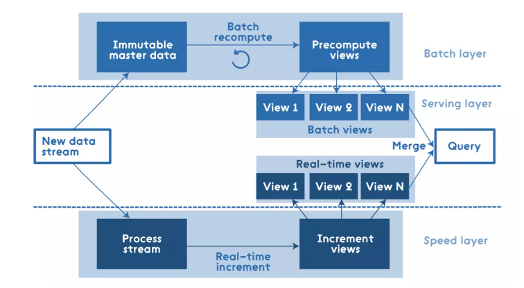
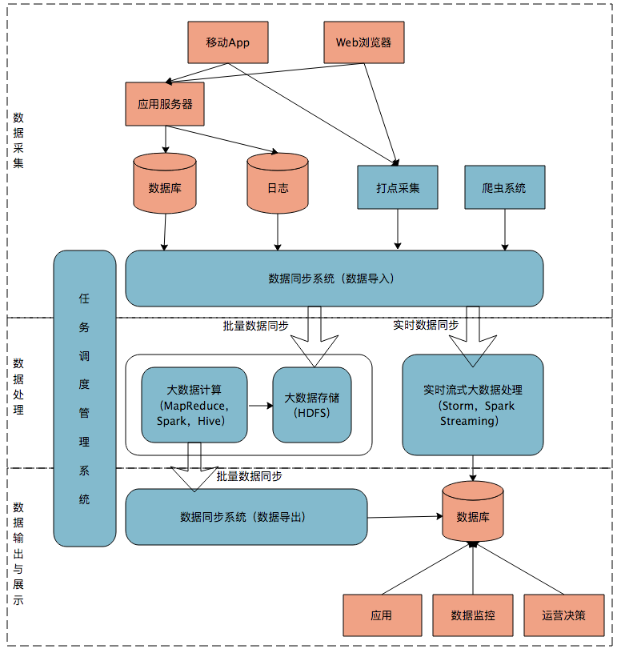

# Lambda架构

## 原型

**Batch Layer**、**Speed Layer**、**Serving Layer**

**缺点**

- 实时与批量计算结果不一致引起的数据口径问题；
- 维护两个复杂的分布式系统，并且保证他们逻辑上产生相同的结果输出到服务层中；

- 批量计算在计算窗口内无法完成；
- 服务器存储大：数据仓库的典型设计，会产生大量的中间结果表，造成数据急速膨胀，加大服务器存储压力。

## 业务案例

# Kappa架构

Kappa架构在Lambda架构的基础上**删除了Batch层**，所有的数据都是流处理实时计算 

- 通过**改进流计算系统来解决数据全量处理**的问题，使得**实时计算和批处理过程使用同一套代码**；
- 用Kafka或者类似MQ队列系统收集各种各样的数据，需要几天的数据量就保存几天；
- 当需要全量重新计算时，重新起一个流计算实例，从头开始读取数据进行处理，并输出到一个新的结果存储中；
- 当新的实例做完后，停止老的流计算实例，并把老的一些结果删除

