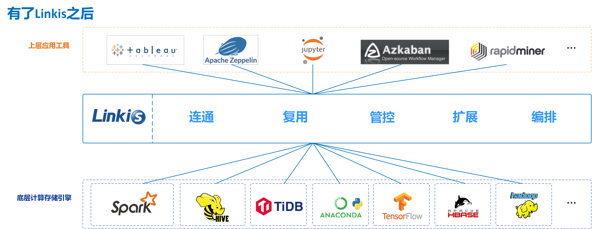

# Linkis

> https://gitee.com/WeBank/Linkis

在上层应用程序和底层引擎之间构建了一层计算中间件。通过使用Linkis 提供的REST/WebSocket/JDBC 等标准接口，上层应用可以方便地连接访问MySQL/Spark/Hive/Presto/Flink 等底层引擎，同时实现变量、脚本、函数和资源文件等用户资源的跨上层应用互通。

## 核心特点

- **丰富的底层计算存储引擎支持**。
  - **目前支持的计算存储引擎**：Spark、Hive、Python、Presto、ElasticSearch、MLSQL、TiSpark、JDBC和Shell等。
  - **正在支持中的计算存储引擎**：Flink、Impala等。
  - **支持的脚本语言**：SparkSQL, HiveQL, Python, Shell, Pyspark, R, Scala 和JDBC 等。
- **强大的计算治理能力**。基于Orchestrator、Label Manager和定制的Spring Cloud Gateway等服务，Linkis能够提供基于多级标签的跨集群/跨IDC 细粒度路由、负载均衡、多租户、流量控制、资源控制和编排策略(如双活、主备等)支持能力。
- **全栈计算存储引擎架构支持**。能够接收、执行和管理针对各种计算存储引擎的任务和请求，包括离线批量任务、交互式查询任务、实时流式任务和存储型任务；
- **资源管理能力**。 ResourceManager 不仅具备 Linkis0.X 对 Yarn 和 Linkis EngineManager 的资源管理能力，还将提供基于标签的多级资源分配和回收能力，让 ResourceManager 具备跨集群、跨计算资源类型的强大资源管理能力。
- **统一上下文服务**。为每个计算任务生成context id，跨用户、系统、计算引擎的关联管理用户和系统资源文件（JAR、ZIP、Properties等），结果集，参数变量，函数等，一处设置，处处自动引用；
- **统一物料**。系统和用户级物料管理，可分享和流转，跨用户、系统共享物料。