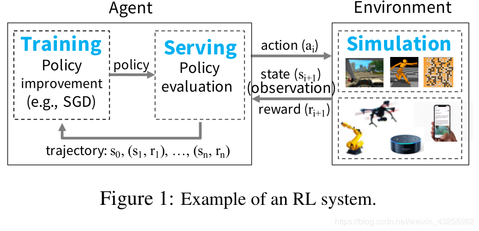
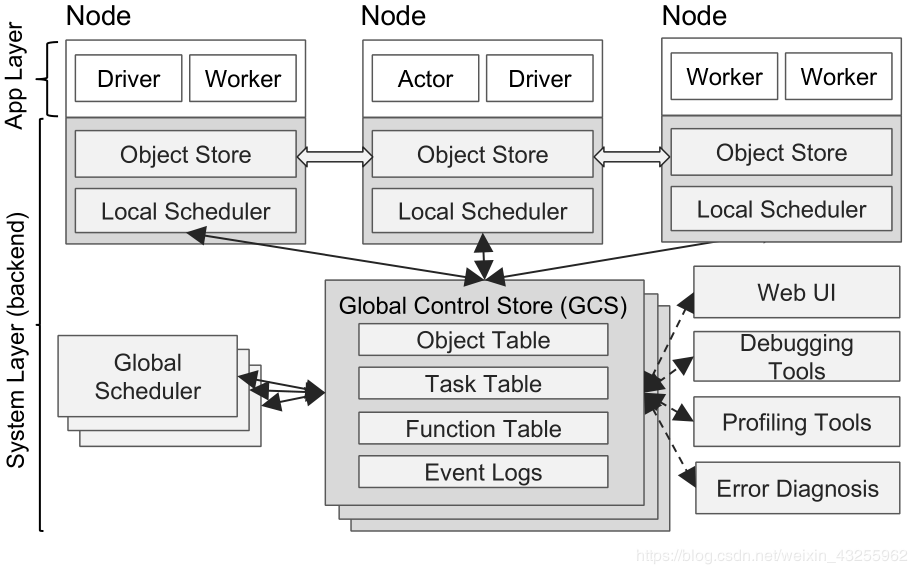
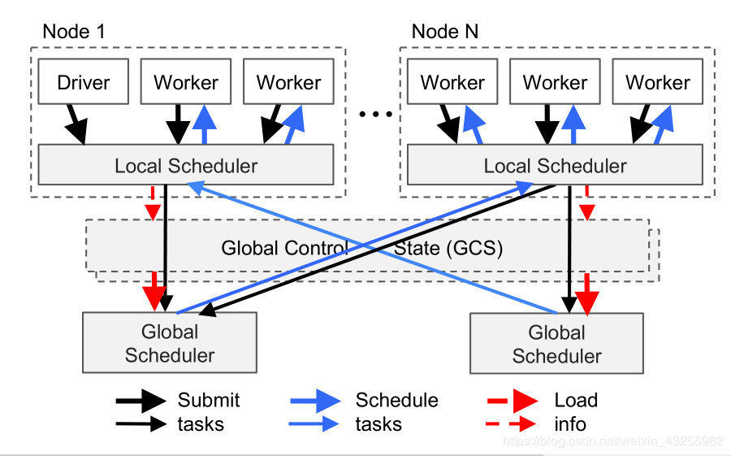
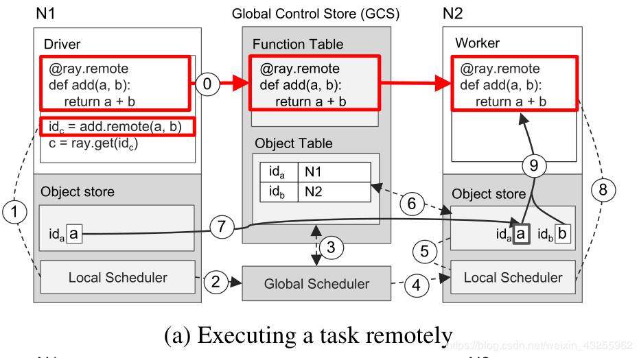
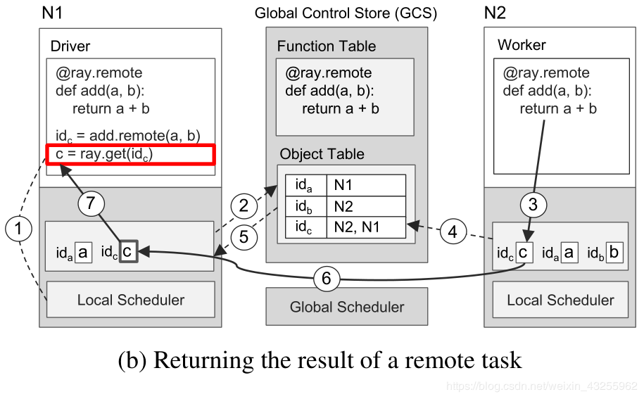

[toc]

# Ray : A Distributed Framework for Emerging AI Application

Ray：已有的系统无法同使满足AI训练、模拟和服务。

- 分布式框架，将**训练、模拟和服务**于新兴RL应用程序的必要组件结合起来。
- 在**动态任务**执行引擎之上统一了**参与者(actor)**和**任务(task)**并行抽象。
- 可扩展性，**控制状态存储在分片元数据存储**，**自下而上的分布式调度策略**。

强化学习系统三要素：**训练**，**模拟**，**服务**

毫秒级的延迟每秒处理数百万个异构任务

- 分布式调度；
- 分布式元数据存储。

无状态的Task，和有状态的Actor。

| 名称                                                         | 描述                                                         |
| ------------------------------------------------------------ | ------------------------------------------------------------ |
| futures = f.remote(args)                                     | 远程执行函数f.remote()可以接受对象或期货作为输入，并返回一个或多个期货。这是非阻塞的 |
| objects = ray.get(futures)                                   | 返回与一个或多个期货关联的值。这是阻塞                       |
| ready futures = ray.wait(futures,k,timeout)                  | 一旦k完成或超时，返回相应任务已完成的期货。                  |
| actor = Class.remote(args)或futures = actor.method.remote(args) | 将class类实例化为远程参与者，并返回它的句柄。调用远程参与者上的方法并返回一个或多个期货。两者都是阻塞。 |

允许**嵌套的远程函数**。

## 介绍

大数据  -->　计算处理框架（批处理、流处理、图处理）

面向数据的应用 --> AI 或者 机器学习，深度学习网络，AI框架（Tensorflow、PyTorch、MxNet）

新兴的AI应用 --> 强化学习（动态环境，实时反应），代表：AlphaGo

> The central goal of an RL application is to learn a policy-a mapping from the state of the environment to a choice of action—that yields effective performance over time, e.g., winning a game or piloting a drone.

强化学习系统要求：

- 细粒度(fine-grained)计算，rendering actions in milliseconds when interacting
  with the real world；
- 支持时间（一次模拟的时间可能是毫秒到小时级别）和资源的异构（GPU训练，CPU模拟）；
- 动态调度（仿真结果或者环境的交互会改变未来的计算）

## 体系结构

#### 应用层

- driver：执行用户程序的进程；
- worker：执行由驱动程序或其他worker程序调用的任务(远程函数)的无状态进程。
- actor：有状态的进程，在调用时只执行它公开的方法。

#### 系统层

- 全局存储控制GCS：保持系统的容错性和低延迟，每秒可动态生成数百万个任务。

  - 具有pub-sub的KV存储，**分片**(shard)的方式实现扩展，每个切片链式复制实现容错。
  - 将**对象的元数据存储在 GCS** 中而不是调度器里，从而将**任务分派与任务调度完全解耦**。

- 分布式调度：满足数据本地性和每秒百万级的调度

  - **全局调度程序**和**节点本地调度程序**组成的两级层次调度程序。
  - **自下向上**的调度，任务先提交到本地调度程序。

  

  > 注：在 [0.5 版本](https://link.zhihu.com/?target=https%3A//ray-project.github.io/2018/07/06/ray-0.5-release.html)之后，全局调度器已经被去掉，变成一个去中心化的调度架构，并且并没有先将任务优先提交到本地。当然，设计还在根据实现情况不断变化中。

- 分布式对象存储：内存中的分布式存储系统来存储每个**任务或无状态计算的输入和输出**

  - 同一节点上共享内存，不同任务以**零拷贝**的代价进行数据共享，数据格式用Apache Arrow；
  - 对象存储只接受*不可变数据*，不支持分布式的对象

### 执行示例流程

